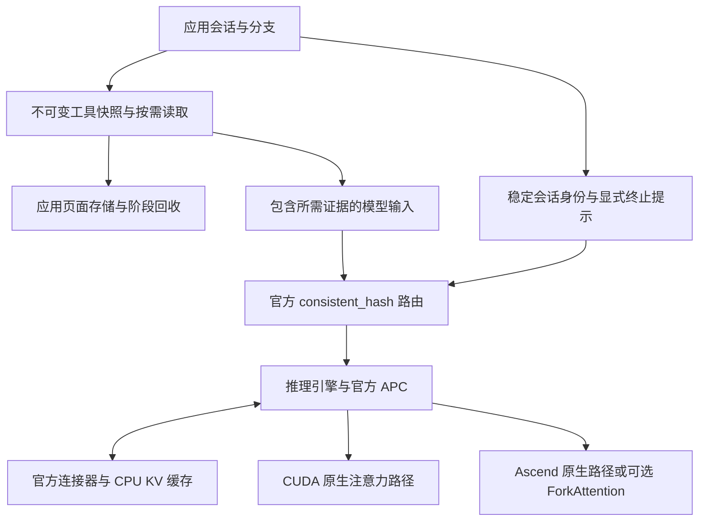

# Agentrix 的框架层内存管理与跨平台推理优化

多轮智能体推理的资源开销，会随会话长度、分支数量和工具结果规模共同增长。相同历史可能被多次预填充，同一份工具报告可能被多个分支反复复制，已经结束的请求还可能占用有价值的 CPU 备份空间。解决这些问题，需要同时管理数据的表示、生命周期和执行位置。

Agentrix 围绕这些问题设计并实现了框架层的数据管理与生命周期策略，并为 Agent 工作流启用适合的框架原生能力。工具结果的不可变分页、分支共享、阶段回收和选择性 KV 备份策略不依赖特定加速器；Ascend ForkAttention 的 FIA 编排和图执行则属于平台后端实现。系统复用官方路由、前缀缓存、卸载连接器和注意力计算能力，将新增实现集中在应用语义与推理后端之间。

合并多种子后的实验结果包括：H100 上工具工作流的平均活动 KV 峰值降低约 **62.1%**；选择性备份将同预算下的恢复首 token 延迟降低 **70.30%**；双 Ascend 上，在较小设备 KV 池与额外 CPU 缓存之间进行取舍，板卡 HBM 采样峰值减少 **14.02 GiB**。ForkAttention 的独立服务对照中，32K×每卡 4 分支的整批耗时降低 **5.67%**，配对输出一致；该收益限于已测形状，其他形状仍需满足输出一致性和稳定性条件。

这些结果来自独立对照，分别衡量工作集、恢复延迟、设备容量和执行耗时。本文先解释平台无关的框架设计，再按 CUDA 和 Ascend 列出验证条件与后端差异。在哪个平台测得收益，与优化是否依赖该平台，是两个问题。不同实验的提升不相加，跨平台数字也不作为硬件性能排名。

## 一 自主设计与框架原生能力

本文分别说明 Agentrix 新增的应用策略与执行组织，以及面向 Agent 场景启用的框架原生能力。前者解释我们设计了什么，后者解释如何利用已有机制减少多轮重算、分支复制和执行开销；已有机制的场景化使用同样纳入优化方案。

| 层次与方向 | Agentrix 新增的工作 | 平台依赖与复用边界 |
| --- | --- | --- |
| 框架层工具数据管理 | 不可变历史快照、内容寻址页面、分支引用、阶段回收、范围检索及有界流式入库 | 不依赖 CUDA 或 CANN；使用 SQLite、内容哈希和常规文件接口 |
| 框架层 KV 生命周期策略 | 将应用明确知道的终止语义映射为备份上限，使有限 CPU 缓存优先保留可复用会话 | 策略平台无关；调用官方选择性卸载接口，实际搬运需要对应后端支持 |
| Ascend ForkAttention 执行 | 根据物理页建立分支组，复用计划，打包查询，合并分段结果，适配动态图参数和工作区 | 当前实现依赖 Ascend FIA 与 ACLGraph；APC 和路由沿用官方机制 |

面向 Agent 工作流，启用以下框架原生能力：

| 原生能力 | 对应的 Agent 场景 | 使用方式与收益范围 |
| --- | --- | --- |
| 官方 `consistent_hash` | 同一会话多轮调用、同文档多次问答 | 使用稳定会话或文档身份绑定副本，为后续请求复用本地缓存创造条件 |
| APC 与分页共享 / CoW | 重复 system prompt、工具描述、公共历史及分支前缀 | 复用已计算的精确前缀和可共享页；私有修改由引擎隔离，不将应用工具页面当作设备 KV 页 |
| CPU KV offload 与按需恢复 | 长生命周期会话在多轮之间暂时不活跃 | 使用官方连接器保留可恢复副本，以额外 CPU 空间换取较小设备池；应用终止提示控制哪些请求值得备份 |
| 长 prefill 分块 | 长历史或大工具结果返回时，与其他会话解码竞争 | 通过官方分块配置控制单轮预填充工作量；单独核对恢复延迟和其他请求的等待时间 |
| Ascend Decode ACLGraph | 多轮生成中反复执行的 decode 步骤 | 复用官方图执行减少重复提交开销，官方 AgentX 对照见第七节 |

原生能力的启用效果按具体配置和负载验证；未做独立开关对照的机制不另列增益百分比。

Prefix-aware DP 属于框架层的请求放置机制，当前直接采用官方 `consistent_hash`，不是 CUDA 或 Ascend 专属优化。**容量扫描属于验证方法**：通过改变设备池与 CPU 池预算，测量满足质量和延迟约束的配置，不把扫描本身列为新增内存管理算法。

官方 `consistent_hash` 已支持会话亲和路由；Agentrix 当前直接使用该实现，原有自定义路由已移除。应用负责提供稳定的文档或会话身份，以便相关请求访问同一副本的缓存。[官方 router](https://github.com/vllm-project/router)

自动前缀缓存 APC 复用已经计算的前缀 KV，主要减少 prefill 重算。共享前缀在后续 decode 中仍需要参与每个查询的注意力计算，因此缓存复用与 ForkAttention 的执行优化解决的是不同开销。[vLLM APC 文档](https://docs.vllm.ai/en/latest/features/automatic_prefix_caching/)

vLLM 的 AgentX 文章将会话结构、分支点、工具时延和会话生命周期列为 Agent Hints 的潜在信息来源，并讨论用这些信息指导调度、缓存保留和预取。本文实现了其中较窄、可直接验证的一部分：应用已知的终止语义驱动选择性备份。工具等待期间的自动迁移和恢复前预取仍属于后续工作。[vLLM AgentX 文章](https://vllm.ai/blog/2026-09-08-vllm-agentx#the-path-ahead-planned-optimizations-and-future-work)

## 二 将原始数据与派生缓存分开管理

Agentrix 区分两类对象。工具快照保存原始证据，需要支持历史读取、分支隔离和明确的所有权；KV 与混合模型状态由模型输入派生，可由推理引擎缓存、备份、恢复或重算。原始证据仍有消费者时，不能因为 KV 被淘汰而删除工具快照；工具正文保存在外部存储，也不意味着模型 KV 已经卸载。

下图概括各模块已经实现的接口关系。性能实验按模块分别对照，尚未测量全部模块同时开启的组合收益；应用页面回收和引擎 KV 回收保持独立。



本文使用 TTFT 表示从请求发出到首个输出 token 的时间，恢复 TTFT 特指被测会话重新请求时的该项延迟；文档 QA 另行记录客户端排队。P95 表示该指标的第 95 百分位。HBM 为加速卡设备内存，RSS 为进程驻留主存；两者的采样峰值都可能低于瞬时真实峰值。

工具工作流、文档 QA 和 NPU ForkAttention 的多种子结果统一合并展示：先保留每个种子已核验的重复测量汇总，再对种子等权平均，变化率由合并后的基线与候选值计算，不直接平均百分比。平均运行峰值不等于整个实验的最高峰。已有恢复 P95 沿用原实验汇总，不将各种子的 P95 再平均；CUDA 算子实验沿用其下文说明的中位数口径。新合并值由已发布汇总数据计算，降幅取近似值以反映源数据的舍入精度。

评价内存收益时，本文分别统计以下指标：

| 指标 | 衡量对象 | 可以回答的问题 |
| --- | --- | --- |
| 设备 KV 池预算 | 引擎预留的缓存容量 | 是否允许使用更小的设备池 |
| 活动 KV 工作集 | 实际占用的缓存块 | 同一池内是否留出更多工作空间 |
| 板卡 HBM 采样峰值 | 模型、缓存、图和临时缓冲等总占用 | 板卡实际观测占用是否下降 |
| CPU KV 预算与搬运量 | 外部备份空间及实际读写字节 | 是否减少低价值写入和恢复重算 |
| 工具页面载荷与进程 RSS | 应用存储、读取和临时分配 | 是否降低分支复制和主存峰值 |

例如，在固定 2 GiB KV 池内减少活动块，不会自动缩小这 2 GiB 的预分配。要建立设备容量收益，需要进一步缩小池预算，并在明确的延迟和正确性门槛下完成对照。这套容量扫描方法适用于不同后端；每个平台需独立验证，不能直接迁移最小池大小或收益百分比。

## 三 应用语义驱动的数据管理设计

### 不可变工具快照与按需进入上下文

传统内联方式将完整工具报告放进每个分支的 prompt。分支只需要其中少量证据时，仍会为全文付出 token、prefill 和 KV 成本。Agentrix 将完整报告保存为不可变快照，向工作流提供可检索、可范围读取的句柄，由实际需要的内容进入模型上下文。

保存历史快照很关键。底层文件修改或删除后，重新执行读文件工具未必能得到当时的观察；快照句柄必须继续指向原始版本。`PagedToolStore` 使用内容哈希标识对象，并通过会话引用限制可访问的对象。对于需要恢复全文的路径，恢复成本也计入工作流耗时。

此外，精确 prompt 去重只处理应用拥有的稳定片段：相同身份且渲染内容一致时省略重复项，身份相同但内容不同则拒绝处理。该机制没有实现通用语义摘要；正文按需加载也会改变模型输入，因此需要单独验证任务质量。

### 页面共享与分支所有权

工具文本按 4,096 字符分为页面，每页以 UTF-8 内容哈希索引。分支继承对象引用，修改时创建新版本；没有变化的页面继续共享。相同大小的局部修改可将新增存储限制在受影响页面附近。

设原始报告大小为 D，同时保留原始版本和 B 个分支版本，每个分支引入的不同页面载荷为 Δᵢ。忽略索引与数据库开销，完整复制需要约 `(B + 1) × D`，共享实现的页面载荷约为 `D + ΣΔᵢ`。这是应用对象的存储模型；设备 KV 页共享仍由官方引擎管理。不等长插入可能移动后续页面边界，不能保证只新增一个页面。

阶段结束时，工作流显式给出仍需保留的完整句柄集合。存储层只删除当前拥有者的过期引用，子分支和兄弟分支的引用保持独立，最后一个拥有者释放后才删除对象及不再引用的页面。无效句柄会使检查点操作原子失败，避免部分回收破坏后续读取。

### 有界流式入库

只实现分页存储还不够。如果调用方先把大结果拼成完整字符串、编码为 bytes，再交给存储，主存峰值已经产生。

Agentrix 在实际文件读取路径中引入单次扫描与有界缓冲。选中正文超过 256 KiB 缓冲阈值后写入临时文件，得到精确总行数后，以 64 Ki 字符块直接传入 `put_stream`。页面构造不再要求完整结果同时驻留内存。临时文件 I/O 和操作系统页缓存是额外成本，不能把进程 RSS 降幅解释为整机内存需求同幅下降。

上述实现与接口见 [应用数据管理代码](../application/src/agentrix_application/prompt_compactor.py) 和 [工具读取路径](../benchmark/src/coding_agent_tools.py)。

### 终止提示驱动的选择性 KV 备份

CPU 备份空间有限时，无差别备份可能让大量只访问一次的请求淘汰将被恢复的会话。Agentrix 使用应用在派发前已经掌握的生命周期信息：只有明确知道不会再复用的请求，才标记为终止，并传递官方 `kv_transfer_params.max_offload_tokens=0`。其余请求沿用引擎默认策略。[官方选择性卸载说明](https://docs.vllm.ai/en/latest/features/kv_offloading_usage/#per-request-selective-offload)

这一策略避免低价值的新备份写入，为可复用会话保留 CPU 缓存。零上限不会删除已有副本、禁止读回已有缓存或主动释放设备显存。一次 LLM 回复结束、一次工具调用开始，或者单个子分支结束，都不足以证明共享前缀不会再次使用。

这项策略根据应用语义选择需要备份的请求，使有限 CPU 缓存优先保留后续会复用的会话。收益通过发生缓存压力、写入、淘汰和恢复的对照实验验证。实现见 [会话与备份选项](../application/src/agentrix_application/session_kv.py)。

## 四 框架层内存管理的分平台验证

本节验证前述共同框架策略在不同后端上的实际效果。工具数据按需加载的模型级实验在 H100 上完成，选择性备份及容量扫描分别在 H100 和 Ascend 上完成。H100 工具工作流使用 Qwen3-8B，混合缓存实验均使用 Qwen3.5-9B；各实验的输入长度、状态粒度和请求规模不同，数字不能用于硬件横向排名。

### CUDA H100 上的工具数据按需加载

实验使用单张 H100 PCIe 80 GB、Qwen3-8B BF16、FlashAttention 3、eager 与原生 APC，两组固定 2 GiB KV 池和 14,336-token 请求窗口。每轮包含 8 个工作流，每个工作流 3 个分支，共享 128 行工具报告。比较完整内联正文与外置快照按需读取两种方式。

服务最大序列数为 32，batch token 上限为 1,024；客户端最多四个工作流、十二个模型请求并发。两组使用相同报告、工具和答案规则。

两个随机种子分别按“内联、分页、分页、内联”顺序运行，每轮独立客户端、相同预热并清空前缀缓存。每个种子、每种方式各测两次，先取两次测量的中位数，再对两个种子等权平均。由于每种子恰有两次测量，这也等于每种方式四轮的算术均值。

| 指标 | 完整内联 | 外置分页 | 合并后的变化 |
| --- | ---: | ---: | ---: |
| 每轮活动 KV 采样峰值均值 | 1,875.38 MiB | 711.56 MiB | 约 −62.1% |
| 同批工作流平均耗时 | 31.99 s | 8.95 s | 约 −72.0% |
| 同批任务完成速率 以内联为 1 | 1.00 | 3.57 | 约 3.57 倍 |

正式测量合计 **64/64 工作流、192/192 分支正确**，零请求错误、零抢占，工具快照最终全部回收。部分分页运行触发了原文恢复，相关输入和耗时已经包含在合并结果中；恢复由公开校验规则触发，不使用隐藏答案。

两组板卡显存采样峰值都为 **18,628 MiB**。本实验确认的是进入模型的数据量和活动 KV 工作集下降，固定预分配池没有缩小。KV 按实际占用块数乘以每块 2.25 MiB 计算，采样间隔中位数为 67～69 ms，可能遗漏短峰值。

另一项容量探针将报告扩大到 256 行，保持设备池和模型窗口不变。分页方式完成 8/8 工作流、24/24 分支；完整内联的 24 个分支均因超出上下文预算被拒绝。该结果说明可以处理更大的外部数据，并没有扩大模型 attention 窗口，失败组耗时也不用于计算加速比。实验范围是合成工具工作流，不是官方 AgentX。[工作流实验入口](../benchmark/scripts/benchmark_tool_result_paging.py)

### CUDA H100 上的选择性 KV 备份

混合缓存实验使用 Qwen3.5-9B BF16、FlashAttention 3、eager、同步调度、Mamba `align`，最大上下文 16,384、最大序列数 8、batch token 上限 8,192。CPU 层使用官方 `OffloadingConnector` 与 LRU。

每轮先准备 4 个待恢复会话，再插入 8 个应用预先声明不会回访的请求，最后恢复原 4 个会话。每个输入为 8,192 token，固定输出 16 token；两个种子各运行三轮，交换策略执行顺序。两组同为 **2 GiB GPU KV + 2 GiB CPU KV**。

| 指标 | 官方默认备份 | 选择性备份 |
| --- | ---: | ---: |
| 恢复请求数 | 24 | 24 |
| 平均恢复 TTFT | 460.96 ms | 136.90 ms |
| 恢复 P95 TTFT | 475.34 ms | 163.59 ms |
| 恢复重算 token 总计 | 196,608 | 6,528 |
| 终止请求 CPU 写入 每轮 | 2.317 GiB | 0 |
| 恢复 CPU 读回 每轮 | 0 | 1.159 GiB |
| 板卡显存采样峰值 | 21,904.56 MiB | 21,904.56 MiB |

选择性备份使恢复重算减少 **96.68%**，平均恢复 TTFT 降低 **70.30%**。恢复阶段的实际 CPU 读回与计算计数支持其机制解释：有限 CPU 池保留了可复用会话，没有被终止请求的新备份挤掉。所有配对输入和生成 token 已核对一致。

该实验固定设备容量，因此两组板卡显存相同；选择性备份的直接收益是减少无效写入、保住可恢复状态并降低重算。[H100 混合 KV 实测](kv_memory_optimization_status.md#cuda-h100恢复延迟与设备容量)

### CUDA H100 上的小设备池容量验证

进一步扫描设备 KV 池，验收条件为恢复 P95 不超过 300 ms，且跨组生成 token 一致。完整矩阵包含 8 种配置、两个种子、各三轮，共 768 个请求和 192 次恢复。下表列出关键配置。

| GPU KV 池 | 策略 | CPU KV 预算 | 平均恢复 TTFT | 恢复 P95 | 板卡显存采样峰值 |
| --- | --- | ---: | ---: | ---: | ---: |
| 2 GiB | 默认备份 | 2 GiB | 460.96 ms | 475.34 ms | 21,904.56 MiB |
| 2 GiB | 选择性备份 | 2 GiB | 136.90 ms | 163.59 ms | 21,904.56 MiB |
| 1 GiB | 选择性备份 | 2 GiB | 139.60 ms | 164.20 ms | 20,944.56 MiB |
| 0.75 GiB | 选择性备份 | 2 GiB | 139.51 ms | 167.27 ms | 20,688.56 MiB |
| 4 GiB | 无卸载 APC | 0 | 115.14 ms | 163.24 ms | 23,750.56 MiB |

与满足同一 P95 门槛的 4 GiB APC 参照相比，0.75 GiB 选择性备份将 GPU KV 配置预算降低 **81.25%**，板卡显存采样峰值减少 **3,062 MiB**。代价是额外 **2 GiB CPU 预算**，以及平均恢复 TTFT 增加 **24.37 ms**。

0.75 GiB 是最低已测达标配置。实验没有扫描 APC 的 2～4 GiB 中间档位，也没有测最大同时活跃会话数，因此不能将它表述为绝对最小容量或严格相同延迟下的容量下限。当前混合模型恢复结论限于已测输入与状态边界。[容量矩阵与边界说明](kv_memory_optimization_status.md#cuda-h100恢复延迟与设备容量)

### Ascend 双卡的选择性备份与容量验证

双卡实验使用 Qwen3.5-9B BF16、官方 `consistent_hash`、DP=2/TP=1、eager、同步调度及 Mamba `align`。每轮准备 8 个待恢复会话，插入 16 个已知不会再访问的终止请求，再恢复原会话；输入 8,193 token，固定输出 8 token。

两个种子、每种子两轮，共 16 个实验单元、32 轮、1,024 个请求及 256 次恢复。各组输入计划一致，960 次跨轮或跨组的生成 token 比较全部一致，零抢占。关键配置如下，预算均按每卡列出。

| 设备 KV 预算 | 策略 | CPU KV 预算 | 平均恢复 TTFT | 恢复 P95 |
| --- | --- | ---: | ---: | ---: |
| 1 GiB | APC | 0 | 772.96 ms | 793.17 ms |
| 1 GiB | 普通 CPU 备份 | 2 GiB | 768.68 ms | 775.14 ms |
| 1 GiB | 选择性 CPU 备份 | 2 GiB | 152.13 ms | 160.35 ms |
| 2 GiB | 选择性 CPU 备份 | 2 GiB | 185.38 ms | 213.88 ms |
| 8 GiB | 缓存充足的 APC 参照 | 0 | 134.83 ms | 147.56 ms |

同为每卡 1 GiB 设备和 2 GiB CPU，选择性备份将平均恢复 TTFT 降低 **80.21%**。该配置四轮中，终止请求 CPU 写入由 **20,476,592,128 字节降为零**，恢复重算由 **262,176 token 降为 32 token**，并实际从 CPU 读回 **10,238,296,064 字节**。

与每卡 8 GiB APC 参照相比，每卡 1 GiB 选择性备份的设备 KV 预算减少 **87.5%**，双卡 HBM 采样峰值由 **61,814 MiB 降至 47,454 MiB**，减少 **14.02 GiB**。代价是双卡合计 **4 GiB CPU 预算**，平均恢复延迟增加 **17.30 ms**，P95 增加 **12.79 ms**。

这是一项明确的容量与恢复延迟交换，限于已测顺序压力。1 GiB 是最小已测预算；预算组顺序固定，不将不同预算间的小幅速度差归因于池大小。实验没有建立增长上下文、多会话并发容量、工具等待迁移或官方 AgentX 的整体收益。[双卡生命周期完整实测](kv_memory_optimization_status.md#双卡会话路由与分层缓存)

## 五 共享前缀路由与注意力的分平台验证

路由根据文档或会话身份决定请求归属，属于框架层；APC 根据实际前缀复用缓存；注意力后端决定共享 KV 如何参与计算。下面分别报告官方路由在 Ascend 上的验证、Ascend ForkAttention 的执行适配，以及 CUDA 算子对照。

### 框架层文档路由在 Ascend 上的验证

Ascend 路由实验使用双 910B2、Qwen3.5-9B BF16、DP=2、TP=1、eager、同步调度及 APC/Mamba `align`，每卡固定 8 GiB KV。官方 router 版本为 0.1.15。

数据取自 LongBench v1 的共享文档子集：16 篇文档、34 个原始问题，其中 12 篇来自 `multifieldqa_en`，4 篇来自 `qasper`，文档长度为 7,447～14,847 token。先发送每篇文档首问，再交错发送后续问题；同一文档使用稳定身份。两个种子改变文档顺序，各测原生 DP、`consistent_hash`、`cache_aware`，总计 204 次问答。下表将两个种子等权合并，每个策略合计 68 次问答；每轮请求数相同，因此请求平均 TTFT 也等于合并请求后的均值。

| 指标 | 原生 DP | consistent_hash | 合并后的变化 |
| --- | ---: | ---: | ---: |
| 首问平均 TTFT | 2.013 s | 2.557 s | 约 +27.1% |
| 后续问题平均 TTFT | 0.823 s | 0.366 s | 约 −55.5% |
| 每轮本地计算 prompt token 均值 | 236,519 | 168,935 | 约 −28.6% |
| 整批平均耗时 | 79.79 s | 76.65 s | 约 −3.9% |

这组实验确认了文档亲和性对后续缓存复用的作用，同时揭示了局限：首问在两个种子中都更慢，整批耗时的变化方向随种子不同，合并后的平均改善不代表每轮都加速。聚合 F1 接近，但与原生 DP 逐题完全相同的预测合计为 **58/68**，不能称为严格输出等价。结果只覆盖共享文档子集，不代表完整 LongBench 排行榜或官方 AgentX。

路由为相同前缀落到同一副本创造条件；它不保证这些分支同时进入同一批次。ForkAttention 还必须在引擎实际执行时确认共享关系。路由本身沿用官方实现，这部分工作的价值是正确接入、场景选择与可复核验证。[文档 QA 配置与结果](dp_routing.md#longbench-共享文档-qa)

### Ascend ForkAttention 的 NPU 执行组织

Ascend 实现复用原生 FIA，新增共享前缀的规划、打包、合并和图执行适配。输入直接使用现有物理 KV 页，不把共享前缀重新复制为连续的大张量。

硬件适配的难点在于计算与数据交接方式不同。仓库 CUDA 分段内核在同一线程块中衔接矩阵乘、softmax 和输出累加，组合使用 shared memory 与寄存器 fragment；Ascend A2 则要面对 AIC/AIV 分离，以及矩阵侧 L1/L0、向量侧 UB 的独立约束。因此，共享前缀和 LSE 合并的数学方法可以复用，线程布局、局部数据驻留、任务粒度与同步不能直接照搬。

当前选择由 FIA 承担分段内部的计算流水，自主实现共享任务组织与 Vector 辅助核；代价是分段结果的全局交接和额外工作区。新增双 head 合并也需要在任务数与 FP32 局部工作集之间取舍，尚无该增量的 NPU 实测收益。完整的架构对照、五项迁移挑战与设计依据见 [NVIDIA H100 与 Ascend A2 的差异](agentx_ascend.md#与-nvidia-h100-的差异与迁移挑战)。

**首先确认物理共享。** CPU 规划器按当前 block table 检查相同物理页组成的连续公共前缀，仅共享完整的 128-token 内核页，每个请求保留非空私有尾部。文本相似、相同会话 ID 或相同序列长度都不足以证明物理页可共享。

**随后组织共享段与私有段。** 同组分支的 query 被打包为共享段上的多行查询，长前缀分片与各分支私有尾部一并提交给 paged FIA。每个分支仍使用自己的 query、私有 KV 和输出，分组不会将分支语义混合。未加入共享组的查询按独立序列处理。

**再用 LSE 合并分段结果。** 假设某一查询在第 j 个分段得到归一化输出 Oⱼ 和 log-sum-exp Lⱼ，令 `m = max(Lⱼ)`，完整注意力输出按下式恢复：

```text
wⱼ = exp(Lⱼ − m)
O  = Σ(wⱼ × Oⱼ) / Σwⱼ
```

实现以 FP32 进行稳定权重合并，再写回模型输出精度。分段结果按各自 softmax 归一化量加权，不能简单平均。查询打包和结果合并由两个辅助内核完成。

**最后减少动态规划与图执行开销。** 每个 metadata builder 缓存最近一次计划，逐 token 校验有效物理页表与页数；共享拓扑不变时只更新长度。固定地址的查询缓冲、页表、合并映射和 FIA 工作区，在一个 KV group 的各层及不同图批大小之间复用，避免逐层重复预留。该缓冲依赖模型执行串行使用，不能在并发执行之间无条件共享。

ACLGraph 接入保留固定的打包与合并步骤，通过 graph-task update 更新 FIA 动态参数，并使用事件保证元数据更新先于对应设备读取。不满足共享条件时使用原生路径。当前在线规划范围为每卡 2～8 个单 token decode 查询；默认关闭，默认共享门槛为 32K。

实现入口为 [共享页与计划复用](../vllm-ascend/vllm_ascend/attention/fork_batch.py)、[缓冲和图适配](../vllm-ascend/vllm_ascend/ops/fork_decode.py) 及 [打包与合并内核](../vllm-ascend/vllm_ascend/ops/triton/fork_attention.py)。这部分自主实现集中在如何把共享关系转化为 NPU 可高效执行的任务；底层 FIA 计算仍由官方算子承担。

### Ascend 长前缀和多分支的模型级效果

模型级对照保持双 910B2、Qwen3.5-9B BF16、官方 `consistent_hash`、DP=2/TP=1、每卡 8 GiB KV、APC/Mamba `align`。使用 Decode ACLGraph 的 `FULL_DECODE_ONLY`，捕获大小为 1、2、4、8，关闭 `npugraph_ex`。共享前缀 32K、每卡四分支、私有尾部 128 token，每请求固定生成 64 token。

两个种子各进行两组独立重启配对，反转 Fork 开关顺序；每次服务先取三次批次的均值，再对四组配对等权平均。下表计入模型其他层、CPU 规划与服务路径的成本。

| 指标 | 原生路径 | ForkAttention |
| --- | ---: | ---: |
| 整批平均耗时 | 3.072 s | 2.898 s |
| 双卡 HBM 采样峰值均值 | 62,421 MiB | 63,181.5 MiB |

整批耗时降低 **5.67%**，四组对照均更快且配对输出一致；代价是双卡 HBM 增加 **760.5 MiB**。HBM 每五秒采样，可能遗漏瞬时峰值。该结果说明特定长前缀形状的执行收益，没有设备容量收益，也不代表官方 AgentX 的整体加速。

Qwen3.5-9B 的 32 层中只有 8 层 full attention 使用这条路径，其余 GDN 与其他计算不由 ForkAttention 加速。单层算子加速不能等比例换算为模型收益；NPU 搬运计数的解释见 [Ascend profiling](agentx_ascend.md#profiling共享分组减少了哪些工作)，架构差异不作为跨平台性能排名。

其他已探索形状仍存在模型输出差异或收益方向不一致，真实长文档 QA 也尚未建立稳定加速，因此保持显式启用。优化需要同时满足任务质量与执行收益，不能仅按计时下降扩大适用范围。[模型级对照与边界](dp_routing.md#长前缀模型级对照)

### CUDA 注意力后端的选择

CUDA 已有 [FlashInfer Cascade](https://docs.flashinfer.ai/api/cascade.html) 等共享前缀注意力路径。当前对照没有建立 CUDA ForkAttention 超越 Cascade 的优势，因此不将其列为有效新增优化。已有算子比较来自 RTX 5070，不能推导 H100 上的后端排名；H100 内存实验沿用前述官方 attention 配置。[算子比较方法](fork_attention/forkattention_operator_profile.md#flashinfer-cascade-与-cuda-forkattention)

## 六 工具页面与主存实验

工具存储实现不依赖 CUDA 或 CANN，但其 CPU/存储实验只能说明应用路径本身的效果。H100 工具工作流已验证其模型级接入；尚不能将相同百分比套到 Ascend 模型服务。

| 实验 | 基线 → Agentrix | 正确性与成本 |
| --- | ---: | --- |
| 8 MiB 报告加 8 个分支版本 每个修改 32 字符 | 唯一页面载荷 72 → 8.03125 MiB，降低 88.85% | 9 个版本全文哈希一致；H100 主机复测的更新耗时 1.50 → 2.52 s，增加约 67.8% |
| 16 阶段各产生 2 MiB 报告 | 页面存储峰值 32 → 4 MiB，降低 87.50% | 延迟消费者仍可读，最终全部回收；进程 RSS 基本不变 |
| 64 MiB 文件中读取 32 行 | 工具进程 RSS 176.23 → 20.32 MiB，降低 88.47% | 未启用分配采样的读取耗时 270.33 → 169.09 ms；输出逐字一致，为准确总行数仍扫描全文 |
| 64 MiB 选中结果完整分页入库 | 进程 RSS 285.32 → 29.63 MiB，降低 89.62% | 耗时 1,078.63 → 1,164.55 ms，增加 7.97%；完整快照可恢复 |

前三项来自各方式两次的独立 CPU/存储对照。页面载荷不含索引与数据库开销，页面更新耗时包含分配采样成本。不能把页面载荷、SQLite 文件、进程 RSS 和 KV 字节数相互替代；页面共享与流式入库保留的依据是内存收益，同时计入其执行成本。

### 大结果流式入库

独立对照使用 8 MiB 和 64 MiB 的超长选中行，并保留小结果控制组。8 MiB 各两对、64 MiB 各三对，交替先后顺序；首次读取测 RSS 与耗时，第二次独立测 Python 分配峰值。下表为各组中位数：

| 场景 | 进程 RSS 峰值：原实现 → 流式 | RSS 降幅 | 工具耗时：原实现 → 流式 |
| --- | ---: | ---: | ---: |
| 8 MiB，截断响应 | 50.78 → 20.26 MiB | 60.10% | 34.56 → 33.94 ms |
| 64 MiB，截断响应 | 274.94 → 20.25 MiB | 92.63% | 256.92 → 265.11 ms，+3.19% |
| 8 MiB，完整分页存储 | 61.22 → 29.64 MiB | 51.58% | 135.95 → 150.03 ms，+10.35% |
| 64 MiB，完整分页存储 | 285.32 → 29.63 MiB | 89.62% | 1,078.63 → 1,164.55 ms，+7.97% |

大结果 Python 分配峰值由约 32.04～256.12 MiB 降至约 **0.444 MiB**；选中数据从 8 MiB 增至 64 MiB 时，工作缓冲没有同步增长。小结果耗时 0.275 → 0.341 ms，增加 0.066 ms，不列为加速。

工具响应与可恢复全文保持一致。临时正文可能达到选中数据大小，OS 页缓存和存储介质成本不包含在 RSS 降幅内。搜索和命令输出的完整捕获、长期事件列表尚未全部改为有界存储，因此不宣称所有工具路径都具有固定主存上限。实现与复现方法见 [应用接口](../application/README.md#paged-tool-snapshots-and-branch-lifetimes) 和 [工具数据对照入口](../benchmark/scripts/benchmark_tool_snapshot_sharing.py)。

## 七 面向 Agent 场景启用框架执行能力

多轮 Agent 在一次任务中反复生成、调用工具并恢复推理。除前述会话亲和、APC 和 CPU 备份外，执行配置也会影响这些重复步骤的成本。

**Decode ACLGraph。** 在双 910B2、Qwen3.5-9B 官方 AgentX 对照中，每卡同为 36 GiB KV，eager 与 graph 各两轮交错运行。输出吞吐由 **48.28 提升至 88.97 token/s（+84.3%）**，平均 TTFT 由 **2.252 降至 1.941 s**。该收益来自启用官方图执行及相关编译、融合路径。实验固定历史会话路由，不能与后续官方 router 实验拼成组合结果；覆盖一个种子的官方闭环回放，不代表全部 Agent 负载。[ACLGraph 对照配置](agentx_ascend.md#decode-aclgraph-与编译执行)

**长 prefill 分块。** 工具结果返回或历史增长可能产生较长的预填充请求。使用框架分块能力限制一次调度中的长 prefill 工作量，为其他会话的解码留出执行机会。历史 Ascend 官方 AgentX 单次对照固定当时的会话路由，将长 prefill 阈值从不限制改为 1,024 token，输出吞吐 **41.35 → 43.16 token/s**，平均 TTFT **6.47 → 4.02 s**。这是该配置的场景化观测，尚不能作为所有负载的最优阈值，也不与图执行收益相加。[分块对照与配置](agentx_ascend.md)

这些能力均来自框架。Agentrix 的方案同时包含应用数据与生命周期策略、ForkAttention 的执行组织，以及针对 Agent 负载选择并验证的框架配置。每项按独立对照报告效果。

## 八 跨平台适用范围与后续方向

本文按框架层设计与设备后端区分贡献。工具数据管理已完成 H100 模型级实验；同一选择性备份策略已在 H100 和 Ascend 分别建立恢复延迟与容量收益；ForkAttention 的当前有效模型结果来自 Ascend 长前缀图执行。前两者的平台标签说明测量范围，后者包含明确的 NPU 执行适配。

CUDA 与 Ascend 使用各自的状态布局、恢复粒度、复制事件和注意力路径，相同应用策略不意味着相同后端成本。双平台增长上下文中已建立串行场景收益，合并双种子的延迟与容量结果见 [KV 内存管理](kv_memory_optimization_status.md#双平台增长上下文与分支结果)。表中列出有收益的配置及必要基线，不代表完整实验矩阵的总体成功率。

下一步重点是扩大内存管理的并发适用范围，形成工具等待迁移和恢复前预取的控制流程；ForkAttention 需定位模型级差异、控制工作区，并建立兼顾质量与稳定收益的准入条件。通用磁盘 KV 分层与 DTK 适配尚未完成，不列入已有成果。
