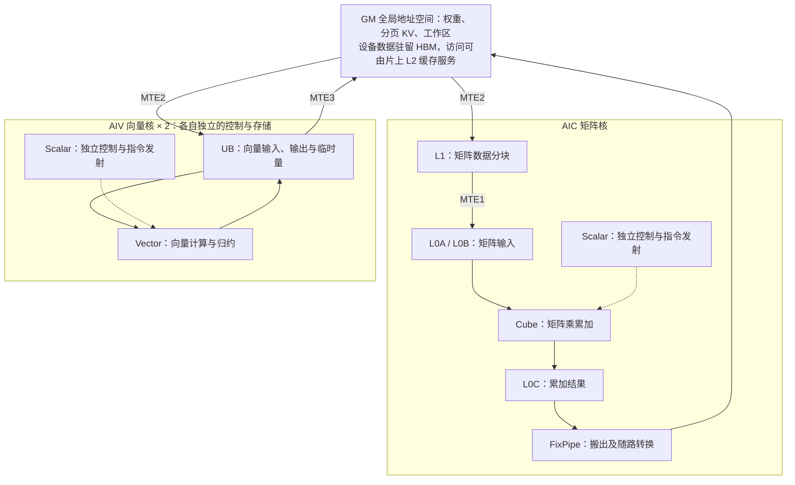
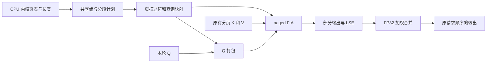

# 面向长上下文与分支推理的 Ascend 优化：架构、算子与内存管理

本文讨论通用大模型推理中的前缀复用、分支 attention、缓存生命周期和执行开销，
以及这些机制在 vLLM-Ascend 上的实现。目标场景包括多轮对话、共享文档问答和
多分支生成。AgentX 是其中一种评估负载，算子微基准与受控模型负载分别用于
分析局部效率和模型级效果。

方案包含三层：官方路由与 APC 提供前缀复用，混合缓存策略管理可恢复状态，
ForkAttention 与图执行改善设备计算和提交效率。各层的结果来自独立对照，
不叠加成统一加速比。框架层方案见 [跨平台优化](agentrix_cross_platform_optimizations.md)，
当前成果总表见 [技术汇报导航](README.md)。

Ascend 算子适配的核心挑战，是把共享前缀的计算复用映射到 **AIC/AIV 分离、
分用途片上存储和显式搬运流水**上。相同的 attention 数学公式，在 NVIDIA
与 Ascend 上具有不同的任务粒度、数据交接和资源约束。下文先对照两种架构，
再说明这些差异如何决定 ForkAttention 的分段、打包、归约和图执行设计。

## 实验平台与评价方法

Ascend 实验采用双 Ascend 910B2 64 GB、Qwen3.5-9B BF16、TP=1/DP=2，
运行时为 vLLM 0.22.1 与 vLLM-Ascend v0.22.1rc1 加本项目适配。
ForkAttention 只处理模型中的 full-attention 层，支持范围在后文单独说明。

早期服务级对照采用官方 [AgentX harness](https://github.com/SemiAnalysisAI/agentx-harness)
的 `inferencex-agentx-mvp`，数据集为 `semianalysisai/cc-traces-weka-062126`，
每轮 900 秒、固定一个随机种子、16 个 session trees、最大上下文 262,144 token。
按完整轨迹峰值上下文过滤，393 条轨迹中保留 220 条；保持官方 prompt、工具等待
时序和输出长度。评估指标包括输出吞吐、TTFT、缓存读取比例及完成量。

算子实验固定 attention 形状、物理 KV 和执行方式；模型实验还计入其他层、
CPU 规划与服务路径开销。Profiling 独立采集，不与正常计时混合。HBM 为板卡
采样占用；固定 KV 池内的复用改善不等于预分配显存下降。

## 请求路由与长 prefill 分块

当前 Prefix-aware DP 直接采用官方 `consistent_hash`。应用提供稳定的文档或
会话身份，使相关请求访问同一副本的 APC；两个副本各自持有 KV，不跨卡共享。
在双卡 LongBench 共享文档子集上，两个种子合并后的后续问题 TTFT 降低约
55.5%，本地 prompt 计算量减少约 28.6%；首问变慢，整体耗时的改善方向因种子
而异。完整条件见 [文档 QA 路由对照](dp_routing.md)。

长 prefill 分块沿用框架调度能力。Qwen3.5 在该 Ascend 组合下的混合缓存管理块
为 1,024 token，非零分块上限与总 batch token budget 必须允许至少一个完整块
推进。早期 AgentX 固定会话粘性路由与总 budget=2,048，仅调整分块上限：

| 长 prefill 上限 | 输出吞吐 | 平均 TTFT | P90 TTFT | 缓存读取比例 |
| --- | ---: | ---: | ---: | ---: |
| 不限制 | 41.35 token/s | 6.47 s | 13.04 s | 78.78% |
| 1,024 token | 43.16 token/s | 4.02 s | 7.92 s | 84.56% |

输出吞吐增加 4.4%，平均 TTFT 降低 37.8%。每组仅一次测量，不能视为通用最优
配置；该历史实验使用当时的会话代理，不作为后来替换为官方 router 的增量结果。

## 混合缓存的选择性保留

Qwen3.5 的可复用前缀同时依赖 full-attention KV 和 GDN 状态。即使 attention
页仍在，缺少对应位置的状态也会使混合缓存命中回退。原 `align` 路径在频繁
prefill 分块后保留大量中间状态，可能挤占更有复用价值的缓存。

当前策略保留输入末尾、已发现的共享前缀边界和 decode 完整块，并按可配置间隔
保留中间检查点。整块输入的重放与追加可能需要不同状态位置，两者分别保留。
共享边界来自本副本的实际前缀哈希命中；到达边界后保存真实计算的状态。

回收时先复用没有有效哈希的空闲块；可选策略进一步优先回收尚未被实际引用的
周期性检查点。周期性状态一旦命中便恢复普通 LRU 待遇。活跃引用、复制源和
同一步计算屏障仍由原引擎保护，缓存池总大小不变。

| 配置 | 含义 |
| --- | --- |
| `interval: null` | 沿用原保留和回收策略 |
| `interval: 0` | 仅保留已知复用边界及 decode 完整块 |
| `interval: 8192` | 额外保留每 8,192 token 的检查点，须与管理块对齐 |
| `prefer_reuse_boundaries: true` | 压力下优先回收未复用的周期性检查点；默认关闭 |

稀疏保留、共享边界和未缓存块优先复用已有上游来源，分别见
[间隔保留](https://github.com/vllm-project/vllm/pull/43447)、
[Mamba 保留](https://github.com/vllm-project/vllm/pull/45845) 和
[共享前缀检查点](https://github.com/vllm-project/vllm/pull/47782)。
本项目针对固定旧版 Ascend 运行时适配这些机制，另加入复用后的晋升策略，
不将其描述为全新缓存算法。

### 同容量下的缓存收益

官方 AgentX 对照固定每卡 36 GiB KV、Decode ACLGraph、`npugraph_ex`、
相同线程亲和配置、会话粘性路由、prefill cap=1,024 和 batch budget=2,048：

| 缓存策略 | 输出吞吐 | 平均 TTFT | P90 TTFT | 缓存读取比例 |
| --- | ---: | ---: | ---: | ---: |
| 原生保留与回收 | 78.91 token/s | 4.968 s | 15.694 s | 80.94% |
| 8,192 间隔 + 复用边界优先 | 90.35 token/s | 1.821 s | 3.518 s | 93.00% |

输出吞吐提高 14.49%，平均 TTFT 降低 63.34%。这是稀疏保留、空闲块回收和
边界保护的组合结果，不能单独归因于某一项。每组一个种子、一次测量，闭环
完成请求组合也会变化；尚未建立重复稳定性，不声称减少预分配 HBM。

实现位于 `vllm_ascend/core/mamba_retention.py` 及对应 manager/scheduler 适配。
当前限于 vLLM 0.22.1、Qwen3.5 的 `align` APC；不与 KV connector、
speculative decoding 或 context parallelism 组合。这与后文 CPU 分层缓存实验
是不同配置，不能将两个实验的收益相加。

## Decode ACLGraph 与编译执行

方案复用官方 ACLGraph 和 GDN 图参数更新能力，以 `VLLM_COMPILE`、
`FULL_DECODE_ONLY`、捕获大小 `[1,2,4,8]` 运行 decode；prefill 和混合批次
沿用相应非图路径。收益包含必要的编译与融合，不能全部归因于图回放。

两组固定每卡 36 GiB KV、相同 8,192-token 保留策略、路由和调度配置，关闭
`npugraph_ex`。按 eager、graph、graph、eager 顺序独立运行官方 AgentX，
每种方式两轮、同一个种子。下表为两轮指标的算术均值：

| 指标 | eager | Decode ACLGraph |
| --- | ---: | ---: |
| 输出吞吐 | 48.28 token/s | 88.97 token/s |
| 平均 TTFT | 2.252 s | 1.941 s |
| 每轮 P90 TTFT 的均值 | 4.052 s | 3.694 s |
| 每用户平均生成速度 | 8.67 token/s | 33.88 token/s |

输出吞吐提高 **84.3%**，平均 TTFT 降低 **13.8%**。P90 列为各轮分位数的
平均，不是合并请求后重新计算的 P90。图模式每卡额外占用约 0.55 GiB 图内存。
结论限于该 256K 过滤负载，不代表所有长上下文工作流。

在另一组固定线程亲和配置的单次对照中，启用官方 `npugraph_ex` 的普通 FX
优化后，输出吞吐 **88.87 → 90.35 token/s**，平均 TTFT **2.005 → 1.821 s**。
未启用 static kernel 或 super kernel；该项尚无重复稳定性结论。这里的候选
与缓存对照复用同一轮测量，不是独立重复。

设备执行间隙的 profiling 分析见下文；线程亲和配置本身未建立独立性能收益。

## Ascend NPU 算子适配设计

本节说明当前 **FIA 版 ForkAttention** 如何在 Ascend 上执行。应用提供会话与分支，
官方 router 决定请求落在哪张卡，APC 负责缓存复用；算子在某个实际 decode 批次中
识别共享物理 KV，把多个分支对相同前缀的注意力计算组织成 FIA 任务。两张 DP 卡
各自执行，不在卡间共享 KV，也不因启用算子而改变请求顺序。

### 与 NVIDIA H100 的差异与迁移挑战

架构对照限定为 **NVIDIA H100 的 Hopper 架构**与 **Ascend 910B2 的 A2 架构**。
同时区分硬件能力与实际代码：仓库 CUDA ForkAttention 使用 `cp.async`、
`ldmatrix`、`mma.sync` 和 warp 归约，采用 SM80 及后续架构可用的实现方式；
H100 支持 TMA，不代表该内核已经使用 TMA 或 Hopper 专用的矩阵流水。
具体可见 [CUDA 指令封装](../vllm/csrc/libtorch_stable/attention/fork/cuda_arch.h)
与 [CUDA 分段内核](../vllm/csrc/libtorch_stable/attention/fork/fork_fwd_kernel.h)。

| 对照维度 | NVIDIA H100 / CUDA | Ascend 910B2 / 当前实现 | 对 ForkAttention 的直接挑战 |
| --- | --- | --- | --- |
| 计算与协作范围 | SM 内包含 Tensor Core 和通用计算单元；线程块可组织矩阵计算与 softmax | AIC 执行 Cube，AIV 执行 Vector，两类核独立控制 | 要重新设计矩阵与向量阶段的数据交接，CUDA 线程块内部的融合方式不能逐条翻译 |
| 局部数据驻留 | 当前 CUDA 内核组合使用 shared memory 与线程寄存器 fragment | 矩阵侧使用 L1/L0，向量侧使用 UB，容量不能任意互借 | 必须分别约束矩阵 tile、FP32 归约临时量和搬运缓冲的生命周期 |
| 并行粒度 | block/warp 调度，驻留受寄存器、shared memory 等限制 | Triton-Ascend program 映射到有限的计算核，细碎任务存在额外执行开销 | 需要重新选择分片数、每任务数据量和 head 分组，照搬 CUDA 网格可能得不偿失 |
| 搬运与同步 | 当前代码使用异步复制、等待和线程块同步；Hopper 另有 TMA 能力 | MTE、Cube、Vector 分别推进，涉及核内队列与跨核数据交接 | 双缓冲必须协调消费者进度、缓冲复用和同步，增加缓冲数也增加片上占用 |
| 分页与布局 | 当前代码显式控制页地址、线程取数和 shared-memory swizzle | paged FIA 接收页表，内部矩阵布局由 CANN 处理，辅助核另行组织连续访问 | 既要适配不连续物理页，又要避免额外大张量整理、补齐和归约布局转换 |

硬件与编程模型依据见 [H100 SM 架构](https://developer.nvidia.com/blog/nvidia-hopper-architecture-in-depth/)、
[CUDA SIMT 编程](https://docs.nvidia.com/cuda/cuda-programming-guide/02-basics/writing-cuda-kernels.html)、
[Hopper 调优指南](https://docs.nvidia.com/cuda/hopper-tuning-guide/index.html)、
[Ascend A2 架构规格](https://asc.gitcode.com/guide/programming_guide/advanced_programming/hardware_implementation/architecture_spec/npu_arch_2201.html)
和 [Triton-Ascend 开发指南](https://github.com/triton-lang/triton-ascend/blob/main/docs/en/programming_guide/index.md)。
表中的迁移挑战是结合这些架构约束和本仓库代码作出的设计分析，不是两种硬件
的性能排名。链接用于说明架构与开发原则，当前运行时的支持范围仍以本仓库
实现为准；具体解决方式如下。

#### 挑战一：重新确定矩阵计算与 softmax 的融合边界

仓库 CUDA 分段内核在同一 CTA，即线程块内，串起 `QK → softmax → PV`。
Q/K/V 分块放入 shared memory，矩阵累加形成寄存器 fragment；softmax
使用这些分数更新局部最大值、分母和输出累加器，随后继续下一块。因而一次
分段计算可以在局部完成多轮矩阵与非矩阵计算，不必把完整 attention 分数
矩阵写回全局存储。跨分段仍可能需要部分结果和最终归并，不能理解为整个
ForkAttention 没有全局中间数据。

A2 的 Cube 与 Vector 分属 AIC/AIV，局部存储也分属不同计算路径。若直接
重写上述循环，就要为矩阵结果交给 Vector、归一化结果返回矩阵阶段安排数据
通路与同步；CUDA 中可由同一线程块继续使用的寄存器 fragment，在这里没有
对应的直接替换方式。这是**计算阶段之间的数据所有权与交接边界发生变化**。
该代架构的跨核通路见后文 [A2 计算架构](#ascend-910b-的计算架构)。

当前实现把分段内部的融合交给 FIA，将自主控制范围放在共享 query 分组、
分片和最终 LSE 合并。这样可以复用官方对 Cube/Vector 流水的实现，但代价是
FIA 与 merge 之间需要显式部分输出和工作区。A2 可以通过融合算子重叠不同
阶段；分离架构不意味着完全串行，也不能据此断定每段数据都会穿透 L2 访问
HBM。本文不把上述概念依赖当成某个 FIA 分支的实际微架构执行轨迹。

#### 挑战二：把片上容量预算从一个 tile 拆到多种存储

GPU 侧也有严格的局部资源约束：较大的寄存器 fragment 或 shared-memory
tile 会影响线程块驻留。H100 每 SM 有 64K 个 32 位寄存器，shared memory
上限为 228 KiB；它们具有不同的分配和访问规则。A2 则需要分别考虑 AIC 的
L1/L0 与 AIV 的 UB。**不能把 H100 的 shared memory 与 A2 的 UB 单独比较
大小，就判定一个 attention tile 能否迁移。** 各阶段使用的数据、归约临时量
和并行驻留方式都不同。[Hopper 局部资源约束](https://docs.nvidia.com/cuda/hopper-tuning-guide/index.html#occupancy)

本项目的新合并内核正体现了这个取舍：一次处理两个 head，最多 17 段补齐到
32，FP32 `values` 的逻辑大小为 `32 × 2 × 256 × 4 = 64 KiB`；扩大到
四个 head 就变为 128 KiB，此外还有输入、乘积及归约临时量。AIV 的 UB
预算约束会影响编译布局及可采用的缓冲方式，不能只按“任务越少越快”扩大
head 组。双 head 已接入代码，其性能增量尚无 NPU 实测结论。

这一挑战还限制了共享范围：APC 可以让许多分支引用同一份全局 KV，但单核
片上存储容不下完整长前缀。算子必须把共享变成**同一小块 KV 服务更多有效
query**，同时控制中间结果占用；全局页共享不会自动形成计算阶段的片上复用。

#### 挑战三：在共享复用、矩阵有效工作量和任务开销之间选粒度

单 token decode 的每个分支只有一行 query。按分支分别计算，共享 KV 容易
被重复读取；把所有共享工作集中到很少的任务，又可能缺少并行度。CUDA
和 Ascend 都存在这个问题，但网格到硬件的映射、每任务局部资源和调度成本
不同，最优分片数不能从一个平台直接沿用。

Triton-Ascend 官方指南专门指出，直接搬用 GPU 上的大量细粒度任务可能带来
明显的启动与初始化成本，并给出按物理核数分配、核内循环处理块的设计方式。
当前实现采用更局部的调整：Q 整行打包、合并时相邻 head 分组；尚未实现按
设备核数固定网格的持久化循环。[Triton-Ascend 多核任务划分](https://github.com/triton-lang/triton-ascend/blob/main/docs/en/programming_guide/index.md#common-multi-core-task-parallelism)

在 FIA 主体中，多分支 query 提供更宽的查询集合，前缀分片增加独立段；两者
共同改变算子形状。分片过细则增加部分输出、LSE 和 merge 工作。因此当前
32K 前缀采用四分片、64K 采用十六分片，是已测形状的取舍；既不能按 Cube
峰值算力推断收益，也不能把一段共享 KV 的全部计算固定压到一个任务中。

辅助核已有一项独立证据：把 Q 的复制宽度由 1024 改为 4096，逻辑 program
由 544 减到 136，profiling 中 Q 打包耗时 **41.306 → 11.285 µs**；同组 FIA
搬运计数没有下降。它说明优化任务粒度本身具有价值，没有证明 NPU 比 GPU
具有固定倍数的任务开销。完整测量范围见 [在线 Q 打包](#在线-q-打包按-npu-执行开销调整任务粒度)。

#### 挑战四：同时满足分页访问和矩阵、向量两套布局需求

物理 KV 页不连续，短尾部和分支长度也不齐。仓库 CUDA 代码通过页地址解析、
CuTe 线程布局、shared-memory swizzle 和 `ldmatrix` 为矩阵指令组织数据；
这些布局与 CUDA 的取数和 fragment 分布相关，不能把 swizzle 参数原样套到
Ascend 的 L1/L0 或 UB。[CUDA tile 与搬运布局](../vllm/csrc/libtorch_stable/attention/fork/kernel_traits.h)

Ascend 路径将混合缓存管理块映射为 128-token 内核页，继续向 FIA 提交物理
页表；只复制较小的 Q 和描述符，避免为规整布局复制整个共享 KV。FIA 内部
处理矩阵输入格式，输出的 `[partial, head, dim]` 又成为归约核的新约束。
因此 merge 保持 `dim` 连续，复用相邻 head 的索引；把分段轴换到末尾并不会
使间接读取的物理地址自动连续。

挑战是同时控制**访问的连续性、格式转换、补齐和局部工作集**。GPU 同样受
合并访存及 bank 冲突影响，但其线程到数据的映射规则不能代替 NPU 的搬运
和布局规则。当前方案把这种差异收敛在 FIA 接口与辅助内核两侧，而不改变
引擎中 KV 页的共享身份。

#### 挑战五：建立正确的异步流水，并保留收益的可解释性

两种平台都需要显式同步。CUDA 源码中的 `cp.async` 等待和线程块屏障，
与 H100 可选的 TMA/barrier 协作，均有各自的完成条件；A2 需要协调 MTE、
Cube、Vector 队列及跨核交接。移植时必须重新明确：哪一方生产缓冲、哪一方
消费、何时可以覆盖。更多流水级只有在独立工作足够且缓冲容得下时才有价值。
[CUDA 异步屏障语义](https://docs.nvidia.com/cuda/cuda-programming-guide/04-special-topics/async-barriers.html)

在当前方案中，FIA 内部同步由 CANN 承担，外部则固定为 `pack → FIA → merge`。
服务层另有一类依赖：页映射与启用状态必须先于 pack 被设备读取，因此
ACLGraph 的等待点放在 pack 之前。这是当前运行时接入需要解决的问题，
不应与 AIC/AIV 的硬件同步混为一谈，也不能把 CUDA Graph 视为无需管理
动态数据、只有 ACLGraph 才有依赖问题。

这些差异还决定性能证据的解释范围：Ascend 的 AIC GM→L1 搬运计数、NVIDIA
的 DRAM/L2 计数，以及各自的活动区间和占用指标，测量位置不同。本文用同一
平台的完整路径对照说明收益，不把它们互换为带宽或利用率。CUDA 算子比较
来自 RTX 5070，H100 上已有的是另外的内存管理实验；它们都不能充当这里
H100 与 A2 的同负载性能排名。

以上挑战共同决定当前实现的边界：共享关系与稳定 softmax 合并可以跨平台
复用，而任务划分、局部驻留、布局和同步必须按后端重新设计。当前 NPU 增量
集中在**共享任务组织与 Vector 辅助算子**，FIA 内部 Cube tile 和流水仍由
官方实现承担。下文给出 A2 数据通路与具体算子设计。

### Ascend 910B 的计算架构

本节以实验使用的 **Ascend 910B2、Atlas A2 架构**为对象。Host CPU 运行调度器、
共享页规划和算子提交；NPU 上的多个计算核执行矩阵、向量与数据搬运任务。
理解算子适配，需要同时看计算单元的组织、数据放在哪里，以及单元之间如何交接数据。

A2 采用 **Cube/Vector 分离架构**：矩阵核 AIC 与向量核 AIV 独立执行，
对应架构的一组计算资源按 **1 个 AIC 配 2 个 AIV** 组织。各核拥有自己的 Scalar
控制单元，负责地址计算、循环及指令发射。AIC 中的 Cube 负责矩阵乘累加；
AIV 中的 Vector 负责向量算术、指数和归约等计算。这里的 1:2 是核类型配比，
设备实际可用核数仍须查询平台信息。参见 [Ascend C A2 架构规格](https://asc.gitcode.com/guide/programming_guide/advanced_programming/hardware_implementation/architecture_spec/npu_arch_2201.html)。

以下为与 attention 相关的简化数据通路，省略了指令缓存、标量数据缓存、BiasTable
及部分旁路。图中每个 AIV 各有自己的 UB；箭头表示数据搬运或计算关系。



在这代架构上，AIC 与 AIV 通过 GM 交换数据，UB 不能作为两类核任意直读直写的
共同缓冲。GM 是编程模型中的全局存储空间；经 GM 交换的数据可能命中 L2，
因此一次 GM 访问也不等于一次 HBM 访问。矩阵输出由 FixPipe 搬出，向量输出
由 MTE3 搬出。上述通路见 [CANN 计算、存储与搬运单元说明](https://www.hiascend.com/document/detail/zh/CANNCommunityEdition/82RC1alpha002/opdevg/Ascendcopdevg/atlas_ascendc_10_0009.html)。

### 存储层级决定能复用多大的数据块

HBM 保存模型权重、跨 decode 步保留的 KV 和设备工作区；L2 缓存全局访存数据；
L1、L0 与 UB 则是执行当前数据块使用的片上缓冲。算子通过编译器或显式搬运
管理这些局部缓冲，不能把 L1 Buffer 当成自动保存整个会话 KV 的缓存。

| 存储 | A2 架构容量与归属 | attention 中的作用 |
| --- | --- | --- |
| HBM / GM | 本轮每卡 64 GB HBM；GM 为全局地址空间 | 保存分页 KV、Q、最终输出及全局中间结果 |
| L2 Cache | 核外片上缓存，容量取决于具体设备 | 为多个核的全局访问提供缓存；命中率受工作集与访问顺序影响 |
| L1 Buffer | 每个 AIC 512 KiB | 暂存矩阵输入分块，供后续搬入 L0 |
| L0A / L0B | 每个 AIC 各 64 KiB | 分别提供 Cube 左、右矩阵输入 |
| L0C | 每个 AIC 128 KiB | 保存矩阵乘累加结果 |
| Unified Buffer（UB） | 每个 AIV 192 KiB | 保存向量计算输入、归约临时量及输出 |

片上容量来自 [A2 架构规格的存储单元表](https://asc.gitcode.com/guide/programming_guide/advanced_programming/hardware_implementation/architecture_spec/npu_arch_2201.html)，
表示硬件容量；编译器和运行库预留会减少实际可用空间，tiling 应以目标平台查询
结果为准。矩阵输入还需要满足内部分形布局及搬运对齐；FIA 接收 TND 或分页
接口布局后，由内部实现处理这些要求，调用方的张量视图不等于 Cube 的内部布局。

以本文的 BF16、4 个 KV heads、head dimension 256 为例，单个 full-attention
层的 32K 前缀仅 K、V 就需要：

```text
2（K 和 V）× 32768（token）× 4（KV heads）× 256（维度）× 2（字节）
= 128 MiB
```

这是根据形状计算的存储量，远大于单核局部缓冲。attention 必须分块搬入并计算。
APC 已让分支引用同一份 HBM 页；ForkAttention 进一步把同一分块对应的多个
分支 query 组织到一起，争取在计算过程中复用已搬入的数据。前者减少重复存储，
后者面向重复读取与执行效率，两者的计量方式不同。

### 异步流水如何影响 attention 的执行

Scalar 将计算和搬运指令发给不同队列，Cube、Vector、MTE 可以异步推进。
通过双缓冲，可在计算当前块时搬入下一块，但这会消耗额外片上空间，且必须保证
消费者读完后才能覆盖缓冲。核内队列依赖与 AIC/AIV 之间的交接都需要同步。
Ascend C 用队列和事件封装这些关系，见 [CANN 异步执行与同步模型](https://www.hiascend.com/document/detail/zh/CANNCommunityEdition/81RC1alpha001/devguide/opdevg/ascendcopdevg/atlas_ascendc_10_0034.html)。

attention 的 `QKᵀ` 和 `P·V` 适合矩阵单元，softmax 的最大值、指数、求和及
归一化适合向量单元。二者交替执行，性能取决于矩阵块形状、搬运是否及时、
向量归约是否跟得上以及交接等待。具体 FIA 分支的核分工由 CANN 和输入形状
决定，不能仅凭这个数学分解就断定所有 decode 形状都按同一条流水执行。

由上述结构可以解释当前 ForkAttention 的三个设计取舍：

| 架构约束 | 当前设计 | 需要同时衡量的成本 |
| --- | --- | --- |
| 单 token query 较窄，多分支分别处理可能重复搬入共享 KV | 把同一共享段的多个 query 打包给 FIA，扩大可复用的查询集合 | Q 打包成本；实际复用仍取决于 FIA 的 tiling |
| 长 KV 必须分块，小批次可独立调度的任务有限 | 将公共前缀切成多个独立分段，为 FIA 提供更多并行任务 | 增加部分输出、LSE 和合并工作；分段数不是启动核数 |
| 分段结果经全局工作区交接，向量归约也消耗带宽 | 以一个辅助内核完成稳定加权合并，并复用固定缓冲 | 工作区 HBM 占用、读写量和辅助内核耗时 |

这些是依据架构作出的设计解释，不代表已直接调优 FIA 的内部流水。当前实现
控制分组、分段、Q 打包、结果合并与工作区；Cube tile、内部布局、MTE 双缓冲
和 AIC/AIV 同步由官方 FIA 负责。ACLGraph 则处理 Host 提交与设备任务依赖，
不能替代内核内部同步，也不会自动消除 KV 搬运。

### 模型适配与实现分工

本轮 Qwen3.5-9B 的 full-attention 形状为 16 个 Q heads、4 个 KV heads、
head dimension 256。32 层中只有 8 层 full attention 进入这条路径；GDN 状态更新
继续走原有算子。因此，单层 attention 的加速比例不能直接当成整个模型的提升。

当前实现将 attention 主体交给 CANN FIA，新增部分集中在共享任务的组织：

| 工作 | 当前实现 | NPU 上的设计目的 |
| --- | --- | --- |
| 判断共享、选择分片 | CPU `ForkBatchPlanner` | 使用 runner 已有 CPU 页表，避免为规划回读设备数据 |
| 组织 Q | Triton-Ascend `pack_fork_batch` | 复制较小的查询，为同一 KV 分段提供多个分支的 query 行 |
| QK、softmax、PV | 原生 paged FIA | 复用官方 attention 的计算、搬运与内部切分能力 |
| 合并分段输出 | Triton-Ascend `merge_fork_batch` | 按 query 与相邻 head 组并行，每个 head 独立做 FP32 稳定归约 |
| 重复 decode 提交 | 官方 ACLGraph 与 graph-task update | 保持图结构和缓冲地址固定，更新本轮长度及页映射 |

这里没有自行控制 FIA 内部的 Cube tile 或 MTE 流水。优化目标是让同一共享段
服务多个 query，并通过分片增加独立任务；实际片上复用程度与并行效率仍由 FIA
实现及输入形状决定，不能声称共享 KV 只从 HBM 读取一次。

### 数据布局与共享准入

在线路径采用以下数据约定，`B` 是本卡实际 decode 请求数，`P` 是缓存页数：

| 数据 | 形状或含义 |
| --- | --- |
| 原始 Q | `[B, 16, 256]`，每个请求本步只有一个 query token |
| 分页 K、V | 逻辑视图为 `[P, 128, 4, 256]`，FIA 接口使用连续的 `[P, 128, 1024]` 视图 |
| `block_table` | int32 内核页编号；每一行描述一个 KV 分段，物理页无需相邻 |
| 打包后的 Q | `[T, 16, 256]`，`T` 为各分段的 query 行数之和 |
| `actual_seq_lengths` | TND 布局的累计 query 行结束位置，不是 KV 长度 |
| `actual_seq_lengths_kv` | 每个分段的有效 KV token 数，限制末页的可见范围 |
| 分段结果及 LSE | `[T, 16, 256]` 和 FP32 `[T, 16, 1]` |

混合缓存管理块与 attention 内核页是不同粒度。例如 1,024-token 管理块通过
runner 的块表映射为 128-token 内核页；算子读取映射后的页表，不重新分配或
复制一份共享 KV。FIA 的 TND、分页和 LSE 接口说明见
[官方 FIA API](https://www.hiascend.com/document/detail/en/Pytorch/2610/apiref/customapi/docs/en/custom_APIs/torch_npu/torch_npu-npu_fused_infer_attention_score.md)。
该链接用于解释接口语义，本文支持范围以固定实验运行时和本仓库代码为准。

`ForkBatchPlanner` 从请求起始页开始比较物理页编号。只有连续的公共前缀进入
共享段；相同文本、相同会话名或局部相同的后缀都不足以证明这里可共享。
分组按完整 128-token 页截断，并保证每个 query 保留非空私有尾部。当前新增的
token 及不足一页的部分仍由其自己的尾部处理，兄弟分支不能访问彼此的私有页。
一批可以含多个共享组和独立请求，独立请求保留完整的自身 KV 序列。

### 四分支、32K 前缀如何转换成一次 FIA 调用

假设本卡四个请求共用 32,768-token 前缀，各有 129、130、131、132 token
私有尾部。共享前缀为 256 个内核页，按当前规则分为四段，每段 8,192 token。
规划结果包含四个共享段和四个私有段：

```text
共享段 S0：query = [q0, q1, q2, q3]，KV = 公共页   0..63
共享段 S1：query = [q0, q1, q2, q3]，KV = 公共页  64..127
共享段 S2：query = [q0, q1, q2, q3]，KV = 公共页 128..191
共享段 S3：query = [q0, q1, q2, q3]，KV = 公共页 192..255
私有段 T0..T3：每段只有对应的 qi 和自己的私有页

query_ends = [4, 8, 12, 16, 17, 18, 19, 20]
kv_lengths = [8192, 8192, 8192, 8192, 129, 130, 131, 132]
```

这里的公共页编号表示前缀中的逻辑位置，实际页编号可以是碎片化的。
Q 打包产生 20 行 query；一次 FIA 调用计算八个分段，而非发出八次 Python
算子调用。每个原始 query 得到四个共享段结果和一个私有段结果。

Fork 路径使用 `input_layout="TND"`、`block_size=128`、`sparse_mode=0`
及 `softmax_lse_flag=True`。打包到同一共享段的 query 来自不同分支，不是
同一序列相邻的时间步，因此不在这些 query 行之间施加三角因果掩码。每行仅
访问已经对该分支可见的前缀或私有尾部，因果约束由分段和有效长度保证。
这也是当前准入严格限制为单 token decode、不能直接扩展到 prefill 的原因。



### 合并分段 softmax，保持注意力语义

分段 FIA 输出的是各段独立归一化的结果，不能直接求和或平均。
对某个 query/head，设第 `j` 段输出为 `O_j`，自然对数域的归一化量为 `L_j`：

```text
m   = max_j L_j
w_j = exp(L_j - m)
O   = sum_j(w_j * O_j) / sum_j(w_j)
```

该公式在数学上恢复完整 KV 集合上的 softmax 加权输出，仍需通过浮点容差和
模型输出检查。`merge_fork_batch` 按 query 与 head 组并行，局部将部分结果转为
FP32，各 head 独立完成加权归约后写回原输出精度，避免额外生成整张 FP32
全局中间张量。在线路径每组处理两个相邻 head，具体布局与取舍见后文。
无效分段通过映射中的 `-1` 屏蔽，图捕获的补齐行输出为零。

在线规划最多 16 个共享分片，故每个 query 最多合并 **17 段**。
独立算子接口可合并最多 33 段，在线路径的上限仍为 17 段。

### 控制 CPU 规划、搬运与工作区成本

同一 metadata builder 保存最近一次计划，每步检查 CPU 页表和页数。页拓扑
未变时只更新尾长；跨页、页重排或有效页数变化时重新规划。长度回退若没有
改变页数，可以复用拓扑并更新长度。不能仅凭请求 ID 复用旧计划。

设备端预分配 Q、部分结果、LSE、页表、查询映射及合并映射。在线最大容量为
`8 × (16 + 1) = 136` 个 query 行；页表宽度由最大上下文决定。
页表或映射变化时才从 pinned CPU 缓冲异步复制描述符，普通 token 增长复用
原有描述符。KV 始终从引擎原有分页缓存读取。

FIA workspace 在图捕获前按支持的描述符上限申请。同一 KV group 的各层和
不同图批大小共用一份 `ForkDecodeBuffers`，避免为每层、每个图各建一套池。
每张 DP 卡拥有自己的池；同池依赖模型执行串行使用，因此当前不支持 DBO
或并发复用。预留工作区本身是显存成本，不能将减少 KV 重复读取写成显存节省。

分片存在取舍：更细的分片增加并行任务，同时增加 Q 打包、部分结果与归约工作。
在线规则为共享前缀不足 64K 时四分片、达到 64K 时十六分片，且不超过页数。
这是已测形状的配置，不是自动搜索器；缩短前缀或减少分支后应重新测量收益。

### ACLGraph 中如何更新而不重新捕获

图内结构固定为 `等待事件 → pack → FIA → merge`。每层的 FIA 任务由
`ForkCapturedAttention` 保存图更新句柄；workspace 与描述符地址保持稳定，
每步更新本轮的 query/KV 长度、页表视图和输出目标。

当前 serving 顺序先排入 graph replay，再由 update stream 准备描述符并执行
`graph_task_update_begin/end`，最后记录 ExternalEvent。图中的等待点必须放在
pack 之前，使查询映射和启用状态更新完成后，设备才能读取并打包 Q；只在 FIA
之前等待不能保护先执行的 pack。该事件顺序属于本实现的运行约定。

无共享组时，FIA 切回原生参数并直接写最终输出，`Count=0` 使 pack/merge
执行空分支；同一张图可以完成 Fork→原生→Fork 切换。回退仍有两个空内核的
提交成本。关闭 Fork 配置则保持原生图路径，不能混淆两者的基线。

### 当前支持范围与启用方式

在线实现固定在 vLLM 0.22.1 的 Qwen3.5 路径，TP=1、PP=1，可使用多卡 DP。
每卡实际批次为 2～8 个单 token causal decode 请求，使用连续 BF16/FP16 张量、
16/4/256 的 heads/head-dim 配置和 128-token 内核页，默认共享门槛 32K。
滑窗、ALiBi、sinks、非零 logits soft cap、量化 KV、speculative decode、CP
及 DBO 不在此路径范围内。全局不支持的配置在启用时拒绝；不合格的 attention
批次或没有共享组时沿用原生计算。默认保持关闭。

在匹配版本的服务命令中加入以下配置：

```bash
--additional-config '{"fork_attention":{"enabled":true,"min_shared_tokens":32768,"diagnostics":true}}'
```

如果已有 `additional_config`，合并该字段并保留其他设置。对照只切换 `enabled`，
保持原生 attention、图模式、模型、KV 预算、输入与输出长度相同。
诊断同时检查 planner 的 `selected` 和 backend 的实际执行记录；CPU 生成计划
不等于 attention 内核确实采用了它。正式计时与 profiler 分开运行。

### Profiling：共享分组减少了哪些工作

独立算子剖析固定 **4 分支、32,768-token 共享前缀、128-token 私有尾部、4 分片**，
使用 Qwen3.5-9B 的 16/4/256 attention 形状、BF16 和同一份分页 KV。
三条路径分别回放五次，下表为每次回放的均值。耗时为所记录 kernel duration
的合计，包含 profiling 影响，不是完整图回放墙钟时间。

| 路径 | 每次回放的设备算子 | kernel 耗时合计（µs） | AIC GM→L1（KB/回放） |
| --- | --- | ---: | ---: |
| 原生 FIA | FIA | 279.960 | 543,232 |
| 仅分片，不合并共享 query | Q 打包 + FIA + 合并 | 244.084 | 543,488 |
| ForkAttention | Q 打包 + FIA + 合并 | 121.784 | 142,848 |

ForkAttention 相对原生路径，kernel 耗时合计降低 **56.5%**，AIC GM→L1 计数
降低 **73.7%**。仅分片路径的该搬运计数基本不变，而 ForkAttention 相对仅分片
路径的耗时进一步降低 **50.1%**。这组对照支持共享 query 分组在增加分片并行
之外减少了重复搬运；不能把全部收益归因于分片数量或更少的算子启动。

按上一节的硬件通路，GM→L1 表示矩阵核将全局数据搬入局部缓冲的流量，
其变化与“同一共享段为多个 query 服务”的设计一致。这里的 KB 保留 profiler
原始单位，不换算成 HBM 带宽，也不用于推算显存节省。L2 可服务全局访问，
因此这组计数不能证明 HBM DRAM 读取也下降相同比例。`aic_read_main_memory` 同样按 CANN 计数口径解释，不作为 HBM 实测。

同一形状的独立、关闭 profiler 的卡 1 算子计时为原生 **289.55 µs**、仅分片
**261.69 µs**、ForkAttention **126.12 µs**，趋势一致。该计时包含 Q 打包、
FIA、合并及图回放间隙，与上表的 kernel 时间合计属于不同测量口径，不能混合
求平均。完整形状矩阵见 [算子性能与对照](#算子性能与对照)。

图执行还有另一组独立的服务级诊断：缓存命中后，每卡 8 并发、每请求输出
32 token，非剖析短请求耗时约 **4.00 → 1.63 s**；对应剖析窗口内，设备 kernel
执行区间的并集占比约 **16% → 50%–57%**，每卡观测到 32 次
`aclmdlRIExecuteAsync`。这些记录与图执行减少设备任务之间空隙的解释一致；
区间并集占比不等于 Cube/Vector 硬件利用率。该结果属于启用官方图执行及相关
编译、融合路径的组合收益，与 ForkAttention 剖析独立，详见
[Decode ACLGraph 对照](#decode-aclgraph-与编译执行)。

这组设备计数不足以确定 Host/Device 重叠比例、Cube 利用率、MTE 等待占比
或内部 tile 命中率，故不据此推导完整瓶颈占比。

### 算子性能与对照

每卡扫描 2/3/4/8 分支、8K/32K/64K 共享前缀、128/1024 token 私有尾部、
1/4/8/16/32 个前缀分片，共 24 个形状、每形状 5 个候选。
三条路径共用同一份碎片化物理 KV：服务当前使用的因果 paged FIA、
ForkAttention、以及不合并共享查询的分片对照。
每个候选采用三条路径的全部 6 种执行顺序，每次计时连续回放 50 次固定 plan 图，报告中位数。
NPU event 时间包括 Q 打包、attention、结果合并及图回放间隙；不包括 CPU 规划或逐步图任务更新。

下表取尾部 128 token；32K 固定 4 分片，64K 固定 16 分片。
卡 0 使用后续确认轮，卡 1 使用完整矩阵；并非挑每行最快分片后的结果。

| 分支 / 共享前缀 | 分片 | 卡 0 FIA → Fork（µs） | 卡 1 FIA → Fork（µs） | 卡 1 仅分片（µs） |
| --- | --- | --- | --- | --- |
| 2 / 32K | 4 | 278.46 → 113.91 | 277.48 → 116.79 | 187.45 |
| 4 / 32K | 4 | 286.01 → 115.81 | 289.55 → 126.12 | 261.69 |
| 8 / 32K | 4 | 553.45 → 124.06 | 561.32 → 131.47 | 458.50 |
| 2 / 64K | 16 | 827.85 → 240.22 | 832.53 → 247.45 | 388.55 |
| 4 / 64K | 16 | 855.55 → 272.32 | 837.67 → 264.45 | 559.63 |
| 8 / 64K | 16 | 1723.64 → 292.68 | 1706.28 → 290.88 | 973.31 |

上述结果衡量独立算子效率。分片和共享查询分组都有贡献；不能把总加速全部归于减少 HBM 读取。
单个长段直接执行在小分支数下可能变慢，分片越多也不一定更快；当前在线启发式不保证其他形状最优。
单实例显式缓冲在本轮形状中约 369～373 MiB，以 FIA 保守最大 workspace 为主。
在线实现按执行流复用工作区，避免每层、每个图重复保留。

独立 profiling 的三路径耗时、搬运计数和架构解释见
[Profiling：共享分组减少了哪些工作](#profiling共享分组减少了哪些工作)。

### 在线 Q 打包：按 NPU 执行开销调整任务粒度

在线图为最多 136 个打包 query 行预留容量。每行包含 `16 × 256 = 4096`
个元素，原先以 1024 个元素为一块，产生 `136 × 4 = 544` 个 Triton program。
即使某些行无效，也需要执行计数判断。将块宽调整为 4096，一次复制完整 query
行，固定网格缩小为 136 个 program。这里减少的是同一 kernel 内的逻辑任务，
kernel 启动次数保持不变。该选择针对当前 NPU 和 attention 形状，依据实测确定。

Q 打包由 Vector 路径执行；FIA 的矩阵计算、KV 分片和 FP32 LSE 合并均保持
不变。每行 BF16/FP16 数据为 8 KiB，调整只改变复制粒度，不增加设备张量或
FIA workspace，也不改变 KV 的共享与存储方式。

在双 910B2 上，各使用两个种子，比较原有在线 ForkAttention 与整行打包版本。
两组均使用 136 行打包容量，输出补齐到 8 行，保持相同分页 KV、分片数和图配置。
每个配置按正反循环顺序计时八轮，每轮回放 100 次 ACLGraph，先取轮次中位数，
再将两卡、两个种子的结果等权合并。下表为 BF16、私有尾部 128 token；时间
包括 Q 打包、FIA、合并及图回放间隙，不包括 CPU 规划、逐步任务更新和模型其他层。

| 并行分支 / 共享前缀 | 原打包完整路径（µs） | 整行打包完整路径（µs） | 耗时降低 |
| --- | ---: | ---: | ---: |
| 4 / 32K | 166.56 | 136.48 | 18.06% |
| 8 / 32K | 168.96 | 139.71 | 17.31% |
| 4 / 64K | 297.85 | 271.60 | 8.81% |
| 8 / 64K | 311.26 | 284.08 | 8.73% |

将私有尾部扩大到 1024 token 后，这四个配置的完整路径耗时仍降低
**8.21%～18.00%**。这两种尾长的每组配对均更快，FIA workspace 均为
**386,662,400 字节**；已有的工作区成本仍然存在。

单独 profiling 的四分支、32K 前缀、128-token 尾部配置中，五次回放的
Q 打包 kernel 均值为 **41.306 → 11.285 µs**，降低 **72.68%**。
FIA 的 AIC GM→L1 计数两组均为 **142,848 KB/回放**，说明这次增量的收益
主要来自辅助算子的执行组织，没有增加一项 KV 搬运削减收益。
该 profiling 与关闭 profiler 的上表分别计量。

整行打包已用于在线 `ForkDecodeBuffers`。这组实验的合并阶段使用原有逐 head
归约，不包含后述双 head 合并增量。上述比例属于完整 attention 算子路径，
不能直接视为模型请求或 Agent 工作流的加速比例；后文的模型结果属于另一次
原生 FIA 与 ForkAttention 的对照。

### LSE 合并：面向 Vector 与 UB 的相邻 head 分组

共享 query 分组减少 FIA 的重复搬运后，Q 打包和分段归约在整条路径中的占比
变得更值得关注。合并阶段不再执行 QK 或 PV 矩阵乘，主要工作是间接寻址、
指数、乘加和求和，优化对象是 Vector 侧的数据组织与任务粒度。

在线实现将一个 program 的责任范围从一个 `query/head` 扩大为一个
`query/相邻双 head`。这属于 ForkAttention 辅助算子的实现优化：保持 FIA
接口与分段算法，调整归约内核的执行组织。双 head 版本已接入代码，尚无该
增量的 NPU 编译、运行与性能结论；本文已有性能表均不包含它。

#### 从分段归一化推导合并公式

对固定 query `q` 和 head `h`，设第 `j` 段可见 token 集为 `S_j`，FIA 内部
缩放后的 attention 分数为 `s_t`。各段互不重叠，合起来覆盖该请求的完整
可见 KV。FIA 返回：

```text
Z_j = sum_{t in S_j} exp(s_t)
L_j = log(Z_j)
O_j = sum_{t in S_j} exp(s_t) * V_t / Z_j

O = sum_j Z_j * O_j / sum_j Z_j
  = sum_j exp(L_j - m) * O_j / sum_j exp(L_j - m)
m = max_j L_j
```

`O_j` 已经过段内 softmax，合并权重必须由 `L_j` 决定；按段长加权或对各段
输出取平均都会改变结果。缩放因子已经在 FIA 中使用，合并时不再重复缩放。
LSE 是自然对数，因此使用 `exp`；换用 `exp2` 时必须同时做底数转换。

相邻 head 只共用分段索引和执行任务。每个 head 的 `m`、权重及分母分别计算，
归约只沿分段轴进行，没有跨 head 求和。对分支也是如此：共享的是可见 KV
页，每个 query 的 attention 分布和输出仍独立。计算使用 FP32，在最终写回
时转成 BF16/FP16；数学等价不意味着不同浮点归约顺序的结果逐位相同。

#### 沿 FIA 的物理布局读取，避免额外转置

FIA 的部分输出连续存储为 `[T, H, D]`，LSE 为 `[T, H, 1]`。
`MergeMap[q, j]` 给出某个原始 query 的第 `j` 段落在哪个部分输出行。
两者的元素地址为：

```text
r = MergeMap[q, j]
partial_offset = (r * H + h) * D + d
lse_offset     = r * H + h
```

不同分段的 `r` 可以不连续，因此分段轴本身是间接访问；同一行中相邻 head
的 `D` 个元素则紧邻。当前内核采用逻辑 tile `[PAD_PARTS, 2, D]`，维持
`D` 为连续维度，沿第 0 轴归约。以 `D=256`、BF16/FP16 为例，一个 head
为 512 字节，两个相邻 head 构成 1 KiB 连续范围。一次载入映射后，广播给
两个 head 使用，无需生成新的转置张量或重新排布 FIA 输出。

将逻辑 tile 改成 `[2, D, PAD_PARTS]` 可以把归约轴放到最后，但原始物理
布局并没有随之变化，分段读取仍是间接且跨步的。编译器可能需要不同的局部
布局转换。该方案保留在独立 benchmark 中用于比较，在线采用维度连续的布局。
是否形成更宽搬运、是否出现额外转置或 UB 溢出，最终取决于 Triton-Ascend
的编译结果，不能仅根据 Python 层的维度排列推断。

#### 任务数与局部工作集的平衡

设图的输出行数为 `B_g`，每个 program 处理 `G` 个 head，逻辑网格为：

```text
grid = (B_g, ceil(H / G))
FP32 value tile = PAD_PARTS * G * D * 4 bytes
```

在线最多 17 段，归约宽度补齐到 32。下表按 `B_g=8, H=16, D=256`
计算，只描述代码的逻辑形状，不是设备测量：

| 每任务 head 数 G | program 数 | 单任务 FP32 values 的逻辑大小 | 取舍 |
| --- | ---: | ---: | --- |
| 1 | 128 | 32 KiB | 任务较细，映射与地址计算按 head 重复 |
| 2，在线采用 | 64 | 64 KiB | 共用索引，保留更多片上临时量余地 |
| 4，实验候选 | 32 | 128 KiB | 任务更少，但更容易受局部存储与归约成本限制 |

A2 的每个 AIV 有 192 KiB UB，Vector 输入与中间量使用该局部存储，具体
可用空间还受编译器预留影响，见 [官方架构规格](https://asc.gitcode.com/guide/programming_guide/advanced_programming/hardware_implementation/architecture_spec/npu_arch_2201.html)。
表中仅计算 FP32 `values`，还没有计入低精度输入、乘积、LSE、权重、归约
临时量及输出；编译器也可能复用或拆分它们。因此，64 KiB 不能解释为实际
UB 峰值，128 KiB 小于物理容量也不足以证明四 head 方案能高效运行。

选择双 head 是在任务粒度与局部工作集之间作出的实现取舍，并非已测最优点。
任务减少还可能降低小批次下可调度的并行度。Triton program 数也不等于实际
启用的 AIV 数；编译器如何映射任务、每核承担多少工作，仍属于后端执行细节。
该选择固定在图捕获之前，不进行逐 token 的主机选型、重新编译或自动调参。

#### 静态图里的动态数据与输出边界

ACLGraph 固定归约网格、张量地址和编译参数，设备上的 `Count` 与
`MergeMap` 决定当前回放的有效工作。每个 program 读取本 query 的映射，
对越过 17 段容量的补齐位置置 `-1`；负索引及越过 head 数的尾组位置都不
执行有效数据读取。部分输出缓冲无需每步清零，无效内容不会参与结果。

图内有两种不同的空状态：

| 状态 | 合并行为 | 目的 |
| --- | --- | --- |
| `Count > 0`，某 query 的映射全部为 `-1` | 将该输出行写为零 | 图补齐行不产生 NaN，也不保留上步结果 |
| `Count == 0` | 不读分段数据、不写输出 | FIA 已按原生路径写出结果，merge 不得覆盖 |

补齐位置的 LSE 按负无穷处理；最大值和分母设置下界，使全无效行的权重为零、
输出为零。该处理定义了补齐行语义，不用于掩盖有效 FIA 输出中的 NaN。
每个 program 独占其 query/head 组的最终输出，不需要原子加法或额外的跨核
归约。图中既有等待点仍位于 pack 前，保护本轮描述符更新；内核读取设备
计数，无需 `.item()` 引起的主机同步。运行时可以沿用同一张图进行
Fork→原生→Fork 切换。

#### 明确收益对象和资源成本

双 head 合并减少的是逻辑 program 数以及重复的映射、地址生成工作。
各 head 的部分输出和 LSE 仍需各读一次，KV 页、FIA workspace、显式部分
结果缓冲、算子启动次数都没有因此减少。以每个 query 有 `J` 个有效段计，
合并读取部分输出的逻辑有效载荷为 `B × J × H × D × 2` 字节；八个分支、
32K 前缀对应五段时为 320 KiB，64K 前缀对应十七段时为 1088 KiB。
这些是按形状计算的值，不是 HBM 流量计数，也不会因 head 分组而减半。

改进目标是降低合并阶段的设备耗时，在 FIA 之外进一步压缩辅助算子成本。
它不提供新的 KV 容量收益，也不将 FIA 改写成 Cube/Vector 融合的新 attention
内核。现有端到端结构仍为 `pack → FIA → merge`；取消中间结果的全局交接
需要进一步改变 FIA 的输出接口或内部流水，超出本次实现范围。

从硬件适配角度看，连续维度、向量归约与 UB 工作集是这里直接控制的对象，
不能把 GPU 的线程块或 warp 配置机械换成 NPU 的任务粒度。分组归约的数学
方法可以跨平台使用，但 Ascend 的最佳粒度不能由 CUDA 上的结果代替。
该增量目前提供实现设计，不将任务数变化换算为新增吞吐、模型延迟或内存收益。

## NPU ForkAttention 在线 decode 接入

在线路径复用 CPU 物理页计划、设备缓冲和 FIA 工作区，减少逐 token 重建与
逐层分配。独立主机诊断中，4 分支/32K 的批次计划重建约 179 µs、复用约
86 µs；8 分支/64K 分别约 260 µs、101 µs。复用仍需页身份检查和尾长更新，
这些规划时间不等于模型延迟节省。

模型级对照固定双 910B2、Qwen3.5-9B BF16、官方 `consistent_hash`、TP1/DP2、
每卡 8 GiB KV、APC/Mamba `align`、Decode ACLGraph，关闭 `npugraph_ex`。
共享前缀 32K、每卡四分支、私有尾部 128 token，每请求固定输出 64 token。
两个种子各做两组独立重启配对，反转策略顺序；每次服务取三次批次均值，
再对四组配对等权合并：

| 指标 | 原生路径 | ForkAttention |
| --- | ---: | ---: |
| 整批平均耗时 | 3.072 s | 2.898 s |
| 双卡 HBM 采样峰值均值 | 62,421 MiB | 63,181.5 MiB |

该形状平均耗时降低 **5.67%**，四组对照均更快，配对输出一致；代价是双卡
HBM 增加 **760.5 MiB**。这是受控模型执行收益，未建立容量收益。其他形状
仍有模型输出差异或收益方向不一致，不能由单层数值等价直接推出整模型等价。
详见 [模型级对照条件与边界](dp_routing.md#长前缀模型级对照)。

官方 AgentX 的早期在线对照未触发 32K 门槛下的共享路径，尚无该负载的整体
收益结论。高 APC 命中率只说明历史可复用，不保证多个分支在同卡同批次执行。
ForkAttention 保持显式启用，收益取决于共享长度、分支数量、实际批次和图模式。

## 内存管理与适用边界

ForkAttention 复用现有物理页，主要优化执行组织；共享 KV 的存储去重由 APC
承担。FIA 工作区会增加 HBM 占用，不能将其搬运计数下降写成容量节省。

框架层选择性备份则控制哪些请求值得写入 CPU 缓存。在双 Ascend 的顺序压力
负载中，每卡同为 1 GiB 设备 KV + 2 GiB CPU KV，恢复平均 TTFT 从
768.68 降至 152.13 ms；与每卡 8 GiB APC 比较，双卡 HBM 采样峰值少
14.02 GiB，代价为总计 4 GiB CPU 预算和 17.30 ms 恢复延迟增加。
增长上下文的独立数据见 [KV 生命周期与容量](kv_memory_optimization_status.md)。
该路径复用官方连接器，与前述混合状态稀疏保留及图执行采用不同实验配置。

工具等待主动迁移、恢复前预取尚未接通；选择性备份不等于按工具事件卸载。
各项优化应按负载选择，不能将所有开关同时启用视为已验证的组合方案。

实现索引：[页表与计划](../vllm-ascend/vllm_ascend/attention/fork_batch.py)、
[共享缓冲与图任务](../vllm-ascend/vllm_ascend/ops/fork_decode.py)、
[辅助内核](../vllm-ascend/vllm_ascend/ops/triton/fork_attention.py)、
[attention 后端](../vllm-ascend/vllm_ascend/attention/attention_v1.py)。
实验入口见 [Ascend 实验代码](../experiments/agentx-ascend) 和
[benchmark 说明](../benchmark/README.md)。
