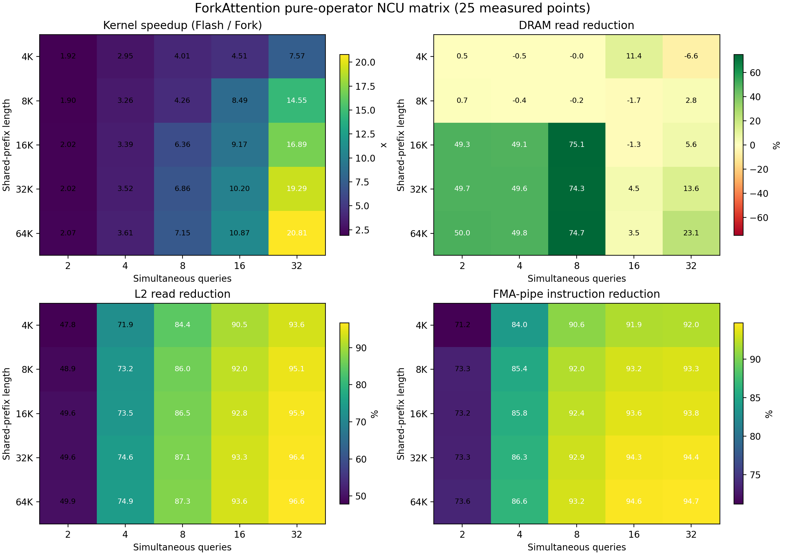
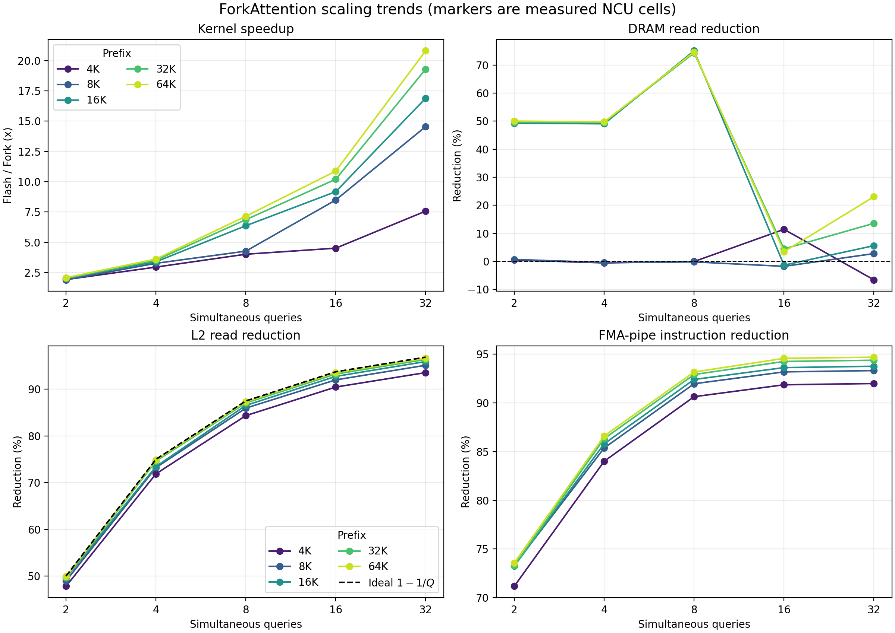

# ForkAttention CUDA Operator Profile

## Status and Scope

This report supersedes the previous single-point Nsight Compute analysis and
the historical two-request tail-kernel sample. The primary evidence is now a
complete 25-cell pure-operator matrix:

- shared prefix: 4K, 8K, 16K, 32K, and 64K tokens;
- simultaneous queries: 2, 4, 8, 16, and 32;
- identical Q, physical paged K/V cache, block tables, sequence lengths, and
  output shape for FlashAttention and ForkAttention;
- actual DRAM, L2, sector, Tensor-pipe, FMA-pipe, and kernel-time counters from
  Nsight Compute.

No model is loaded in this matrix. “Qwen3-0.6B geometry” means only that the
operator inputs use 16 query heads, 8 KV heads, head dimension 128, FP16, and
vLLM's 16-token paged-KV block layout. Model weights, MLP layers, scheduler,
tokenizer, sampling, CUDA Graph replay, and API serving are not involved.

The old matched Nsight Systems result remains useful only as separate
system-level context: in the earlier Qwen3-0.6B service capture, total
attention-kernel time was 1,661.09 ms for Flash and 404.85 ms for Fork, or a
4.10x reduction. It is not mixed into the operator matrix below.

## Executive Result

ForkAttention wins in all 25 operator cells. NCU attention-kernel speedup
ranges from 1.90x to 20.81x and increases consistently with query count and,
for wide cohorts, prefix length.

Across the matrix:

- L2 read traffic falls by 47.8%-96.6%;
- Tensor-pipe warp instructions fall by 86.2%-96.8%;
- FMA-pipe warp instructions fall by 71.2%-94.7%;
- actual DRAM savings depend on Flash's selected kernel and L2 hit behavior;
- at 16K-64K with 2/4/8 queries, Fork reduces DRAM reads by approximately
  50%/50%/75%;
- at 16/32 queries, Flash switches to a single-kernel specialization with over
  92% L2 read-hit rate, so external DRAM savings become smaller even though
  Fork remains 4.51x-20.81x faster and removes 90.5%-96.6% of L2 reads.

The stable mechanism is therefore reduced attention work and reduced on-chip
read traffic. External DRAM bytes are a cache-capacity-dependent consequence,
not a monotonic proxy for ForkAttention performance.

## Visual Summary

The heatmaps retain all 25 measured points. Rows vary shared-prefix length and
columns vary the number of simultaneous queries; every printed value is read
directly from `matrix.csv`, not fitted or interpolated.



Three patterns are immediately visible. Kernel speedup increases toward the
bottom-right as both reusable prefix work and cohort width grow. L2 and FMA
reductions are primarily controlled by query count and form stable vertical
bands. DRAM reduction instead has a regime boundary: it is large for long
prefixes at 2/4/8 queries, but is partly hidden by Flash's high L2 hit rate at
16/32 queries. The diverging DRAM color scale is centered at zero so small
regressions are not visually presented as savings.

The trend plots connect cells only to aid reading; circular markers are the
actual NCU observations. Each colored line is one fixed prefix length. The
dashed black L2 curve is the analytical shared-work limit `1 - 1/Q`, not a
measurement or regression fit.



The nearly overlapping L2 lines and their proximity to the theoretical curve
show that query count determines how much duplicate prefix traffic can be
removed. Prefix length has a stronger effect on absolute time and therefore on
kernel speedup. The discontinuous DRAM curves reinforce why external-memory
traffic must be interpreted together with L2 hit behavior, rather than used as
the sole performance explanation.

## Experimental Setup

### Hardware and Software

| Setting | Value |
|---|---|
| GPU | NVIDIA GeForce RTX 5070, GB206, compute capability 12.0 |
| SM count | 48 |
| L2 capacity | 50,331,648 bytes reported by NCU, approximately 48 MiB |
| GPU memory | 12,337,938,432 bytes, 12,227 MiB reported by `nvidia-smi` |
| Driver | 590.48.01 |
| Host | Linux 6.17.0-19-generic, x86_64 |
| PyTorch | 2.11.0+cu130 |
| PyTorch CUDA runtime | CUDA 13.0 |
| Nsight Compute | 2025.4.1.0, build 37053803 |
| NCU cache control | `all`, the NCU default; controlled cold-cache launch |
| NCU clock control | `base`, the NCU default |
| vLLM base commit | `b5086c8b761e950175b3bcc3bb74d9a10a8154a2` plus local ForkAttention changes |
| Fork build | native `sm_120` CUDA kernels |

Performance-monitor counters were accessible without `sudo`. No privileged
profiling configuration was required.

### Fixed Tensor Geometry

| Input property | Value |
|---|---:|
| Query heads, `H_q` | 16 |
| KV heads, `H_kv` | 8 |
| GQA ratio, `H_q/H_kv` | 2 |
| Head dimension | 128 |
| Q/K/V and output dtype | FP16 |
| Softmax intermediate dtype | FP32 |
| KV block size | 16 tokens |
| Query length | 1 token per request |
| Private suffix | 128 tokens per query |
| Causal masking | enabled |
| Warm-up calls | 5 per backend and metric run |
| Profiled work | exactly one complete decode operator invocation |
| Output-token denominator | query count: one output token per query |
| Random seed | 2026 |
| Correctness tolerance | `atol=2e-2`, `rtol=2e-2`, matching the Fork kernel tests |

For every cell, all query rows reference the same physical prefix pages. Each
query then references its own eight private suffix pages. This is physical KV
sharing, not merely equal tensor contents.

The unique K/V footprint before metadata and outputs is:

```text
bytes_per_KV_token = K/V * H_kv * head_dim * sizeof(FP16)
                   = 2 * 8 * 128 * 2
                   = 4,096 bytes

unique_KV_bytes = (prefix_tokens + query_count * 128) * 4,096
```

For example, the 8K/16 cell contains exactly 40 MiB of unique K/V data. Its
measured cold-cache DRAM reads are about 40.2 MiB for Flash and 40.9 MiB for
Fork, which is consistent with reading the unique footprint once plus
operator metadata and intermediate state.

### Matrix Variables

| Dimension | Values |
|---|---|
| Shared prefix | 4,096; 8,192; 16,384; 32,768; 65,536 tokens |
| Simultaneous queries | 2; 4; 8; 16; 32 |
| Total cells | 25 |

The largest 64K/32 cell allocates roughly 272 MiB of unique K/V data plus Q,
outputs, block tables, and Fork split buffers. It fits comfortably in the
12 GiB GPU and passed the same numerical comparison as every other cell.

### Fork Plan Construction

The microbenchmark uses the same production helpers that choose Fork tile
shape and adaptive prefix chunk size. The policy targets two CTA waves on the
48-SM GPU and preserves the gather kernel's maximum of 32 splits per request.

Each cell below is `shared prefix chunks / maximum splits per query`. The extra
split is the private suffix.

| Prefix | 2 queries | 4 queries | 8 queries | 16 queries | 32 queries |
|---|---:|---:|---:|---:|---:|
| 4K | 10 / 11 | 8 / 9 | 4 / 5 | 2 / 3 | 2 / 3 |
| 8K | 10 / 11 | 8 / 9 | 4 / 5 | 4 / 5 | 4 / 5 |
| 16K | 10 / 11 | 8 / 9 | 8 / 9 | 8 / 9 | 8 / 9 |
| 32K | 10 / 11 | 8 / 9 | 8 / 9 | 8 / 9 | 8 / 9 |
| 64K | 10 / 11 | 8 / 9 | 8 / 9 | 8 / 9 | 8 / 9 |

The maximum observed value is 11 splits, well below the 32-split gather
specialization limit. The 64K points therefore do not rely on an unsupported
or artificially truncated plan.

## Measurement Method

### Correctness and Capture Boundary

Each process performs the following sequence:

1. allocate deterministic Q, K, V, output, block tables, and Fork metadata;
2. invoke Flash and Fork once and synchronize;
3. compare every output element using the stated FP16 tolerance;
4. run five warm-up calls for the selected backend;
5. call `torch.cuda.profiler.start()`;
6. invoke exactly one Flash or Fork operator and synchronize;
7. call `torch.cuda.profiler.stop()`.

NCU uses `--profile-from-start off`, so tensor creation, correctness checking,
warm-up, Python metadata construction, and CUDA initialization are excluded.
The kernel filter includes only `flash_fwd*`, `fork_fwd*`, `gather_kernel`, and
`merge_attn_states_kernel`.

Flash uses one kernel for the measured 16/32-query shapes and split/combine
kernels for the measured 2/4/8-query shapes. Fork uses two split
specializations for shared prefix and private suffix, plus gather when needed.
All kernels belonging to the selected operator are summed.

### Counter Groups

GB206 cannot collect all required counters in one hardware pass. Combining
them would force per-kernel replay and alter cache state. Each cell/backend is
therefore executed in five separate single-pass processes:

| Run | NCU metrics |
|---|---|
| DRAM | `dram__bytes_op_read.sum`, `dram__sectors_op_read.sum` |
| L2 total | `lts__t_sectors_op_read.sum` |
| L2 hit | `lts__t_sectors_op_read_lookup_hit.sum` |
| L2 miss | `lts__t_sectors_op_read_lookup_miss.sum` |
| Instructions | `smsp__inst_executed_pipe_tensor.sum`, `smsp__inst_executed_pipe_fma.sum` |

Every group reports one NCU pass. The aggregator rejects a cell if its five
groups capture different attention-kernel launch counts.

Derived values use:

```text
L2 read bytes = L2 read sectors * 32 bytes/sector
L2 hit rate   = hit sectors / (hit sectors + miss sectors)
bytes/token   = cohort DRAM read bytes / query count
speedup       = summed Flash kernel duration / summed Fork kernel duration
```

Hit, miss, and total sectors come from independent cold-cache invocations. Their
small run-to-run difference is expected; the direct hit-rate counter is
reconstructed from the hit and miss runs rather than averaged per kernel.

## Operator Performance

Each cell is `Flash microseconds / Fork microseconds (speedup)`. Durations are
from the single-pass DRAM counter capture under NCU base clocks; they are not
unprofiled end-to-end latency.

| Prefix | 2 queries | 4 queries | 8 queries | 16 queries | 32 queries |
|---|---:|---:|---:|---:|---:|
| 4K | 72.3 / 37.7 (1.92x) | 115.1 / 39.1 (2.95x) | 223.6 / 55.7 (4.01x) | 453.9 / 100.7 (4.51x) | 891.0 / 117.7 (7.57x) |
| 8K | 121.9 / 64.3 (1.90x) | 214.8 / 65.9 (3.26x) | 412.9 / 96.9 (4.26x) | 881.1 / 103.8 (8.49x) | 1,736.8 / 119.4 (14.55x) |
| 16K | 238.4 / 118.2 (2.02x) | 410.3 / 121.2 (3.39x) | 806.3 / 126.7 (6.36x) | 1,735.7 / 189.2 (9.17x) | 3,432.0 / 203.2 (16.89x) |
| 32K | 458.9 / 226.8 (2.02x) | 800.9 / 227.6 (3.52x) | 1,589.3 / 231.6 (6.86x) | 3,490.3 / 342.2 (10.20x) | 6,841.2 / 354.6 (19.29x) |
| 64K | 905.4 / 436.7 (2.07x) | 1,588.1 / 439.6 (3.61x) | 3,162.0 / 442.4 (7.15x) | 7,042.0 / 647.6 (10.87x) | 13,955.9 / 670.8 (20.81x) |

Three scaling effects are visible:

1. At fixed prefix length, Flash time grows roughly with query count because it
   repeats shared-prefix work. Fork grows much more slowly.
2. At fixed query count, both kernels grow with prefix length, but Fork reads
   and computes the shared portion once per cooperative group.
3. The 16/32-query cells benefit most because the shared work dominates while
   Fork amortizes split/gather overhead across a wide cohort.

## DRAM Read Traffic

Each cell is `Flash MiB / Fork MiB (Fork reduction)`. Positive reduction means
Fork reads fewer bytes; a negative value means Fork's split/gather overhead is
slightly larger than the bytes Flash fetches after L2 reuse.

| Prefix | 2 queries | 4 queries | 8 queries | 16 queries | 32 queries |
|---|---:|---:|---:|---:|---:|
| 4K | 17.3 / 17.2 (+0.5%) | 18.3 / 18.4 (-0.5%) | 20.4 / 20.4 (-0.0%) | 27.8 / 24.7 (+11.4%) | 32.2 / 34.4 (-6.6%) |
| 8K | 33.5 / 33.3 (+0.7%) | 34.2 / 34.4 (-0.4%) | 36.4 / 36.4 (-0.2%) | 40.2 / 40.9 (-1.7%) | 51.1 / 49.7 (+2.8%) |
| 16K | 129.1 / 65.5 (+49.3%) | 130.3 / 66.4 (+49.1%) | 276.1 / 68.7 (+75.1%) | 72.5 / 73.5 (-1.3%) | 87.7 / 82.8 (+5.6%) |
| 32K | 258.2 / 129.9 (+49.7%) | 259.7 / 130.9 (+49.6%) | 518.3 / 133.0 (+74.3%) | 144.1 / 137.6 (+4.5%) | 170.3 / 147.2 (+13.6%) |
| 64K | 515.1 / 257.4 (+50.0%) | 514.6 / 258.5 (+49.8%) | 1,034.4 / 262.0 (+74.7%) | 275.2 / 265.6 (+3.5%) | 381.9 / 293.9 (+23.1%) |

DRAM read bytes per output token provide the same data normalized by the number
of output tokens in the cohort. Each cell is `Flash MiB/token / Fork
MiB/token`.

| Prefix | 2 queries | 4 queries | 8 queries | 16 queries | 32 queries |
|---|---:|---:|---:|---:|---:|
| 4K | 8.67 / 8.62 | 4.56 / 4.59 | 2.55 / 2.56 | 1.74 / 1.54 | 1.01 / 1.07 |
| 8K | 16.76 / 16.65 | 8.56 / 8.59 | 4.54 / 4.55 | 2.51 / 2.55 | 1.60 / 1.55 |
| 16K | 64.56 / 32.73 | 32.59 / 16.59 | 34.51 / 8.59 | 4.53 / 4.59 | 2.74 / 2.59 |
| 32K | 129.08 / 64.94 | 64.92 / 32.72 | 64.78 / 16.63 | 9.01 / 8.60 | 5.32 / 4.60 |
| 64K | 257.54 / 128.72 | 128.64 / 64.62 | 129.30 / 32.74 | 17.20 / 16.60 | 11.94 / 9.18 |

DRAM sectors are exactly the byte counts divided by 32. The complete exact
sector counts, unrounded bytes, and normalized bytes/token for all 25 cells are
preserved in `matrix.csv` and the per-cell JSON summaries.

### Why DRAM Is Non-Monotonic

The unique K/V footprint grows linearly with prefix and private suffix. Flash,
however, does not necessarily fetch every logical read from DRAM:

- At 4K-8K, repeated reads mostly fit in L2. The 8K/16 Flash kernel requests
  520.6 MiB at L2 but reads only 40.2 MiB from DRAM because 92.3% of L2 reads
  hit. Fork requests only 41.6 MiB at L2, but nearly all are compulsory misses,
  so external DRAM is similar.
- At 16K-64K with 2/4/8 queries, Flash uses the measured split/combine path and
  effective L2 reuse is insufficient. The 64K/8 cell reads 1,034.4 MiB from
  DRAM while Fork reads 262.0 MiB, a 74.7% reduction.
- At 16/32 queries, Flash selects a single-kernel specialization and its L2 hit
  rate rises above 92%. This makes external DRAM much lower than the logical
  read volume. Fork still removes the logical reads and computation, but DRAM
  reduction becomes smaller.

The abrupt transition at 16K/8 versus 16K/16 is therefore a real kernel/cache
boundary, not a contradiction or a smooth sequence-length trend.

## L2 Read Traffic and Hit Behavior

Each cell is `Flash MiB / Fork MiB (Fork reduction)` at the L2 read interface.
Unlike DRAM, this metric tracks the repeated read requests before L2 satisfies
them and is monotonic across the matrix.

| Prefix | 2 queries | 4 queries | 8 queries | 16 queries | 32 queries |
|---|---:|---:|---:|---:|---:|
| 4K | 33.6 / 17.5 (47.8%) | 66.6 / 18.7 (71.9%) | 132.8 / 20.8 (84.4%) | 264.7 / 25.2 (90.5%) | 529.0 / 34.0 (93.6%) |
| 8K | 65.7 / 33.5 (48.9%) | 130.6 / 35.0 (73.2%) | 261.9 / 36.8 (86.0%) | 520.6 / 41.6 (92.0%) | 1,041.5 / 50.6 (95.1%) |
| 16K | 130.1 / 65.6 (49.6%) | 259.5 / 68.9 (73.5%) | 517.2 / 69.6 (86.5%) | 1,033.2 / 74.8 (92.8%) | 2,073.8 / 84.2 (95.9%) |
| 32K | 257.7 / 129.8 (49.6%) | 515.0 / 130.8 (74.6%) | 1,032.6 / 133.5 (87.1%) | 2,063.6 / 139.0 (93.3%) | 4,123.5 / 149.0 (96.4%) |
| 64K | 516.2 / 258.8 (49.9%) | 1,029.3 / 258.8 (74.9%) | 2,062.1 / 261.6 (87.3%) | 4,136.6 / 266.5 (93.6%) | 8,248.0 / 276.9 (96.6%) |

The measured reductions approach the ideal shared-work ratios. Ignoring suffix
and overhead, sharing one prefix across `Q` queries predicts `1 - 1/Q`: 50%,
75%, 87.5%, 93.75%, and 96.875% for Q=2/4/8/16/32. The L2 table closely follows
those values, providing direct byte-level evidence for cross-query KV reuse.

L2 read-hit rates are shown as `Flash / Fork`:

| Prefix | 2 queries | 4 queries | 8 queries | 16 queries | 32 queries |
|---|---:|---:|---:|---:|---:|
| 4K | 48.8% / 1.6% | 72.4% / 1.8% | 84.5% / 1.6% | 90.6% / 2.2% | 93.9% / 2.1% |
| 8K | 49.0% / 0.9% | 73.5% / 1.0% | 82.6% / 1.0% | 92.3% / 1.7% | 95.4% / 1.9% |
| 16K | 0.3% / 0.4% | 49.6% / 0.5% | 49.6% / 0.7% | 92.8% / 1.3% | 95.7% / 1.8% |
| 32K | 0.2% / 0.2% | 49.6% / 0.3% | 49.5% / 0.4% | 93.0% / 0.7% | 96.3% / 1.1% |
| 64K | 0.1% / 0.2% | 49.8% / 0.1% | 49.9% / 0.2% | 93.4% / 0.4% | 95.4% / 0.6% |

Fork's low hit rate is expected and positive in this context: it removes the
duplicate requests rather than issuing them and relying on L2 to deduplicate
external traffic. Its remaining reads are primarily compulsory unique reads.

## Tensor and Floating-Point Instructions

Each cell is `Tensor-pipe reduction / FMA-pipe reduction` for Fork relative to
Flash. NCU reports warp instructions, not scalar FLOPs.

| Prefix | 2 queries | 4 queries | 8 queries | 16 queries | 32 queries |
|---|---:|---:|---:|---:|---:|
| 4K | 86.2% / 71.2% | 93.2% / 84.0% | 96.2% / 90.6% | 96.2% / 91.9% | 96.2% / 92.0% |
| 8K | 87.3% / 73.3% | 93.5% / 85.4% | 96.5% / 92.0% | 96.5% / 93.2% | 96.5% / 93.3% |
| 16K | 87.3% / 73.2% | 93.5% / 85.8% | 96.6% / 92.4% | 96.5% / 93.6% | 96.5% / 93.8% |
| 32K | 87.3% / 73.3% | 93.6% / 86.3% | 96.8% / 92.9% | 96.7% / 94.3% | 96.7% / 94.4% |
| 64K | 87.4% / 73.6% | 93.7% / 86.6% | 96.8% / 93.2% | 96.8% / 94.6% | 96.8% / 94.7% |

Instruction reduction is large even where DRAM bytes are flat. This explains
why 8K/16 is 8.49x faster at the operator level despite Fork reading 1.7% more
DRAM in that single capture. Flash's cache hits avoid external memory but do
not eliminate its repeated attention math or on-chip data movement.

## Negative-Benefit Boundary

The main matrix intentionally starts at 4K and two queries. A separate boundary
test forced Fork on smaller or weakly shared shapes to determine when saved KV
work no longer offsets launch, split, gather, and occupancy costs. This is
important because a reduction in bytes or instructions does not by itself
guarantee lower latency.

The first sweep used the same Qwen3-0.6B operator geometry and correctness
check, but varied prefix from 16 to 2,048 tokens and query count from 1 to 32.
Each reported eager time is the median of 15 alternating Flash/Fork repetitions
with 400 operator invocations per repetition after 50 warm-ups. The confirmed
low-query boundary around a 2K prefix is:

| Prefix | Queries | Private suffix | Flash | Fork | Flash/Fork | Fork overhead |
|---:|---:|---:|---:|---:|---:|---:|
| 2K | 1 | 128 | 54.95 us | 74.21 us | 0.740x | +35.0% |
| 2K | 2 | 128 | 65.18 us | 74.54 us | 0.874x | +14.4% |
| 2K | 4 | 128 | 88.41 us | 74.46 us | 1.187x | -15.8% |

The transition is not monotonic in prefix length because the production
adaptive splitter activates at 4K. At 4K it creates additional prefix CTAs and
restores parallelism; the forced q=1/2/4 points measured 3.05x/4.03x/5.22x.

The 2K/q=2 negative point was then captured with the same five-pass NCU method
as the main matrix:

| Metric | Flash | Fork | Fork change |
|---|---:|---:|---:|
| Total attention-kernel time | 44.224 us | 88.512 us | 2.00x slower |
| DRAM read bytes | 9,682,944 | 9,530,624 | 1.6% lower |
| L2 read bytes | 18,431,328 | 9,829,504 | 46.7% lower |
| Tensor-pipe warp instructions | 278,528 | 36,864 | 86.8% lower |
| FMA-pipe warp instructions | 299,288 | 75,160 | 74.9% lower |

The apparent paradox is occupancy. Flash's split kernel launches 96 blocks,
or two waves on this 48-SM GPU, and takes 37.760 us; its combine kernel takes
6.464 us. Fork's main kernel launches only 24 blocks, or 0.25 reported waves,
and takes 85.280 us; gather adds 3.232 us. Fork performs substantially less
logical work but does not expose enough parallelism to use the GPU efficiently.

The current production cascade heuristic rejects fewer than eight queries and
prefixes shorter than 256 tokens. Therefore the clear q=1/2 forced-operator
regressions above do not enter the Fork path in normal serving.

### Low Shared-Fraction Risk

A second sweep kept q=8/16/32 but enlarged the per-query private suffix. With a
256-512-token shared prefix and a 16K-32K private suffix, q=16 repeatedly sat at
the break-even boundary:

| Prefix | Queries | Private suffix | Event Flash/Fork | Fork overhead |
|---:|---:|---:|---:|---:|
| 256 | 16 | 16K | 0.993x | +0.75% |
| 512 | 16 | 16K | 0.994x | +0.60% |
| 256 | 16 | 32K | 0.986x | +1.41% |
| 512 | 16 | 32K | 0.992x | +0.83% |

These small differences must be classified as neutral rather than confirmed
regressions. In a base-clock NCU capture of 256-prefix/q=16/32K-suffix, Flash
took 3,860.512 us and Fork took 3,843.040 us, a 1.005x Fork speedup. The sign
therefore changes across measurement conditions while the magnitude stays
within approximately 1.5% of parity. Neighboring q=8 points were within 0.9%-
4.0% of parity, while q=32 retained a repeatable 7.6%-10.2% advantage.

The practical conclusions are:

1. Keep the current minimum-query guard; lowering it would expose the verified
   low-occupancy regression.
2. Treat a very small shared-prefix fraction as a neutral-risk region, not as
   guaranteed benefit, even when prefix and query-count thresholds pass.
3. A future routing score should include estimated shared work, private work,
   and CTA waves. Prefix length or DRAM bytes alone cannot capture the q=16
   tile/occupancy boundary.
4. No robust negative point was observed for q>=8 under NCU base clocks in this
   limited sweep, but the near-zero margin justifies a conservative fallback
   band if end-to-end tests show additional metadata or scheduling overhead.

## Reliability and Repeatability

All 25 cells passed output validation and all five counter groups captured
matching kernel counts. Three representative cells were captured three times
for DRAM bytes and kernel duration:

| Cell | Backend | DRAM range / mean | Kernel-time range / mean | Mean kernel time |
|---|---|---:|---:|---:|
| 4K / 2 | Flash | 0.83% | 0.88% | 72.52 us |
| 4K / 2 | Fork | 0.10% | 1.37% | 37.39 us |
| 16K / 8 | Flash | 5.83% | 0.31% | 807.88 us |
| 16K / 8 | Fork | 0.12% | 1.61% | 125.55 us |
| 64K / 32 | Flash | 1.79% | 0.32% | 13,982.35 us |
| 64K / 32 | Fork | 6.62% | 1.93% | 662.82 us |

The repeated speedups are approximately 1.94x, 6.43x, and 21.10x, consistent
with the matrix's 1.92x, 6.36x, and 20.81x. Large DRAM conclusions are also
stable in direction: the repeated 16K/8 and 64K/32 means show about 74% and 27%
less DRAM for Fork. Sub-percent DRAM differences in short-prefix cells should
be treated as neutral rather than as a meaningful win or regression.

## Interpretation

### What the Matrix Proves

1. ForkAttention directly removes cross-query shared-prefix work. L2 byte
   reduction follows the theoretical `1 - 1/Q` curve across five prefix
   lengths and five cohort widths.
2. The work reduction includes computation, not only memory. Tensor and FMA
   instruction counts fall sharply at every point.
3. Operator speedup grows with cohort width and shared-prefix length, reaching
   20.81x at 64K/32 under NCU.
4. Actual DRAM savings appear when Flash cannot retain repeated prefix reads in
   L2. Long-prefix 2/4/8-query cells provide direct DRAM-byte evidence.
5. A high Flash L2 hit rate can hide duplicate work from DRAM counters without
   eliminating L2 traffic, instructions, or kernel time.

### What the Matrix Does Not Prove

- It is not an end-to-end model benchmark. There are no weights, MLPs,
  normalization, sampling, scheduler, prefix-cache admission, or API overhead.
- NCU base-clock kernel duration is not production wall time.
- The results apply directly to this attention geometry and data layout. A
  different GQA ratio, head dimension, KV dtype, page size, or GPU cache
  hierarchy can change tile selection and the DRAM boundary.
- Every cell is a simultaneous, perfectly aligned cohort with physically shared
  resident pages. Staggered arrivals, early EOS, preemption, or cache eviction
  reduce the effective query count.
- The capture measures a cold-cache operator invocation. Warm persistent cache
  behavior can reduce external DRAM bytes, especially for Flash, but cannot
  remove the logical L2 and instruction difference already measured here.

### Deployment Implication

The routing signal should be the effective simultaneous cohort and shared
resident prefix, not textual prompt similarity alone. On the evaluated
geometry:

- two queries provide a consistent but modest approximately 2x operator gain;
- four to eight queries move into the 3x-7x region as prefix length grows;
- 16-32 aligned queries provide the strongest 4.5x-20.8x operator gain;
- long prefixes can additionally reduce actual DRAM traffic when the Flash
  working set exceeds effective L2 capacity.

System-level speedup will be lower because non-attention layers and scheduling
remain. The earlier 4.10x all-attention Nsys result and 2.30x end-to-end result
are consistent with this dilution, but they are separate experiments.

## Artifacts and Reproduction

The complete matrix is stored under:

```text
benchmark/results/investigation_20260718/ncu_operator_matrix/
```

Important artifacts:

- `matrix.csv`: one exact aggregated row per matrix cell;
- `p<P>_b<Q>/flash_attn_summary.json`: exact Flash totals;
- `p<P>_b<Q>/fork_attn_summary.json`: exact Fork totals;
- per-metric raw CSV and `.ncu-rep` files in every cell;
- `dram_repeats/` under the three repeated sentinel cells.

Committed negative-boundary aggregates are under
`benchmark/results/investigation_20260718/forkattention_negative/`:

- `short_prefix.csv` and `private_suffix.csv`: the two exploratory sweeps;
- `low_query_confirm.csv` and `long_private_suffix_confirm.csv`: increased-
  repetition confirmation sweeps;
- the Flash/Fork summary JSON files under `ncu_p2048_q2_s128/` and
  `ncu_p256_q16_s32768/`: exact NCU totals for the negative and neutral points.

Raw NCU CSV and `.ncu-rep` files remain local because of their size.

The negative-boundary CUDA Event sweep can be reproduced with:

```bash
vllm/.venv/bin/python \
  benchmark/scripts/benchmark_fork_attention_negative.py \
  --prefixes 1024,2048,4096 \
  --queries 1,2,4 \
  --suffixes 128 \
  --iterations 400 \
  --repeats 15 \
  --output benchmark/results/forkattention_negative.csv
```

The script alternates backend order on every repetition, reports range/median
for both backends, and validates every Fork output against Flash before timing.

Regenerate the committed figures from the exact aggregate without rerunning
NCU:

```bash
vllm/.venv/bin/python \
  benchmark/scripts/plot_fork_attention_ncu_matrix.py \
  benchmark/results/investigation_20260718/ncu_operator_matrix/matrix.csv \
  --output-dir docs/assets/forkattention_operator_profile
```

The plotting script checks that the Cartesian matrix is complete before
drawing. It uses no smoothing, confidence estimator, or omitted points and
writes 200-DPI PNG files.

Run the full matrix from the repository root:

```bash
MATRIX_DIR="$PWD/benchmark/results/ncu_operator_matrix" \
./benchmark/scripts/run_fork_attention_ncu_matrix.sh
```

Override either dimension without editing the scripts:

```bash
PREFIXES=4096,8192,16384,32768,65536 \
QUERY_COUNTS=2,4,8,16,32 \
MATRIX_DIR="$PWD/benchmark/results/ncu_operator_matrix" \
./benchmark/scripts/run_fork_attention_ncu_matrix.sh
```

Run one cell only:

```bash
PREFIX_TOKENS=32768 \
BRANCHES=8 \
PREFIX_CHUNK_TOKENS=0 \
OUTPUT_DIR="$PWD/benchmark/results/ncu_operator_p32768_b8" \
./benchmark/scripts/run_fork_attention_ncu.sh
```

The runner uses `vllm/.venv/bin/python`, invokes the pure Torch operator
workload, exports every raw NCU report, validates per-group launch counts, and
writes JSON and matrix CSV summaries. It does not require a model path.

## Final Conclusion

The new 25-point matrix replaces the old single NCU sample as the primary
operator evidence. ForkAttention's benefit is not inferred from source code or
a logical work model: it is measured directly as lower L2 bytes, fewer memory
sectors, fewer Tensor/FMA instructions, and lower kernel time over five prefix
lengths and five cohort widths.

The most defensible summary is:

> For the Qwen3-0.6B attention geometry on an RTX 5070, ForkAttention reduces
> NCU attention-kernel time by 1.90x-20.81x across a 4K-64K by 2-32 query
> matrix. It removes 47.8%-96.6% of L2 read traffic and 71.2%-96.8% of measured
> math-pipeline instructions. When the Flash working set exceeds effective L2
> capacity, Fork also reduces actual DRAM reads by about 50%-75% in the
> long-prefix 2/4/8-query regimes. At wider cohorts Flash's L2 hit rate can hide
> duplicate reads from DRAM counters, but it does not remove the repeated L2
> traffic, computation, or kernel time.
