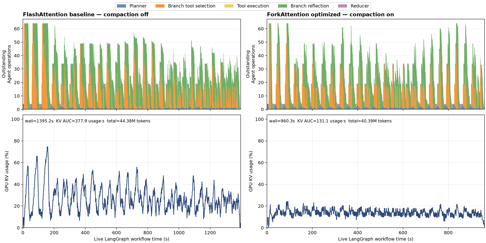
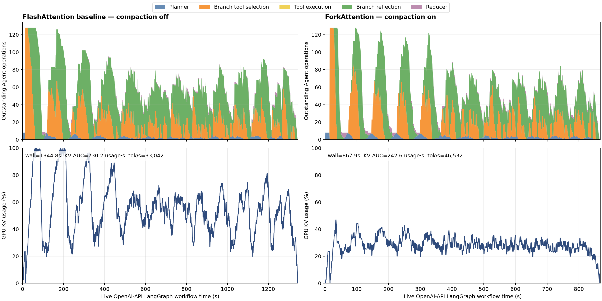

# HotpotQA LangGraph Agentrix End-to-End Experiment

## Scope

This document records the corrected live LangGraph experiment for the
long-prefix ForkAttention workload. It replaces the earlier report based on
resumable in-process sessions.

The measured workflow uses LangGraph `StateGraph` and dynamic `Send`. Every
planner, branch tool-selection, post-tool reflection, and reducer turn is
generated online through the OpenAI-compatible vLLM HTTP server. Tool calls
execute against the HotpotQA candidate paragraphs. No LLM response or request
timing is replayed.

Each LLM turn is an independent HTTP request:

```text
HotpotQA question and candidate paragraphs
  -> case-scoped BM25 bootstrap retrieval
  -> LangGraph planner
  -> StateGraph Send to 16 branches
  -> 16 independent tool-selection requests
  -> local paragraph_search tools
  -> 16 independent reflection requests
  -> StateGraph reducer
```

This request lifecycle matters. A previous diagnostic used
`StreamingAgentSession` to retain each request's KV across the tool boundary.
That path also allowed the Flash baseline to avoid reprefilling the long
prefix and was not equivalent to the original positive OpenAI-API workflow.
Its performance numbers are intentionally not retained in this report.

## Data and Prefix Distribution

The source is the official HotpotQA distractor development split, with
SHA-256:

```text
4e9ecb5c8d3b719f624d66b60f8d56bf227f03914f5f0753d6fa1b359d7104ea
```

The frozen manifest is
[`benchmark/configs/hotpot_agentrix_long_prefix_100.jsonl`](../benchmark/configs/hotpot_agentrix_long_prefix_100.jsonl).
It contains 100 distinct target questions. Each target keeps its official
candidate paragraphs and adds deterministic donor cases as realistic
distractors.

The actual Qwen3 tokenizer measurements for the sibling roots are:

| Item | Value |
|---|---:|
| Cases | 100 distinct cases |
| Shared-root range | 7,871-14,311 tokens |
| Mean shared root | 11,236 tokens |
| Branches per case | 16 |
| Total branches | 1,600 |
| Recorded Agent lifecycle events | 5,100 per arm |

No accuracy result is reported. This experiment studies memory and systems
performance rather than a difficult semantic subset.

## Matched Configuration

The experiment ran on one NVIDIA RTX PRO 6000 Blackwell Server Edition GPU
with Qwen3-14B BF16.

| Setting | Value |
|---|---|
| Model | Qwen3-14B, BF16 |
| Cases / concurrent cases | 100 / 4 |
| Branches per case | 16 |
| Maximum concurrent HTTP requests | 64 |
| Maximum vLLM sequences | 80 |
| Maximum model length | 24,576 tokens |
| Maximum batched tokens | 16,384 |
| GPU memory utilization | 0.9 |
| Prefix caching | enabled in both arms |
| Async scheduling | disabled |
| Artificial tool delay | zero |
| TTL / CPU offload / DP | disabled |
| Repetitions | one complete engine lifetime per arm |

The requested comparison is a full optimized-mode pair:

| Arm | Attention backend | Exact prompt compaction |
|---|---|---|
| Baseline | `FLASH_ATTN` | off |
| Optimized | `FORK_ATTN` | on |

The baseline therefore does not enable compression. Because attention and
compaction change together, the end-to-end result is not presented as a
kernel-only ablation.

ForkAttention used Prefix Forest and CUDA Graph execution with
`common:4,8,12;forest:2048`. The explicit forest plan avoids an unsafe default
estimate that can select a 64-CTA workspace for a runtime forest requiring
more CTAs.

## End-to-End Results

Both arms completed all 100 cases, 1,600 branches, and 5,100 lifecycle events.
Neither server log contains an EngineCore fatal error, CUDA Graph workspace
mismatch, or HTTP 500 response.

| Metric | Flash baseline, no compaction | Fork + compaction | Change |
|---|---:|---:|---:|
| Workflow wall time | 1,395.17 s | 960.27 s | **-31.17% / 1.453x** |
| Total model tokens | 44,384,141 | 40,386,192 | -9.01% |
| Prompt tokens | 44,081,743 | 40,117,888 | -8.99% |
| Completion tokens | 302,398 | 268,304 | -11.27% |
| Total model tokens/s | 31,812.81 | 42,057.34 | **+32.20%** |
| GPU KV usage-seconds | 377.91 | 131.11 | **-65.31%** |
| Time-averaged GPU KV usage | 27.09% | 13.65% | **-13.44 pp / -49.60%** |
| Peak live GPU KV usage | 74.69% | 24.19% | **-50.50 pp / -67.62%** |
| Peak process GPU memory | 89,371 MiB | 89,693 MiB | +322 MiB |
| Maximum running / waiting requests | 64 / 31 | 64 / 31 | equal |

`nvidia-smi` process memory is nearly unchanged because vLLM preallocates its
KV pool. The scheduler's live-KV percentage and its time integral describe the
actual change in KV residency.

The optimized run activated ForkAttention on 9,839 of 11,122 measured engine
steps, or 88.46%, and recorded 326,528 shared plus 687,945 singleton CTA plan
entries. The result is therefore not a silent fallback to FlashAttention.

## Stage Attribution

Prompt compaction removed 15,137,150 repeated tool-result characters. This
explains part of the post-tool improvement and the 9.01% reduction in total
model tokens.

The branch tool-selection phase provides a cleaner ForkAttention signal. It
occurs before tool results exist, so prompt compaction cannot shorten this
phase. Both arms process exactly 18,833,694 prompt tokens; completion-token
volume differs by only 0.46%.

| LLM stage | Flash mean latency | Fork + compaction | Change | Attribution |
|---|---:|---:|---:|---|
| Planner | 11,107.38 ms | 10,798.57 ms | -2.78% | no branch cohort |
| Branch tool selection | 9,938.35 ms | 5,931.82 ms | **-40.31%** | same prompt volume; Fork signal |
| Branch reflection | 17,255.41 ms | 9,202.04 ms | **-46.67%** | Fork + compaction |
| Reducer | 6,876.43 ms | 5,837.72 ms | -15.11% | shorter branch outputs |

The corrected run therefore contains two distinct effects:

- ForkAttention substantially accelerates the same-token sibling cohort
  before compaction applies.
- Exact compaction further shortens post-tool reflection and downstream
  reduction.

The overall 1.453x speedup is the combined optimized-mode result. The
tool-selection row is the strongest evidence that the gain is not merely a
consequence of processing fewer tokens.

## Agent and KV Timeline



The upper lanes show outstanding online LangGraph operations on the same clock
as the lower GPU KV-usage lanes. The complete systems and stage summary is
available in
[`experiment_results/hotpot_langgraph_http_100case_b16_no_ttl_qwen14b_c4.csv`](experiment_results/hotpot_langgraph_http_100case_b16_no_ttl_qwen14b_c4.csv).

Full `run.json` files, server logs, Prometheus snapshots, and memory samples
remain on the experiment server:

```text
/root/autodl-tmp/Agentrix/benchmark/results/
  hotpot_http_100case_b16_no_ttl_qwen14b_c4/
```

Only the compact CSV and rendered timeline are kept in the documentation tree.

## Eight-Case Concurrency Follow-Up

### Purpose and Configuration

The follow-up keeps the same 100 cases, 16 branches per case, Qwen3-14B
model, independent OpenAI-compatible HTTP requests, zero tool delay, and
Flash-uncompressed versus Fork-compacted arms. It changes only the concurrency
limits:

| Setting | Four-case experiment | Eight-case follow-up |
|---|---:|---:|
| Concurrent LangGraph cases | 4 | 8 |
| Maximum concurrent HTTP requests | 64 | 128 |
| Maximum vLLM sequences | 80 | 144 |

Eight different HotpotQA tasks can therefore be mixed in one server batch.
Each task contributes a separate 16-sibling cohort with its own case-specific
root. ForkAttention shares KV reads within a sibling cohort; it does not treat
the eight unrelated roots as one common prefix.

The Flash arm from the original c8 pair was already complete and valid. The
first Fork attempt used the default forest CUDA Graph estimate and terminated
when a runtime forest required 86 CTAs but the selected workspace held only
64. That incomplete attempt is excluded. The corrected Fork arm used
`common:4,8,12;forest:2048`, preserving CUDA Graph execution while holding all
other c8 settings fixed.

### Results

Both corrected arms completed all 100 cases, 1,600 branches, 3,400 online LLM
requests, and 5,100 lifecycle events. Neither completed arm contains an
EngineCore fatal error, workspace mismatch, or HTTP 500 response.

| Metric | Flash baseline, no compaction | Fork + compaction | Change |
|---|---:|---:|---:|
| Workflow wall time | 1,344.81 s | 867.93 s | **-35.46% / 1.549x** |
| Total model tokens | 44,435,458 | 40,386,170 | -9.11% |
| Prompt tokens | 44,132,611 | 40,117,608 | -9.10% |
| Completion tokens | 302,847 | 268,562 | -11.32% |
| Total model tokens/s | 33,042.11 | 46,531.79 | **+40.83%** |
| GPU KV usage-seconds | 730.18 | 242.61 | **-66.77%** |
| Time-averaged GPU KV usage | 54.30% | 27.95% | **-26.34 pp / -48.52%** |
| Peak live GPU KV usage | 100.00% | 46.98% | **-53.02 pp / -53.02%** |
| Peak process GPU memory | 89,735 MiB | 90,129 MiB | +394 MiB |
| Maximum running requests | 128 | 128 | equal |
| Maximum waiting requests | 79 | 84 | +5 |

Prompt compaction removed 15,148,979 repeated tool-result characters. The
optimized arm activated ForkAttention on 4,509 of 5,638 measured engine steps
(80.0%) and recorded 285,706 shared plus 504,098 singleton CTA plan entries.

The same-token tool-selection phase again separates the shared-prefix signal
from compaction. Flash and Fork process 18,833,558 and 18,833,694 prompt
tokens respectively, a difference of only 136 tokens or 0.0007%. Completion
volume differs by 0.53%, while mean latency falls by 35.84%.

| LLM stage | Flash mean latency | Fork + compaction | Change | Attribution |
|---|---:|---:|---:|---|
| Planner | 25,496.23 ms | 19,433.71 ms | -23.78% | queueing; roots are unrelated |
| Branch tool selection | 16,648.69 ms | 10,682.07 ms | **-35.84%** | same token volume; Fork signal |
| Branch reflection | 32,648.03 ms | 17,314.72 ms | **-46.97%** | Fork + compaction |
| Reducer | 11,104.71 ms | 9,173.66 ms | -17.39% | shorter branch outputs |

Compared with the four-case pair, the Flash baseline rises from a 74.69% KV
peak to 100%, while the optimized arm rises from 24.19% to 46.98%. The
end-to-end speedup changes from 1.453x to 1.549x. This is consistent with
greater opportunity at wider concurrency, but each point is a single matched
pair, so the difference between the two speedups is not a confidence-bounded
scaling claim.

### Agent and KV Timeline



The complete two-row systems and stage summary is
[`experiment_results/hotpot_langgraph_http_100case_b16_no_ttl_qwen14b_c8_corrected.csv`](experiment_results/hotpot_langgraph_http_100case_b16_no_ttl_qwen14b_c8_corrected.csv).
The large raw JSON files, server logs, Prometheus data, and memory samples
remain only on the experiment server:

```text
/root/autodl-tmp/Agentrix/benchmark/results/
  hotpot_http_100case_b16_no_ttl_qwen14b_c8_corrected/
```

To reproduce this follow-up, use the two commands in the reproduction section
with `CASE_CONCURRENCY=8`, `CONCURRENCY=128`, `MAX_NUM_SEQS=144`, and a
separate c8 output root. The Fork arm must retain the explicit
`forest:2048` capture plan.

## Limits

- This is one matched pair, not a repeated-run confidence interval.
- The comparison intentionally changes both ForkAttention and prompt
  compaction, so 1.453x is not a pure kernel speedup.
- TTL, offload, and DP are disabled. This run does not measure KV recovery or
  CPU-to-GPU transfer overhead.
- No task-accuracy claim is made.
- Case concurrency is four. Higher independent-request concurrency needs a
  sufficiently large forest CUDA Graph plan.

## Reproduction

Run the Flash baseline without compaction:

```bash
MODEL_PATH=/root/autodl-tmp/models/Qwen3-14B \
HOTPOT_PATH=/root/autodl-tmp/data/HotpotQA/hotpot_dev_distractor_v1.json \
HOTPOT_CASE_FILE="$PWD/benchmark/configs/hotpot_agentrix_long_prefix_100.jsonl" \
OUTPUT_ROOT="$PWD/benchmark/results/hotpot_http_100case_b16_no_ttl_qwen14b_c4" \
VARIANTS=baseline PROMPT_COMPACTION=0 \
CASES=100 CASE_CONCURRENCY=4 HOTPOT_BRANCHES=16 CONCURRENCY=64 \
MAX_NUM_SEQS=80 MAX_MODEL_LEN=24576 MAX_NUM_BATCHED_TOKENS=16384 \
GPU_MEMORY_UTILIZATION=0.9 \
bash benchmark/scripts/run_hotpot_agentrix_e2e.sh
```

Run the optimized arm with the same workload:

```bash
MODEL_PATH=/root/autodl-tmp/models/Qwen3-14B \
HOTPOT_PATH=/root/autodl-tmp/data/HotpotQA/hotpot_dev_distractor_v1.json \
HOTPOT_CASE_FILE="$PWD/benchmark/configs/hotpot_agentrix_long_prefix_100.jsonl" \
OUTPUT_ROOT="$PWD/benchmark/results/hotpot_http_100case_b16_no_ttl_qwen14b_c4" \
VARIANTS=forkattention PROMPT_COMPACTION=1 \
CASES=100 CASE_CONCURRENCY=4 HOTPOT_BRANCHES=16 CONCURRENCY=64 \
MAX_NUM_SEQS=80 MAX_MODEL_LEN=24576 MAX_NUM_BATCHED_TOKENS=16384 \
GPU_MEMORY_UTILIZATION=0.9 \
VLLM_FORK_ATTN_CUDAGRAPH_CAPTURE_BUCKETS='common:4,8,12;forest:2048' \
bash benchmark/scripts/run_hotpot_agentrix_e2e.sh
```

Generate the compact summary and timeline from the remote raw result:

```bash
benchmark/.venv/bin/python benchmark/scripts/plot_hotpot_http_pair.py \
  --root \
  benchmark/results/hotpot_http_100case_b16_no_ttl_qwen14b_c4
```
