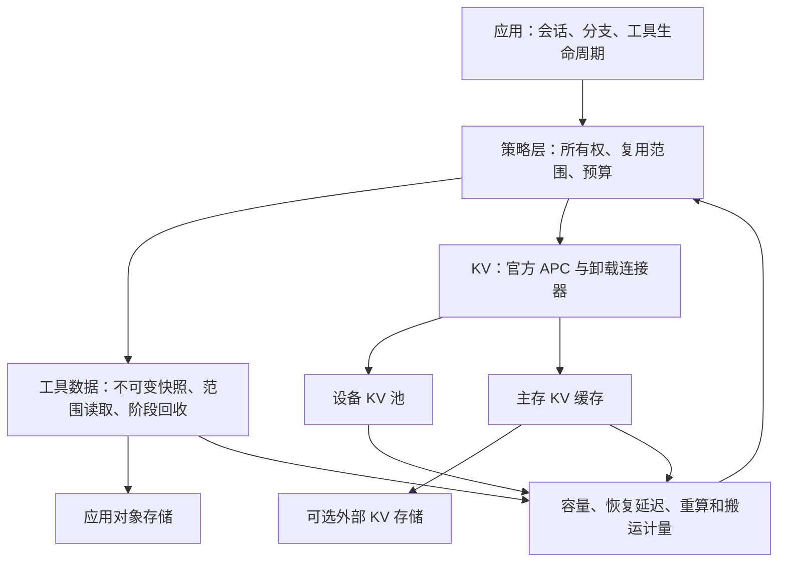

# KV 内存管理：设计、状态与验证边界

跨平台收益与负结果的总表见 [优化现状](README.md)。本文区分活动 KV、可回收缓存、
预分配设备内存与主机工具数据；数字不能合并成统一的“显存节省”。

2026-10-02 路由增量复核：官方 consistent_hash 之上的首次放置负载感知候选
完成双 Ascend 四轮文档 QA、136 次问答；延迟一退一进，本地 prompt 计算量
分别增加 3.07% / 0.62%，未证明内存收益。已撤下候选补丁和实验开关，继续
使用官方策略；这不推翻之前官方文档亲和路由相对原生 DP 的缓存复用收益。
配置、关键结果与边界见 [DP 路由记录](dp_routing.md)。

同日官方 consistent_hash + FIA ForkAttention 联合对照已完成八轮、272 次
问答。4K 门槛、eager、7K–15K 文档下，同文档并发组两卡均触发共享计算，但
整批耗时增加 8.78% / 9.23%，prompt 计算量不变，双卡 HBM 采样峰值增加
713–722 MiB（含无共享分轮组）。未建立内存或整体延迟收益，不采用该配置为
默认优化；输出量存在差异，不能把总耗时变化作为纯算子退化幅度。完整限制见
[联合对照记录](dp_routing.md)。

2026-10-03 长前缀、多分支扫描已完成：216 个计时批次、2016 个正式请求，
1008 次配对输出 token 哈希一致、零抢占。每请求固定 64 个输出 token。
**ACLGraph 下出现受控负载的延迟收益**：32K 共享前缀、每卡 8 分支，整批耗时
降低 6.80% / 6.23%；64K、每卡 4 分支降低 7.46% / 9.38%，每卡 8 分支降低
8.65% / 14.32%。两种顺序各一次服务、每形状三次连续测量；不是官方 AgentX。
代价是双卡 HBM 采样峰值增加 **759 MiB（约 0.74 GiB）**，prompt 计算量不变，
未建立设备或主存容量收益。eager 未建立跨顺序一致的整批加速。FIA 保持显式
实验启用，完整矩阵与限制见 [长前缀扫描](dp_routing.md)。

## 内存优化的验收与下一步（2026-09-28）

### 官方会话路由之上的内存管理探索（2026-10-01）

最初完成源码与部署能力核对；随后完成的双卡实测见下一节。
保留官方 `consistent_hash`，不重写路由策略。需要先修正一个设计前提：
普通 HTTP 推理结束后，`KVCacheManager.free()` 释放请求引用，
`BlockPool.free_blocks()` 将无引用块放回可分配队列；块仍可能带有有效前缀。
因此“工具开始时再次释放缓存”通常不增加可用块，反而可能损失本地命中。
异步传输的引用和完成栅栏另算，不能绕过连接器直接回收。

[官方 AgentX 博客的未来工作](https://vllm.ai/blog/2026-09-08-vllm-agentx#the-path-ahead-planned-optimizations-and-future-work)
支持利用生命周期提示指导保留、淘汰和预取。
[官方 Router 主线文档](https://github.com/vllm-project/router/blob/main/docs/program_scheduling.md)
已有 Program scheduling、会话绑定和 Progress-TTL，但明确区分逻辑准入与物理
KV 操作：该功能本身不执行卸载、淘汰或预取。不能另写一套相同准入机制，
也不能把 Router 的逻辑容量释放报告成 HBM 释放。

部署能力探测确认：当前实验固定的 `vllm-router==0.1.15` CLI 没有
`--enable-program-scheduling` 和 `--program-scheduling-config-json`。
因此主线文档不能直接当作当前二进制可用功能；若评估主线能力，须先固定源码
提交和隔离构建，再以同一版本的绑定组隔离版本变化。当前版本保持不变。
探测结果保存在服务器 `${RESULTS_DIR}/lifecycle-capability-probe.json`。

首选验证目标是 **会话归属固定时的选择性 CPU 备份及按需恢复**：

| 组别 | Router | KV 管理 | 用途 |
| --- | --- | --- | --- |
| A | 官方 consistent_hash | 原生 APC | 测量设备缓存受压后的重算 |
| B | 与 A 相同 | 官方 CPU offload、默认备份 | 测量 CPU 分层的收益及成本 |
| C | 与 A 相同 | 与 B 相同预算，已知终止请求设 max_offload_tokens=0 | 测量生命周期提示的增量 |

三组保持输入、输出预算、会话归属、工具等待时间和请求依赖相同。逐档改变
设备 KV 预算及会话数，短工具等待与长工具等待分开；提示只来自派发时已知的
应用状态，不从未来轨迹反推。先使用正确性已验证的混合状态边界，再补任意
边界的回归。压力通过正常请求产生，正式计时期间禁止全局 reset 制造驱逐。
保持 token-ID 输出一致，统计每个 DP rank 的命中、重算、抢占、读写字节，
以及端到端完成时间、恢复 P95 和排队时间。必须计入每副本 CPU 预算之和。

同等预算下提高可承载会话数，或相同恢复延迟约束下减少设备 KV 预算，才算
容量收益；减少 CPU 写入另列，不能算作设备内存下降。固定预算下没有压力时，
应验证不退化。若 C 相比 B 无收益，则不加入额外策略。

随后才考虑工具等待预测和预取：需要绑定到准确的副本、会话代次、前缀哈希及
混合缓存边界；引擎必须报告操作完成后才能更新缓存驻留记录。CPU 备份未完成
时不强制淘汰，预取不得无界占用设备块，预测错误须可取消或退回正常按需恢复。
当前没有该物理控制闭环，不启动名义上的“预取”实验，也不以全局缓存清理代替
会话级操作。保留前缀的所有权要覆盖分支共享，某分支结束不能删除其他分支仍
需使用的缓存。以上为待验证设计，不是新增已实现能力或原创性结论。

### Ascend 双卡会话路由与分层 KV 实测（2026-10-01）

已完成官方 `consistent_hash` 与选择性 CPU 备份的组合验证。Qwen3.5-9B BF16、
双 910B2、DP=2/TP=1、router 0.1.15、eager 同步调度、Mamba align；
最大上下文 16384、最大序列数 8、批次 token 上限 8192。
每轮先准备 8 个待恢复会话，插入 16 个应用已知不会再访问的终止请求，再恢复
原 8 个会话；输入均为 8193 token，输出 8 token，稳定会话 ID 不随组别改变。
两 seed、每 seed 两轮，共 16 个单元、32 轮、1024 个请求及 256 次恢复。

| 每卡设备 KV | 策略 | 每卡 CPU 预算 | 恢复平均 TTFT（ms） | 恢复 P95（ms） |
| --- | --- | --- | ---: | ---: |
| 1 GiB | APC | 0 | 772.96 | 793.17 |
| 1 GiB | 普通 CPU 备份 | 2 GiB | 768.68 | 775.14 |
| 1 GiB | 选择性 CPU 备份 | 2 GiB | **152.13** | **160.35** |
| 2 GiB | APC | 0 | 767.11 | 776.33 |
| 2 GiB | 普通 CPU 备份 | 2 GiB | 795.32 | 818.59 |
| 2 GiB | 选择性 CPU 备份 | 2 GiB | 185.38 | 213.88 |
| 4 GiB | APC | 0 | 769.15 | 781.28 |
| 8 GiB | APC，缓存充足参照 | 0 | **134.83** | **147.56** |

1 GiB 选择性组相对同预算普通备份，平均恢复 TTFT 降低 **80.21%**。
每个配置的四轮中，终止请求累计 CPU 写入从 **20,476,592,128 字节降到零**，
恢复重算从 **262,176 token 降到 32 token**；选择性组实际从 CPU 读回
**10,238,296,064 字节**。这验证了避免无复用请求挤占 CPU 缓存的作用。

1、2、4 GiB APC 在本轨迹下都未保住恢复前缀，因此追加 8 GiB APC，确认其
恢复命中本地缓存。相对这个缓存充足参照，1 GiB 选择性组的设备 KV 预算
降低 **87.5%**；双卡 HBM 观测峰值由 **61,814 MiB 降至 47,454 MiB**，
少 **14.02 GiB（23.23%）**，代价是总计 **4 GiB CPU 缓存预算**。
恢复平均延迟增加 **17.30 ms**，P95 增加 **12.79 ms**；每轮总耗时分别为
47.46 与 47.51 秒。1 GiB 是本轮最小已测预算，不能称为最小可用预算。
HBM 为每 5 秒的板卡采样峰值，可能漏掉瞬时峰值，不等于分配器精确高水位。

所有组输入计划一致，**960 次跨轮/跨组生成 token 比较全部一致**，零抢占。
普通备份与选择性备份在两个 seed 中反转执行顺序；预算组的执行顺序固定，
不将不同预算间的小幅速度差异归因于池大小。APC 入口曾错误要求 reset 外部
缓存，已改为只 reset 设备缓存并补回归；该失败未产生有效请求，保留在服务器。
退出时的进程归属采样竞态也已修正：仅接受最近 10 秒确认属于控制器的 worker，
未识别进程仍拒绝汇总。失败现场、脚本版本和补测前结果均保留。

应用入口为 `agentrix_application.session_kv.session_kv_options`：默认只设置
官方 `X-Session-ID`，显式 `terminal=True` 才添加官方零备份上限。未知复用、
工具等待及仍有共享前缀使用者的分支，不能仅凭当前轮结束就标记为 terminal。
这是官方机制的接入与适配验证，不是新的哈希路由或淘汰算法。

本轮是相同输入恢复的顺序压力实验，未测增长上下文、多会话并发容量、自动
工具等待迁移/预取或官方 AgentX；未将该配置设为生产默认。Mamba 任意边界
仍受下方旧版运行时限制，不能从 8193-token 结果推导所有上下文长度都有收益。
复现脚本和校验入口见 [benchmark 说明](../benchmark/README.md#controlled-kv-lifecycle-probe)。
原始产物仅在服务器 `${RESULTS_DIR}/dp-kv-lifecycle-20261001/`，
以 `validated-summary.json`、`closeout.json` 和源文件 manifest 为索引。
全部实验服务已退出，双卡恢复空闲；本地仅保留代码、复现说明和关键数据。
最终相关回归共 55 项通过，覆盖请求身份与终止提示、逐卡统计、APC reset、
结果完整性与输出差异拒绝、板卡采样归属和旧版 usage 兼容；新增代码静态检查
及差异空白检查通过。应用接入保持显式启用，未修改默认引擎策略。

### 官方 AgentX 分层缓存对照（2026-10-01，已完成）

已完成官方 harness `56a0cf70f4c0359454ee4bd15a17770b541a3e3e` 的
`inferencex-agentx-mvp`，数据集 `semianalysis_cc_traces_weka_062126`。
双 910B2、Qwen3.5-9B BF16、DP2/TP1、eager、同步调度、Mamba `align`，
统一官方 `consistent_hash` 与会话 header；上下文上限 131072、并发 8、
每卡最大序列 16、batch token budget 8192。每轮重启引擎及路由，正式阶段
900 秒、收尾 300 秒；两个 seed 反转三组配置的执行顺序，共六轮。

| 配置 | 每卡设备 KV 池 | 每卡 CPU 备份池 |
| --- | ---: | ---: |
| APC | 8 GiB | 无 |
| APC + CPU offload | 8 GiB | 8 GiB |
| 较大 APC | 16 GiB | 无 |

同容量比较检查 CPU 分层缓存能否减少重算；较大 APC 组提供显存与延迟的
对照。统计官方有效性、完成/错误/收尾取消、TTFT、吞吐、缓存命中、抢占、
搬运计数和板卡显存采样。报告不通过有效性校验时停止矩阵并保留现场。
六轮均 `submission_valid=true`，正式请求合计 213 个，请求错误和收尾取消均为
0。控制器已完成退出，双卡无运行进程。关键结果如下（吞吐采用官方报告口径）：

| Seed | 每卡配置 | 完成请求 | 平均 TTFT / P95（秒） | 输出吞吐（token/s） | 缓存读取比例 |
| --- | --- | ---: | ---: | ---: | ---: |
| 20260707 | 8 GiB APC | 47 | 2.587 / 11.427 | 13.367 | 89.59% |
| 20260707 | 8 GiB APC + 8 GiB CPU | 47 | 2.082 / 11.129 | 13.367 | 95.25% |
| 20260707 | 16 GiB APC | 47 | 1.927 / 9.974 | 13.367 | 96.96% |
| 20260708 | 8 GiB APC | 25 | 1.858 / 7.833 | 13.302 | 86.88% |
| 20260708 | 8 GiB APC + 8 GiB CPU | 23 | 2.481 / 11.172 | 10.918 | 81.36% |
| 20260708 | 16 GiB APC | 24 | 1.694 / 5.449 | 12.007 | 91.01% |

同为 8 GiB 设备缓存，CPU 备份组在第一个 seed 平均 TTFT 降低 19.51%，
吞吐基本相同；第二个 seed 平均 TTFT 增加 33.56%，输出吞吐降低 17.92%，
并少完成两个请求。第二个 seed 的完成请求集合不等长，不能把汇总延迟差异
解释为逐请求等量工作的纯速度差。第一个 seed 的 CPU 组在包含预热的指标
采样窗口内发生 1 次抢占，其余五组为 0。

**结论：当前无提示的 CPU 分层配置未建立跨 seed 的稳定端到端收益，保持
实验性，不设为默认，也不声称等效替代 16 GiB APC。** 较小设备池预算本身
不等于满足同样延迟/完成量要求的内存优化；板卡采样和搬运细项见下方补充分析。
这些结果也不推翻前述显式终止提示在受控压力实验中的收益，二者负载与提示
条件不同。完整汇总保存在服务器 `aggregate-summary.json`。

资源补充分析已完成；下列计数覆盖预热、正式阶段与收尾，不能与仅正式阶段的
报告分母混用。HBM 为约 5 秒间隔的双卡板卡总量采样峰值，非分配器精确峰值；
采样验证了进程归属，每组有 234–251 个有效样本。

| Seed | 每卡配置 | 双卡 HBM 峰值（MiB） | 本地计算 prompt token | 外部恢复 token |
| --- | --- | ---: | ---: | ---: |
| 20260707 | 8 GiB APC | 61880 | 1324261 | 0 |
| 20260707 | 8 GiB APC + 8 GiB CPU | 61920 | 1048790 | 344064 |
| 20260707 | 16 GiB APC | 78240 | 937315 | 0 |
| 20260708 | 8 GiB APC | 61872 | 1014855 | 0 |
| 20260708 | 8 GiB APC + 8 GiB CPU | 61890 | 1096765 | 44032 |
| 20260708 | 16 GiB APC | 78232 | 920173 | 0 |

CPU 组相对 16 GiB APC 的双卡观测峰值降低 15.94 / 15.96 GiB，但纯 8 GiB
APC 也具有同样的低显存水平，不能把减小设备池的全部效果归因于 CPU 备份。
CPU 组两个 seed 分别写出 40.05 / 38.95 GiB，读回 13.68 / 1.39 GiB。
这些是累计流量，**不是 CPU 驻留占用或缓存命中率**。第一个 seed 本地计算量
减少，第二个 seed 在完成请求更少的情况下仍有更多本地计算；是否因 CPU
缓存容量不足或混合状态恢复边界导致，当前证据不足。

因此确认的是可量化的设备内存与延迟交换，而非等效服务能力下的容量收益。
CPU 配置预算为双卡合计 16 GiB，历史采样未记录主存 PSS，不能声称总物理内存
节省。服务器 `memory-summary.json` 保存资源核算；复现工具为
`benchmark/scripts/summarize_agentx_memory.py`。

后续 CPU 容量诊断已启动：设备池固定每卡 8 GiB，对比每卡 CPU 8 / 16 GiB，
两个 seed 反转顺序共四轮，其他官方 AgentX 参数不变，复跑小 CPU 基线。
增补进程树 PSS/USS 采样（包含模型与 harness，不等同于 CPU KV），用于衡量
增加主存能否改善恢复与延迟。目前无新结果，不增加引擎策略或宣称新优化。
产物仅在服务器 `${RESULTS_DIR}/agentx-cpu-capacity-20261001/`。


首轮在数据集配置阶段因官方离线 tokenizer 加载器将本地目录按 Hub 仓库名
解析而失败，未发送推理请求。重跑仅在客户端取消 Hub/Transformers 离线开关，
继续使用同一本地 tokenizer 和缓存数据集；新增 tokenizer 与 harness 导入路径
预检，在占用设备前发现此类配置错误。原失败记录保留，未修改官方 harness。

本轮不注入 `terminal` 或 checkpoint 提示。官方 trace 的 `end_turn` 或子代理
结束信息不足以保证共享前缀以后不再使用；不能读取未来请求来冒充在线提示。
因此本轮验证官方分层缓存路径，**不构成选择性备份提示的端到端验证**。
原始配置、逐请求数据、日志和进度仅在服务器
`${RESULTS_DIR}/agentx-kv-dp-20261001/`；复现入口为
`benchmark/scripts/run_agentx_kv_comparison.py`。

吞吐提升不是保留优化的必要条件。正确性通过后，若同等负载和延迟要求下需要的
GPU KV 池更小，或同等容量下可承载更多会话，或 CPU 缓存有效占用、搬运量及
重算量下降，均可作为独立收益；同时报告延迟和其他资源的代价。
预先固定比较条件，不用缩短上下文、少完成请求或增加未计入的主机内存制造收益。

| 指标 | 测量与判定 |
| --- | --- |
| GPU 活跃占用 | 非空、不可回收物理块的峰值和占用时间积分；共享页只计一次，传输临时引用单列 |
| 可回收前缀缓存 | 有效缓存块数、混合状态对应的可恢复边界和淘汰后的重算量；与活跃占用分开 |
| 实际设备内存 | 固定工作量和延迟要求，逐档缩小 KV 池，记录可用的最小配置及板卡峰值；固定池内释放不等于 HBM 归还 |
| CPU 缓存与搬运 | 已预留内存、有效缓存载荷、传输中固定页、读写字节及恢复耗时分别统计；减少写入不等于 RSS 自动下降 |
| 容量与服务质量 | 固定池下完成的会话数、错误、抢占、P95 恢复 TTFT 和任务完成延迟；吞吐同时报告 |

此前 checkpoint 四轮回放固定 40 GiB KV 池，板卡峰值基本相同，正式命中未增加。
这些结果没有证明内存收益，也没有测出最小可用 KV 池或容量曲线；不能仅根据吞吐
无提升就断言所有内存指标无收益。新增 checkpoint 入口保持撤回状态，等待独立证据
才重新评估。此前补查原始 KV 时间序列时连接超时，恢复连接后又遇到设备占用。
2026-09-29 已在空闲 H100 上继续执行混合缓存往返和容量对照，见下方实测小节；
新增结果不改变已撤回 checkpoint 的结论。

### 优先复用官方选择性卸载

源码核对发现以下现成能力，沿用固定官方基线 `2cf0a6915c` 的连接器与管理器。
本轮仅修复部分尾块未遵守备份上限的问题，见下节；不恢复历史私有管理器：

- `OffloadingConnector` 已有 CPU 备份、按需恢复及 Mamba/Attention 混合分组与
  边界处理。Qwen3.5-9B 的硬件往返已验证，下方独立报告内存和延迟。
- 请求的 `kv_transfer_params.max_offload_tokens` 已能限制写入 CPU 的前缀长度；
  设为零跳过本请求的新备份，省略保持原有策略。它不会删除已有副本、关闭 CPU
  命中读取或主动释放 GPU 显存。详见
  [官方选择性卸载说明](https://docs.vllm.ai/en/latest/features/kv_offloading_usage/#per-request-selective-offload)。
- 官方 `ReqContext` 会传递请求的 `kv_transfer_params`，并有请求开始、结束等
  生命周期回调。博客中的工具时长提示和工具返回前预取尚未在当前组合接通，
  不能将该基础接口当作完整 Agent Hints 实现。

现有选择性卸载、零上限和仅 prompt 备份的五项调度单元测试通过，覆盖同步及
异步调度路径。这只验证任务选择行为，不是实际数据搬运或内存收益的测量。

普通 HTTP 请求完成后，调度器已经释放请求的 KV 引用；无其他使用者的缓存块
仍可命中，但允许后续分配覆盖。因而这一负载下再做一次 trim 通常没有额外容量。
内存方向应先验证：把可复用前缀保存在 CPU 后，能否缩小 GPU KV 池且维持恢复
延迟；再用派发请求时已知的复用范围、会话生命周期等提示减少无效备份。
工具等待期间的主动迁移、提前恢复与选择性备份是不同能力，需分别验证。

本轮对照使用 Qwen3.5-9B、相同输入和会话计划、相同调度及 attention 后端：

1. 原生 APC，无 CPU 卸载。
2. 同一 GPU KV 池，启用官方 CPU 卸载，记录额外 CPU 预算。
3. 与第二组相同的 GPU/CPU 预算，用官方字段限制已知不会复用的备份范围。

先做混合状态正确性和缓存压力检查，再逐档扫描 KV 池与会话数。提示只能使用
当时可获得的信息；离线未来轨迹的上限实验另列，不能冒充在线策略。
第二组对第一组衡量分层缓存的收益和 CPU 成本，第三组对第二组衡量提示的增量。
首轮采用按需恢复；工具返回前预取需要独立预算，避免过早恢复挤占活跃会话空间。
应用工具结果外置会改变模型输入，继续作为另一类实验，不混入官方 AgentX 回放。
vLLM 通用 CPU offload worker 限于 CUDA/ROCm/XPU；Ascend 插件另有官方 NPU
实现，须使用与运行时匹配的插件配置，见下节。CUDA 容量对照单独报告，
不与应用工具结果外置或此前 checkpoint 实验合并归因。

### 选择性备份边界修复与验证入口

混合缓存的部分尾块备份使用 `max_offload_tokens or prompt_tokens` 判断上限，
使零上限退回到完整 prompt；正数上限低于尾块边界时又会触发断言。
本轮复用连接器已有的 `_calc_num_offloadable_tokens`，跳过超出范围的尾块，
不申请传输作业或 CPU 存储。读取已有 CPU 副本仍然允许。此项是官方路径的
正确性修复，不是新的淘汰算法，也没有测出的设备内存或模型性能收益。

新增用例在修复前复现三个失败；修复后调度与配置套件 167 项通过，随后增加
零上限仍允许恢复的检查，部分尾块相关 9 项通过。覆盖零、较小正数、边界相等
及未设上限，尚未用实际 Qwen3.5 混合状态搬运验证。

`benchmark/scripts/benchmark_agent_kv_tiering.py` 使用官方接口准备两类对照：

- `roundtrip`：冷请求备份后只清设备前缀缓存，保留外部副本，再恢复相同输入。
  检查实际 CPU 写入/读回字节、本地缓存未命中以及恢复前后生成 token IDs 一致。
- `pressure`：保留会话之间插入应用预先声明不会再访问的终止请求；仅在
  `selective` 组为这些请求设置 `max_offload_tokens=0`。输入计划哈希一致，
  分阶段记录写入、读回、重算、本地命中和恢复延迟。

脚本先等待 prompt 来源统计覆盖全部已完成输入，并等待计数稳定后取差值；
这不是通用的传输完成栅栏。强制往返另外以成功的设备缓存 reset 检查引用释放。
缺少统计、计数重置、未发生卸载、输出不一致或终止请求仍写入均拒绝有效结果。
脚本最初的 17 项单元检查通过；硬件首跑发现卸载计数器在首次搬运后才注册，
已修正启动时的检查，仍在请求执行后强制验证实际读写，补充后 18 项检查通过。
这是受控顺序负载，不是官方 AgentX，也不评估任务质量。
压力组仍需确认设备缓存确实受压；单次结果不能证明更小 KV 池或更高会话容量。

2026-09-28 在 H100 上准备独立运行目录，启动前检查到设备被占用，未启动模型，
没有终止其他任务，也没有留下自动抢占空闲窗口的后台启动程序。
源码、补丁、配置和验证记录仅保存在服务器
`${EXPERIMENT_DIR}/agent-kv-tiering-h100-20260928/`；后续三组使用相同设备池，
两个卸载组使用相同 CPU 预算，再扫描池容量。复现命令见
[benchmark 说明](../benchmark/README.md#controlled-kv-lifecycle-probe)。

### H100 混合 KV 选择性备份实测（2026-09-29）

设备空闲后继续执行。Qwen3.5-9B BF16、FlashAttention 3、eager、同步调度，
`max_model_len=16384`、`max_num_seqs=8`、`max_num_batched_tokens=8192`、
Mamba `align`、原生 APC；卸载使用官方 `OffloadingConnector`、LRU 和
2 GiB CPU 预算。运行时包含上述部分尾块上限修复，没有接回历史私有管理器。

先完成硬件往返：8,192-token 冷请求备份后只清 GPU 缓存，从 CPU 读回
296.625 MiB，恢复 7,920 token，只重算尾部 272 token；16 个生成 token
与冷启动逐个相同，本地缓存命中为零。物理块为 528 token。这验证了该路径
混合状态恢复后的输出，不能推广为任意输入的任务质量评测。

压力负载为四个保留会话、八个独立终止请求，再恢复四个会话；每个 prompt
8,192 token、固定输出 16 token。终止属性由应用在派发时声明，只有选择性组
为这些请求设置 `max_offload_tokens=0`。两个 seed，各三轮，交换两种策略的
执行顺序；每轮清空 GPU/CPU 缓存，跨组核对输入计划和生成 token IDs。

| 同为 2 GiB GPU + 2 GiB CPU | 官方默认卸载 | 选择性备份 |
| --- | ---: | ---: |
| 恢复请求数 | 24 | 24 |
| 平均恢复 TTFT | 460.96 ms | 136.90 ms |
| P95 恢复 TTFT | 475.34 ms | 163.59 ms |
| 恢复重算 token，总计 | 196,608 | 6,528 |
| 终止请求 CPU 写入，每轮 | 2.317 GiB | 0 |
| 恢复 CPU 读回，每轮 | 0 | 1.159 GiB |
| 板卡显存采样峰值 | 21,904.56 MiB | 21,904.56 MiB |

默认卸载在压力后无法读回这些会话；选择性备份保留可复用副本，重算量下降
96.68%，平均恢复 TTFT 下降 70.30%。这是使用官方请求字段减少缓存污染的
应用策略收益，不是新增 CPU 淘汰算法。固定 2 GiB 设备池时显存峰值没有下降。
容量扫描继续以恢复 P95 不超过 300 ms、所有输出一致为门槛，额外 CPU 预算
单列；此顺序负载不测最大同时活跃请求数，也不是官方 AgentX。

恢复连接后核验容量矩阵全部完成：八种配置、两个 seed、各三轮，共 768 个
请求、192 次恢复。跨组输入计划和全部生成 token 一致，采样期间各组设备独占，
无采样错误、无抢占。两种卸载策略各使用 2 GiB CPU 预算，APC 不使用 CPU KV 池：

| GPU KV 池 / 策略 | 恢复平均 TTFT | 恢复 P95 TTFT | 板卡显存采样峰值 | 300 ms 门槛 |
| --- | ---: | ---: | ---: | --- |
| 2 GiB / 默认卸载 | 460.96 ms | 475.34 ms | 21,904.56 MiB | 未通过 |
| 2 GiB / 选择性备份 | 136.90 ms | 163.59 ms | 21,904.56 MiB | 通过 |
| 1 GiB / 默认卸载 | 459.66 ms | 468.37 ms | 20,944.56 MiB | 未通过 |
| 1 GiB / 选择性备份 | 139.60 ms | 164.20 ms | 20,944.56 MiB | 通过 |
| 0.75 GiB / 默认卸载 | 464.50 ms | 479.16 ms | 20,688.56 MiB | 未通过 |
| 0.75 GiB / 选择性备份 | 139.51 ms | 167.27 ms | 20,688.56 MiB | 通过 |
| 2 GiB / 无卸载 APC | 459.06 ms | 494.39 ms | 21,830.56 MiB | 未通过 |
| 4 GiB / 无卸载 APC | 115.14 ms | 163.24 ms | 23,750.56 MiB | 通过 |

选择性备份的 GPU KV 配置从 2 GiB 缩至 1 GiB，板卡显存采样峰值减少
960 MiB，恢复重算仍为每请求 272 token，已测 P95 仍满足门槛。
进一步比较已测达标配置：4 GiB APC 与 0.75 GiB 选择性备份都满足恢复
P95 不超过 300 ms。GPU KV 配置预算减少 81.25%，板卡显存采样峰值减少
3,062 MiB；代价是额外 2 GiB CPU 预算，以及平均恢复 TTFT 从 115.14 增至
139.51 ms。不能把 KV 预算降幅写成整卡显存降幅。
0.75 GiB 是最低已测达标配置，不是绝对容量下限；未扫描 APC 的 2–4 GiB
中间档位，也未测最大同时活跃请求数。结果不等于单次请求结束会自动归还 HBM。

此前 SSH 超时未能读取最终状态；本轮恢复访问后确认控制器已完成，16 份结果
均有效，不必重跑容量矩阵。遗留的本实验模型服务已停止，其他用户任务未操作。
两张设备目前均有其他任务，因此部分尾块硬件检查仍待空闲设备：

| 项目 | 当前状态 |
| --- | --- |
| 0.75 GiB 默认卸载 / 选择性备份 | 两个 seed、六轮产物与设备采样核验完成 |
| 2 / 4 GiB 无卸载 APC | 全部完成，见容量表 |
| 部分尾块硬件检查 | 用细粒度匹配配置启动官方卸载服务，验证六种上限；准备脚本不等于测试通过 |
| 归档与退出 | 完整产物保留服务器，容量分析已更新，本实验服务已停止 |

`benchmark/scripts/check_agent_kv_boundaries.py` 是尾块检查的本地复现入口。
它在原 prompt 后追加一个 token，使被保存的尾部状态确实可以作为下一次请求的
前缀；所有恢复请求都设置零备份上限，检查“允许读取已有副本、禁止新备份”。
分别覆盖未设置、零、小于整块、最后整块边界、尾边界前一个 token 和尾边界相等。
本地计数和请求构造检查通过，硬件结果待独占设备空闲后验证。
本轮两份验证脚本相关的本地检查共 26 项通过，包括计数器延迟注册、零和正数
上限传递、恢复边界拒绝检查，以及写入中断后保留上一份完整结果。
结果文件改为临时文件写入后原子替换，避免监控或重连时读到半份 JSON。
恢复连接后，新增尾块入口和当前验证脚本已同步到独立实验目录并保存源码哈希；
服务器同样 26 项检查通过。这些检查不替代仍待执行的部分尾块硬件验证。

首次尝试因卸载计数器延迟注册，在发模型请求前被测试脚本拒绝；修正后重新运行，
失败日志仍保留，未混入有效测量。原始逐请求结果、计数、采样及配置都保存在
服务器 `${EXPERIMENT_DIR}/agent-kv-tiering-h100-20260928/`。

### Ascend 可先执行的验证（2026-09-30）

已恢复 Ascend 访问。最初在既有双卡服务运行期间，分别执行小缓冲 NPU↔CPU
搬运检查，共 **32 项通过**，不是吞吐或模型级卸载实验。随后暂停本项目旧服务，
在隔离运行目录进行模型级验证；原服务启动配置仅在服务器私有记录中保存。

复用当前安装的 `simple_kv_offload.npu_mem_ops.build_params/copy_blocks` 和
`swap_blocks_batch`，检查 BF16、FP32、uint8 三种页面缓冲的完整内容。
每张卡四轮覆盖乱序映射、重复源页面写入不同目标、单页和空传输；同时核对
未参与搬运的页面没有被改写。生产与搬运使用不同流，以事件确认完成后才读取
目标或复用源缓冲。每进程设备张量载荷为 56 KiB，运行时上下文开销另计。

这验证底层页面搬运、流依赖及缓冲复用的正确性；异构 dtype 缓冲不代表真实
Qwen3.5 GDN/attention 状态布局，重复源复制不等于已验证引擎分支 CoW。
现有服务共享设备，因此不使用本轮耗时评价带宽或推理性能。

实际安装组合还有明确的接口缺口：导入旧 `NPUOffloadingSpec` 时，适配器引用
的 `vllm.v1.kv_offload.mediums` 不存在；该路径尚未实例化就失败。
旧 spec 还限制单缓存组。不能仅按包版本标签认定接口匹配。

随后参考官方 Ascend native offload 实现，回移适配旧版 handler 接口及混合缓存
布局；保留官方 CPU 缓存管理器。来源为官方提交
[9d8cc214](https://github.com/vllm-project/vllm-ascend/commit/9d8cc21421cb7f9b8fa055df52129b19466fc6ae)
和 [7e451fc5](https://github.com/vllm-project/vllm-ascend/commit/7e451fc52a16f11bbd4abce9fb1a520ba30ef0c5)，
属于兼容适配，不是原创卸载算法。通过隔离 overlay 补齐请求卸载上限及缓存清理
结果返回，未覆盖已安装的推理源码。

**模型级往返已跑通，仍为隔离实验配置，默认不启用。**
本轮修复两个旧版兼容问题，均参考仓库中较新版官方实现：

- 异步恢复的计算 token 数为零，旧 Mamba 对齐检查提前退出，阻止分配与 H2D 提交；
  现在跳过异步加载阶段的计算对齐检查。
- Mamba 状态不能像 attention 页一样退回一个 token；旧查找可返回状态块内部的
  命中长度，导致输出不一致。现在将命中上限向下对齐到有效 Mamba 状态边界。

单卡 910B2、Qwen3.5-9B BF16、eager 同步调度、2 GiB 设备 KV 池及
2 GiB CPU 池下，**4 会话 × 3 轮，共 12 次强制 CPU 恢复全部通过**。
每请求输入 8,193 tokens、生成 16 tokens；清空设备前缀缓存后，每次实际从 CPU
恢复 8,192 tokens、重算 1 token，本地前缀命中为零，生成 token 与各自冷启动
完全一致，无抢占。恢复平均 TTFT **193.04 ms**，累计 H2D **3,839,361,024 bytes**。
这证明该配置的往返正确性，不等于官方 AgentX 整体收益。

边界限制：8,192-token 整块输入在当前预填充策略下缺少更早的可用状态快照。
修复后四个请求安全回退重算且输出一致，但没有 H2D，因而“强制恢复”验收不通过。
修复前单会话偶然一致、四会话中一项输出不一致的记录均排除，不用作性能证据。
不通过改变验收条件掩盖这个边界：8,193-token 实验验证可恢复路径，8,192-token
实验记录回退路径；尚未新增更密集的状态快照策略。

缓存压力对照也已完成：两组 seed，每组每种配置三轮；每轮 4 个保留会话、
8 个终止请求、4 个恢复请求，输入 8,193 tokens、输出 16 tokens。
普通卸载与选择性备份各 96 个请求，共 **192 个请求、48 次恢复**；跨配置
输入计划与所有生成 token 逐项一致，无抢占。两组均使用 2 GiB 设备池 + 2 GiB
CPU 池；选择性备份只对已知不会回访的终止请求传递官方 `max_offload_tokens=0`。

| 指标 | 普通 CPU 卸载 | 选择性备份 |
| --- | ---: | ---: |
| 恢复平均 TTFT | 794.16 ms | 192.22 ms |
| 恢复 P95 TTFT | 813.13 ms | 206.56 ms |
| 终止请求 CPU 写入，六轮累计 | 15,357,444,096 bytes | 0 |
| 恢复重算 token，六轮累计 | 196,632 | 24 |
| 恢复 H2D，六轮累计 | 0 | 7,678,722,048 bytes |

平均恢复 TTFT 下降 **75.80%**。普通卸载的终止请求挤掉了待恢复会话的 CPU
缓存；选择性备份避免这些写入，保住状态及 attention 页。设备/CPU 池预算相同，
本轮没有测量板卡显存峰值下降或更小池容量，不能把此结果称为显存节省。
这仍是 eager、同步调度的顺序生命周期实验，不是官方 AgentX 吞吐、并发容量、
ACLGraph 或完整工具等待自动迁移验证。它复用官方机制，不作为原创算法收益。

实验完成后停止专用服务并释放 NPU；旧服务未自动恢复，私有启动配置仍保留。

六项布局检查及此前 32 项底层搬运检查通过。原始日志、配置、失败记录与源码哈希
只保存在服务器 `${EXPERIMENT_DIR}/ascend-native-offload-20260930/`。

本地指标解析兼容新旧卸载计数器；两种格式同时出现且值一致时只计一次，
值冲突时拒绝测量。相关验证脚本与 overlay 回归共 **31 项通过**。

复现入口为 `benchmark/scripts/check_ascend_kv_transfers.py`。源码哈希、两张卡
结果、接口错误记录及汇总仅保存在服务器
`${EXPERIMENT_DIR}/kv-transfer-correctness-20260930/`。
H100 容量结论不外推为 Ascend 收益；H100 部分尾块硬件检查仍单独待完成。

## 面向长生命周期与分支的统一方案

本节是后续实现约束；除明确标为已有或已测的部分，均为待实现、待验证的设计。
目标是用有限的设备、主存与存储预算完成长会话和分支任务，并控制恢复延迟。
应用数据和 KV 派生缓存使用同一组生命周期信号，但采用独立的数据格式、引用及
容量账本。原始证据未过期时不能因 KV 淘汰而删除；KV 丢失允许从保留的精确输入
重算。不能因为工具数据已移到磁盘，就宣称已经把模型 KV 卸载。



### 生命周期与资源所有权

拟采用应用事件驱动策略，不在请求正文中猜测工具是否结束。事件至少带会话、
分支、版本和单调序号；工具事件还带调用标识，旧调用的迟到完成不能覆盖新状态。
事件重放需要幂等。初期只接应用当前已知的信号，不使用未来轨迹推断真实收益。

| 事件或状态 | 工具数据动作 | KV 动作与限制 |
| --- | --- | --- |
| 活跃推理 | 保留当前证据与有界读取窗口 | 官方引擎拥有计算中的物理块；外部策略不能释放活跃引用 |
| 创建分支 | 子分支继承不可变对象引用，后续修改生成新版本 | 精确公共前缀使用官方 APC；私有后缀独立分配；支持的可写共享尾页执行 CoW |
| 工具等待 | 流式存储大结果，记录预计返回窗口 | 按压力和复用价值决定备份；普通已完成 HTTP 请求的块本来就可回收，不能重复计入释放量 |
| 准备恢复 | 按需取回证据切片 | 先用官方按需恢复；预取须有独立配额和截止时间，不能长期占住设备空间 |
| 分支结束或取消 | 只释放该分支引用，兄弟分支仍可读取 | 释放该请求及传输持有的引用；公共前缀仍由官方缓存管理 |
| 阶段完成 | 应用显式声明下一阶段所需的完整 live set，再回收其余对象 | 按未来已知复用范围限制新增备份；该字段不会删除已存在的缓存副本 |
| 会话结束 | 最后一个所有者释放后回收非审计保留对象 | 停止该会话的新备份、取消未开始的预取；不误删其他会话共享的缓存 |

设备计算引用、传输期间的临时引用、应用对象的持久所有权必须分开。
迁移只有在数据复制完成、版本仍一致且目标可读取后才算成功；提交前源数据不得
被写坏。崩溃或取消必须释放临时资源；备份失败回退到官方淘汰/重算，不返回半份
混合状态。应用对象过期与缓存容量淘汰分别处理，不能以“冷”推断原文已无用途。

### 分支共享与混合模型

共享以实际 token 前缀及模型配置一致为条件，不能按语义相似或 session ID
直接复用 KV。模型权重、位置编码、适配器、缓存布局、分片及精度不兼容时重算。
共享的物理页只计一次，私有后缀、尾页复制、保留的循环状态和传输缓冲分别计量。
输入文本缩短、设备读取流量下降与物理页共享是三个独立收益。

CUDA 固定基线已有完整页 APC 和部分命中尾页 CoW；继续使用现成块管理器与复制
路径。Qwen3.5 的 GDN/Mamba 状态会更新，恢复必须选取与 full-attention KV
一致的状态边界，不能把两个分支的循环状态拼接。目标平台不支持相应 CoW 或状态
往返时保守重算，不能只搬 attention KV 就报告混合缓存命中。

应用工具数据已有 `PagedToolStore`：内容寻址的不可变页、分支继承引用、范围修改
和最后引用回收。等长修改可共享未变页；改变长度导致页边界移动时共享率可能下降。
不再实现另一套同用途的引用计数器；策略层只决定何时调用既有生命周期接口。

### Prompt 与工具数据

稳定 system prompt、工具 schema 和公共上下文保留稳定顺序和版本标识；优先使用
现有精确去重，不每轮重写公共前缀破坏 APC。工具按需选择或语义摘要改变模型可见
信息，必须另做任务质量、证据回溯和工具可发现性检查，不混入原样 AgentX 对照。

大工具结果以不可变快照保存，模型获取小型描述和读取句柄，按范围或查询加载。
应用须允许找到被移出当前 prompt 的历史句柄。生产、存储、检索全链路都要限制
缓冲大小；“完整读入后再分页”仍会产生主存峰值。本轮将文件读取的选中内容改为
有界缓冲和流式入库，实测见 [工具数据结果](nvidia_memory_results_and_ascend_plan.md)。
命令输出和搜索输出的完整捕获、长期累积的事件列表尚需后续处理，不能据此宣称
所有工具或无限长会话已经获得固定主存上限。

### 分层预算与策略

设备活跃工作集、设备可淘汰缓存、CPU KV 副本、外部 KV 数据、工具对象、元数据
和临时缓冲分别设预算。CPU/磁盘容量是显式成本，不作为免费的无限后备。
固定设备池内的动态回收用于重分配给新请求；真正降低板卡占用要缩小预分配池并
验证同等服务质量，不声称单次淘汰会自动归还 HBM。

初期策略采用可解释规则：已知会复用的前缀允许备份，已知无后继需求的范围跳过
备份；不知道时沿用官方默认。用 `max_offload_tokens` 控制前缀备份范围，不把
它当成 GPU 驱逐或 CPU 删除 API。已保存副本的淘汰仍使用官方 LRU/ARC；只有
相对这些基线出现收益，才增加生命周期优先级策略。

工具等待时长只能指导优先级，不能授权删除仍有所有者的原文。迁移要综合剩余
等待窗口、实际复制带宽、重算代价、预计复用次数与当前压力；短等待、低压力或
无法在恢复前完成复制时避免额外搬运。用高低水位及最短驻留时间抑制来回迁移。
预取先预留容量，再发起传输；额度包括目的设备块、CPU 固定页和在途数据，恢复
取消后及时撤销。默认先按需恢复，提前预取另作对照，不一次混入多个变量。

### 异构平台与官方能力边界

| 平台 | 优先复用的路径 | 仍需验证 |
| --- | --- | --- |
| CUDA | vLLM APC/CoW、`OffloadingConnector`、CPU 和官方 secondary tiers | 本轮已验证混合状态往返、选择性备份与小池复验；并发容量、工具等待主动迁移和预取仍需单独验证 |
| CANN/Ascend | 官方 vLLM-Ascend NPU offload/缓存池适配，策略层不直接调用 CUDA API | 插件与 vLLM 版本匹配、混合状态布局、设备流完成事件与图执行兼容；本轮主存实验不等于 NPU KV 验证 |
| DTK | 保持应用存储和策略层不依赖设备，接入目标推理后端提供的复制/事件/分配接口 | 尚无本轮可用的 DTK 环境；不得将 ROCm 支持自动等同于 DTK 已验证 |

本地 Ascend 插件已有 `NPUOffloadingSpec` 及 CPU/NPU 搬运代码。
该旧 spec 显式要求 `len(gpu_block_size) == 1`，不能据此认定已支持当前
Qwen3.5 的混合缓存；须先核对匹配版本的官方分组与状态恢复实现。
[较新官方指南](https://docs.vllm.ai/projects/ascend/en/latest/user_guide/feature_guide/kv_cache_cpu_offload.html)
已描述由 NPU 实现接管 CPU/tiering spec；本地旧版文档仍显式选择 NPU spec，
两种配置不可直接混用。迁移优先采用版本匹配的官方实现，不另写通用 DMA 后端。
跨设备迁移也不能假定 KV 原始字节格式兼容；布局不兼容时保留文本/工具对象，
在目标设备重算 KV。

### 分步验收

1. 应用数据：峰值 RSS、唯一页载荷、完整恢复、分支隔离、阶段回收及异常回滚。
   本轮先修复选中大文件内容的主存峰值，并独立报告额外存储 I/O 和耗时。
2. KV 分层：相同模型、输入、会话数下，对比 APC、官方 CPU 卸载和提示限制备份；
   扫描设备池容量，再增加 CPU/外部存储对照。先核对实际搬运和混合命中。
3. 长生命周期：逐步增加轮数、分支数和工具等待，记录各层峰值与时间积分、
   回收滞后、取消后残留、重算 token 和恢复 P95；区别活跃分支增长与内存泄漏。
4. 平台迁移：同一语义与失败场景测试复用于不同后端，性能分别报告。候选策略须
   在至少一个资源指标建立可重复收益，再决定是否保留运行时代码。

完整生命周期控制器、工具等待主动迁移、返回前预取以及 DTK 适配尚未实现。
本节把它们作为统一设计的后续步骤，不把已有底层能力重新列为原创实现。

## 当前代码核查（2026-09-27）

初次核查对应 CUDA `437cf6727e79`、Ascend 插件 `7ba43c552045`；后续
DP 改动见 [路由指南](dp_routing.md)，缓存提示实验及撤回结论见下节。
内存容量、缓存复用和算子读取流量是不同指标，不能合并计算 ForkAttention 收益。

| 项目 | 当前实现与证据 |
| --- | --- |
| 共享前缀物理 KV 页 | vLLM 原生 APC 已通过哈希查找和引用计数共享完整页，FlashAttention 也能使用；不是 ForkAttention 独有的容量优化 |
| Ascend Qwen3.5 混合缓存 | 已实现稀疏 GDN 状态保留、未缓存块优先回收、复用边界保护及实际命中后的晋升；服务器源码、安装包和原测量的三个核心文件哈希一致 |
| Ascend 缓存收益 | 相同 36 GiB/卡，官方 AgentX 单次对照输出吞吐 78.91 → 90.35 tok/s，平均 TTFT 4.968 → 1.821 s；这是策略组合的观测，尚无稳定性或单项归因结论 |
| CUDA 稀疏状态保留 | 当前 `single_type_kv_cache_manager.py` 已有 `retention_interval` 和共享边界保留；`block_pool.py` 已有未缓存块优先回收，不能把向旧 Ascend 组合移植的部分算作相对当前 CUDA 的新增算法 |
| 驻留索引 / placement | 本文下方描述的 `kv_residency.py`、`kv_placement.py` 及对应环境开关不在当前 CUDA 子模块中；相关 profile 脚本仍保留旧导入 |
| Native fanout offload | 当前 vLLM 没有消费 `fanout_offload`、`fanout_allow_hot_prefix_backup` 的代码；旧脚本传入这些字段不代表策略生效 |
| LMCache `FORK_AWARE` | 当前 policy registry 仅有 LRU、LFU、FIFO、MRU；旧配方的 `FORK_AWARE` 会被拒绝 |
| Proactive backup | LMCache 侧协调代码仍在，但其依赖的 vLLM 开关、observer 和挂载调用缺失；当前组合没有接通 |
| 工具数据与上下文管理 | 当前应用层仍有外置工具结果、按需读取、不可变页面共享、阶段回收和文件流式扫描；独立于 CUDA/NPU attention 内核 |
| 工具等待 trim / TTL | 应用模块仍在，当前 CUDA 引擎缺少其 trim API；不等于工具等待卸载已接通，无当前端到端收益 |
| Agent Hints 驱动的卸载 / 预取 | 本轮用官方字段测得终止请求选择性备份的收益，见上方实测；工具等待主动迁移与提前恢复仍未接成完整策略 |

历史提交说明上述旧策略确实实现过：vLLM 的 `agentrix` 分支保留驻留/placement
（`0d0ce78224`）及恢复成本排序（`f1ecb2e8a3`）；LMCache 的 `fork-attn` 分支
保留 `FORK_AWARE`（`b84945ca`、`768bd187`）。这些提交不属于当前固定版本的
祖先，不能把“历史分支已有实现”写成“当前运行时已启用”。

另一轮 CUDA GPU session retention、CPU session LRU 和 adaptive prefill
实验曾在 `a7b928cd76` 加入，随后在 `fa702ea44c` 明确撤回。提交记录说明筛选
没有建立一致收益，包括 GPU retention 的平均 TTFT 变差 51.3%；本轮未重跑这些实验。
`8040e1b792` 的可选 KV 容量准入绕行未建立收益，本轮删除实现和专用测试，
恢复官方 FCFS 准入；后续完整 H100 对照未建立 checkpoint 提示的整体收益，也已撤回。
稀疏保留、共享前缀发现和
未缓存块优先回收在 CUDA 基线已有官方实现，来源与版本边界见
[官方重复实现核对](README.md#官方重复实现核对)。

应用层源码在 `application/src/agentrix_application/prompt_compactor.py` 和
`benchmark/src/coding_agent_tools.py`。2026-09-27 已在原 H100 服务器 GPU 1
用当前应用代码复测：Qwen3-8B BF16、FlashAttention 3、eager、原生 APC、固定
2 GiB KV 池，两个 seed 各进行两次 inline/paged 对照。采样活动 KV 峰值分别
降低 **53.36% / 70.74%**，同批任务完成速率为 **3.40 / 3.78 倍**；合计
64/64 工作流、192/192 分支正确，零请求错误。两组板卡显存峰值均为 18,628 MiB。
主机实验也复现了页面共享、阶段回收和文件流式读取的存储/RSS 收益，页面共享的
写入耗时同时增加约 67.8%。相关 45 项测试通过，全部原始产物位于 H100 服务器
`${RESULTS_DIR}/memory-audit-h100-20260927/`。
首轮 53.2% / 3.59 倍的原始数据也已核验。配置、采样局限及复现入口见
[NVIDIA 内存实验第 3.3 节](nvidia_memory_results_and_ascend_plan.md#33-h100-当前应用代码复测2026-09-27)。
这些是合成工具工作流的应用层结果，不是官方 AgentX、CUDA 内核或历史
residency/placement/offload 策略的性能结论。

Ascend 优化改变固定池内保留的内容，不降低已分配 HBM，也没有取消每次实际
prefill 所需的 GDN 计算和状态更新。原生对照使用相同补丁包的 `interval=null`，
关闭稀疏保留及优先回收；不是另装一份未修改的上游环境。两组使用相同图模式、
绑核、路由、容量及官方输入配置，未启用后续的 ForkAttention 算子。

复算核对了官方报告、manifest 和诊断快照。优化组最后一次累计采样记录了
951 次优先周期块回收、3 次命中晋升、8368 次未缓存块回收，证明策略被实际触发；
这些是含预热及重试的过程计数，不是独立 KV 页数、节省字节数或已执行重算 token。
两组两卡的 `num_preemptions` 均为 0，不能据此声称减少了抢占或解决了 OOM。
`kv_cache_usage_perc` 按未进入 free queue 的块计算；可淘汰但仍有缓存内容的块在
free queue 中，因此该指标不能直接当作有效缓存驻留率或 HBM 分配率。
完整配置和局限见 [AgentX on Ascend](agentx_ascend.md)。核查产物仅保存在服务器
`${RESULTS_DIR}/memory-audit-20260927/`。

本次重跑 50 项缓存/配置测试通过。修复了测试提前导入 `Scheduler` 而持有插件
替换前类引用的问题，测试现在解析插件加载后的运行时类；缓存与调度运行时代码未改动。
这是既有官方结果的复算和功能回归，没有重新运行一轮官方性能 benchmark。

旧报告的 `branches * prefix + sum(suffix)` 对比 `prefix + sum(suffix)` 只是
“每分支复制”与“共享存储”的逻辑模型，不是启用 APC 的 FlashAttention 与
ForkAttention 的实际物理页对照，也不是测得的 HBM 读取字节。后续容量结论应使用
同一 APC 配置下的物理页数、有效混合命中长度、淘汰/重算及工作区峰值。

## Agent Hints：提前保留分叉状态（2026-09-27）

**当前状态：2026-09-28 完成两个 seed、四轮官方 AgentX 对照，未建立整体收益，
已撤回本地新增提示入口、额外分块逻辑和专用测试。官方检查点、共享前缀发现及
稀疏保留机制继续沿用。下方先保留历史局部实验，完整回放结果见本节末尾。**

历史实验采用按请求显式启用的最小实现：父请求提前声明潜在分叉位置，Mamba `align`
调度在不超过该位置的完整缓存块边界结束一次 prefill 分块，使现有缓存机制保存
对应的混合状态。稀疏保留模式也保留该位置的状态。子请求通过正常前缀哈希复用，
无需携带提示；状态仍可正常淘汰，不增加永久固定的块或扩大预分配 KV 池。

归档实现通过 `vllm_xargs` 传入一个整数；当前代码不再消费这个字段：

```json
{"vllm_xargs": {"agentrix_cache_checkpoint_tokens": 6144}}
```

位置按最终输入 token 序列计数，包含 chat template。只接受严格位于父请求 prompt
内部的正整数；布尔值、字符串、越界值等忽略。当前只处理文本输入，忽略多模态和
prompt embeddings 提示。调度消费限于 Mamba `align` 路径；不传字段保持原有策略。
提示必须在父请求处理该位置前提供，不能恢复已经丢失的历史状态。

当时实现新增 24 行运行时代码，基于 CUDA `0375607fae`，涉及：

- `vllm/vllm/v1/request.py`：读取并限制提示范围。
- `vllm/vllm/v1/core/sched/scheduler.py`：复用现有分块与状态保存路径。
- `vllm/vllm/v1/core/single_type_kv_cache_manager.py`：兼容稀疏状态保留。

### 单卡性能对照

Qwen3.5-9B BF16、单张 H100 PCIe 80 GB、FlashAttention 3、eager、同步调度，
固定 8 GiB KV 池，`max_model_len=16384`、`max_num_seqs=8`、
`max_num_batched_tokens=8192`、`mamba_cache_mode=align`，启用 APC。
实际缓存块为 528 token，提示 6,144 对应可保留边界 5,808。

同一服务交替发送无提示/有提示请求，每种场景先进行两对预热，再测六对，
每对使用相同输入并交替先后顺序；每次清空缓存。父请求输入 12,316 token，
完成后并发四个子请求，每个输入 6,174 token；所有请求固定生成 16 token。
总耗时包含父请求及四个子请求，未排除创建 checkpoint 的成本。

| 目标分叉场景指标 | 无提示 | 有提示 |
| --- | ---: | ---: |
| 父子请求总耗时中位数 | 2,391.85 ms | 2,204.24 ms |
| 子请求 TTFT 中位数 | 384.55 ms | 196.06 ms |
| 子请求 TTFT P95 | 393.78 ms | 205.75 ms |
| 父请求耗时中位数 | 1,309.30 ms | 1,310.84 ms |
| 每轮四个子请求合计未命中输入 token | 7,272 | 1,464 |

六对总耗时均改善，逐对降幅为 3.83%–9.02%，中位数 **7.84%**；
子请求 TTFT 中位数下降 **49.02%**。基线每轮子请求命中为
`[0, 5808, 5808, 5808]`，提示组为 `[5808, 5808, 5808, 5808]`：
收益来自省掉第一个子请求的 5,808-token 重算。TTFT 分位数按各组全部
24 个计时子请求计算，未命中 token 按 API 的输入量减缓存量计算。

控制场景各运行六对：无子请求时逐对总耗时变化中位数为 **增加 0.47%**；
分叉位置已自然落在缓存边界 7,920 时为 **增加 0.02%**，均不记为收益。
局部收益仅适用于已知分叉且边界未保存的场景；后续完整回放未改善，入口已撤回。
目标分叉组 30 对请求的输出 token 完全一致；三个场景共 132 个计时请求的算术
答案均正确。另用六个不同验证码验证长前缀内容：冷子请求、带提示父请求及缓存
命中子请求的 18 个答案全部正确，六个热子请求均实际命中 5,808 token。
106 项 Request/混合缓存回归和代码检查通过。

这是受控合成分叉负载，不能将上述收益直接推广到官方 AgentX；下方另列官方回放
对照。尚未测 Ascend、图执行、异步调度或高缓存压力下的收益。它不改变
attention 内核，不保证被淘汰后的复用。

复现脚本已随源码归档到服务器。本命令只适用于归档版本：使用实验目录中的
`runtime` 快照启动上述模型服务并设置 `VLLM_SERVER_DEV_MODE=1` 后运行：

```bash
vllm/.venv/bin/python \
  "${EXPERIMENT_DIR}/checkpoint-source-archive/benchmark/scripts/benchmark_agent_checkpoint.py" \
  --base-url http://127.0.0.1:8000 --model Qwen3.5-9B \
  --tokenizer "${MODEL_DIR}/Qwen3.5-9B" --pairs 6 --warmup-pairs 2 \
  --output "${RESULTS_DIR}/checkpoint-fork.json"
```

无子请求控制用 `--fanout 0`，已有边界控制用 `--branch-tokens 7920`，
分别设置输出文件。完整配置、原始 JSON、日志、补丁和源码哈希仅保存在服务器
`${RESULTS_DIR}/agent-hints-checkpoint-h100-20260927/`。

### 官方 AgentX 无提示基线

使用官方 harness `56a0cf70f4c0359454ee4bd15a17770b541a3e3e`，
场景 `inferencex-agentx-mvp`、数据集 `semianalysis_cc_traces_weka_062126`。
Qwen3.5-9B、单张 H100、FlashAttention 3、eager、同步调度、APC/Mamba `align`，
固定 40 GiB KV 池、上下文上限 131,072、最大序列数 32、批次 token 上限 8,192；
harness 并发 8、seed `20260707`、正式计时 900 秒。本轮未注入 checkpoint 提示。

设置 `--benchmark-grace-period 300` 的重跑已完成，官方报告
`submission_valid=true`：预热 10 个请求全部完成，正式请求 67 个全部完成，
请求错误和收尾取消均为 0。TTFT/ITL 时间覆盖率为 97.31% / 100%，
通过官方 95% 门槛；采样抢占数为 0，测试服务已停止并释放 GPU。

| 指标 | 无提示基线 |
| --- | ---: |
| 官方输出吞吐 | 26.48 token/s |
| TTFT 平均值 / P50 / P95 | 869.09 / 699.98 / 1,347.78 ms |
| 请求延迟平均值 | 24.16 s |
| ITL 平均值 | 50.15 ms |
| API 输入 token 的缓存读取比例 | 96.05% |

输出总量为 31,773 token，官方吞吐分母包含收尾阶段，约为 1,200 秒；
报告的 `benchmark_duration` 字段另为 988.11 秒，复算吞吐时应使用前者。
这是本配置下的 trace 回放结果，包含框架等待及工具间隔，不代表模型满载吞吐。
此轮用于确认官方回放和报告有效性；checkpoint 提示的成对诊断见下节。

默认 30 秒收尾的首轮完成 66 个请求、取消 2 个、请求错误 0，
TTFT/ITL 时间覆盖率仅为 89.09% / 93.37%，报告标记 `submission_valid=false`。
该轮不作为有效性能基线。重跑只修改收尾等待，其余负载与服务配置保持一致。
原始报告、日志及重跑配置仅保存在服务器
`${RESULTS_DIR}/agentx-checkpoint-h100-20260927/`。

### 官方 AgentX：checkpoint 开启 / 关闭对照

沿用上述官方 harness、数据集及服务配置，各组重新启动服务，先预热 10 个请求，
再运行 900 秒正式阶段和 300 秒收尾。实际顺序为开启提示、关闭提示；每组正式
完成 67 个请求，输出 31,773 token，错误和取消均为 0，报告均标记
`submission_valid=true`。这是一次诊断对照，未进行多轮交替顺序复测。

官方 trace 没有 checkpoint 字段，因此使用外部适配器，离线查看同一会话及分支的
后续 prompt，选择可能复用的前缀位置，再按实际 chat template 和 token 序列验证。
两组均计算并记录候选，关闭组不发送提示字段。保留官方回放的请求、工具等待、
输出长度和缓存隔离标记；提示来源是未来轨迹，不是已实现的在线预测器，也不是
全部 Agent Hints 策略的收益上限。官方 harness 安装源码与固定提交的 833 个
源文件一致，适配器通过外部运行时挂载。

| 正式阶段指标 | 关闭提示 | 开启提示 |
| --- | ---: | ---: |
| 官方输出吞吐 | 26.48 token/s | 26.48 token/s |
| TTFT 平均值 | 849.89 ms | 1,056.77 ms |
| TTFT P50 / P95 | 658.54 / 1,403.31 ms | 718.69 / 3,108.80 ms |
| 请求延迟平均值 | 23.32 s | 23.90 s |
| ITL 平均值 | 47.34 ms | 48.35 ms |
| API 输入 token 的缓存读取比例 | 96.05% | 96.05% |
| 缓存读取 token 总数 | 6,055,104 | 6,055,104 |
| 发送 checkpoint 提示 / 额外 prefill 分块边界 | 0 / 0 | 13 / 1 |

67 个正式请求逐一匹配后，缓存命中长度和输出 token 数全部相同。13 个提示均指向
32,736-token 边界，只有一次实际增加 prefill 分块；其余提示没有改变分块。
本轮没有额外缓存命中，平均 TTFT 增加 24.34%，平均请求延迟增加 2.46%，
不记为有效优化，也不能把单次观测的全部延迟差异归因于提示。
官方每轮生成的缓存隔离标记不同，正式输入总量相差 15 token；这不是提示省下的
重算量。预热阶段另有一个请求的缓存命中长度不同，不应声称两组所有请求完全一致。

吞吐分母均包含完整收尾阶段，约为 1,200 秒；官方 `benchmark_duration` 字段
分别为 965.85 / 988.04 秒。固定输出量及回放等待限制了该吞吐指标的区分能力，
不能据此推断模型满载吞吐。两组 ITL 时间覆盖率均为 100%，TTFT 覆盖率分别为
94.49% / 97.45%；官方规则是任一延迟信号达到 95%，因此两组均通过。

提示组曾因适配器在指标解析进程中过早初始化 tokenizer，漏收数据集就绪通知，
导致已完成请求的原始记录未被解析。推理结束后重新发送相同数据集通知，官方
解析器处理了原先排队的全部记录，保留原始请求时间戳、响应和阶段边界。
关闭组将初始化移到发送请求的 worker，记录正常导出；提示计算和引擎观测逻辑
未改动。恢复过程及两版适配器均留档。这一差异也是本轮只作为诊断结果的限制。

**当时决定：** 不把该自动注入策略纳入正式实现，显式 checkpoint 入口暂时默认
关闭。后续完整复测仍未建立整体收益，现已撤回入口。提示选择器的修正及再筛选
见下节。原生 decode CUDA Graph 和异步调度的独立对照尚未开展。

本轮未新增生产运行时代码。服务已停止，原始报告、逐请求匹配、适配器、恢复记录
和复现控制器 `controller-comparison.py` 仅保存在服务器
`${RESULTS_DIR}/agentx-checkpoint-h100-20260927/`。

### 提示选择器修正与收益筛选

继续检查发现，旧适配器遗漏了同一 SPAWN 组内的兄弟请求，并按未来复用次数
选择边界。后续消费者通常能够复用首个消费者新建的状态，因此不能把复用次数
直接当成独立重算收益。补查 77 个已记录请求，包括执行时间重叠的请求对，
找到两处候选：预热阶段兄弟请求约 5,280 token，正式阶段另一个请求约 528 token。
这是该窗口的候选诊断，不是全数据集或全部 Agent Hints 方法的收益上限。

服务器侧修正版加入兄弟请求的下一次调用，优先考虑首次、较近的复用，实验中
将轨迹预测窗口限制为 60 秒；同一隔离域内相同前缀只声明一次。它仍依赖离线
轨迹，尚未成为在线框架的预测器。对上述 77 个请求进行离线适配器检查后，
只生成一个 30,096-token 提示，去掉原来的 13 次远期提示；提示去重、隔离域、
原始 payload 保持、输入偏离拒绝及关闭模式检查通过。

使用官方 trace 中的真实 prompt 做三项短对照，模型及服务配置不变；这些是
诊断片段，不是新一轮官方 AgentX 正式 benchmark。前两项按顺序执行三个请求，
生成限额为 1 / 1 / 16 token；第三项使用原先十个预热请求的到达间隔及每请求
1-token 输出。各项均先预热一对，再计时四对；每组清空缓存，相同输入交替
开关提示，总耗时包含生产者创建 checkpoint 的成本。提示位置在计时前确定，
未计入在线预测或适配器开销。

| 诊断场景 | 每组新增缓存命中 token | 逐对总耗时降幅中位数 | 改善组数 |
| --- | ---: | ---: | ---: |
| 补 30,624-token 边界，供后来的辅助请求复用 | 528 | 0.23% | 3 / 4 |
| 补 30,096-token 边界，供较早的兄弟请求复用 | 6,336 | 2.26% | 4 / 4 |
| 十请求并发到达，补相同兄弟边界 | 3,696–6,864 | 0.59% | 4 / 4 |

第一项逐对变化为 -0.06%–0.79%，不认定有稳定收益。第二项为 1.56%–2.36%，
第三项为 0.37%–0.86%；并发组的原生命中长度随请求交错变化，提示组均命中
30,096 token。三个场景合计 128 个计时请求，64 对请求的输出 token 全部一致。
这些局部结果确认选择正确的兄弟边界可以省去重算，但不能计入前一轮官方正式
阶段的吞吐收益，也未建立在线自动提示策略的整体收益。

此次片段筛选后曾保留默认关闭的显式 checkpoint 入口；下方完整复测后已撤回。
旧频次策略或修正版自动注入策略均未纳入生产默认配置。修正版适配器、检查脚本、
诊断输入及原始结果只保存在上述服务器实验目录，测试服务已停止。

### H100 完整回放复测与撤回（2026-09-28）

沿用官方 harness `56a0cf70f4c0359454ee4bd15a17770b541a3e3e`、上述场景和
数据集，重新核对安装包的 833 个源文件与官方提交一致。Qwen3.5-9B BF16、单张
H100 PCIe 80 GB、FlashAttention 3、eager、同步调度、APC/Mamba `align`，固定
40 GiB KV 池、上下文 131,072、最大序列数 32、批次上限 8,192 token。
官方并发 8、每轮预热 10 个请求、正式阶段 900 秒、收尾上限 300 秒。
两个 seed 按关闭→开启、开启→关闭执行，每轮重新启动服务；服务配置核对一致。

四轮均为 `submission_valid=true`，合计完成 271 个正式请求和 40 个预热请求，
错误、取消和采样抢占均为 0。下表吞吐取官方完整报告；延迟和缓存量只比较同一
seed 内来源一致的共同请求。共同请求的输出长度全部相同，不跨 seed 合并加速比。

| 指标 | seed `20260707`：关闭 → 开启 | seed `20260928`：关闭 → 开启 |
| --- | ---: | ---: |
| 正式请求数 | 68 → 67 | 68 → 68 |
| 官方输出吞吐 | 27.57 → 26.48 token/s，−3.95% | 41.21 → 41.00 token/s，−0.50% |
| 共同请求数 | 67 | 68 |
| 共同请求平均 TTFT | 921.91 → 836.04 ms，−9.31% | 741.08 → 729.64 ms，−1.54% |
| 共同请求 P95 TTFT | 2,169.71 → 1,229.16 ms | 1,276.40 → 1,256.44 ms |
| 共同请求平均完成延迟 | 22.502 → 22.771 s，+1.20% | 26.808 → 26.838 s，+0.11% |
| 共同请求 P95 完成延迟 | 61.208 → 62.007 s | 65.581 → 65.005 s |
| 共同请求缓存读取 token | 6,055,632 → 6,055,104 | 6,034,512 → 6,034,512 |
| 板卡显存采样峰值 | 60,346 → 60,348 MiB | 60,348 → 60,348 MiB |

两个开启组均只在预热阶段发送一个提示、增加一次 prefill 分块；正式阶段没有
新增提示，也没有增加缓存命中。第一组平均 TTFT 降幅约 91% 来自一个缓存命中量
未变的请求，不能将请求交错带来的延迟波动归为 checkpoint 加速。
预热阶段分别多命中 7,392 / 4,752 token，但从客户端取得发送额度到完成的平均
耗时分别增加 0.31% / 0.85%；提示校验单次耗时约 551 / 641 ms。
正式阶段包含客户端派发的平均完成时间也分别增加 1.19% / 0.13%。

第一组关闭测试多完成一个 1,306-token 输出请求，因此同时报告共同请求指标，
不把 −3.95% 直接解释为模型满载吞吐下降。官方吞吐分母在第一组均约 1,200 秒，
第二组为 916.56 / 921.16 秒；300 秒是收尾上限，实际提前结束由官方 harness
决定。两组共同请求的输入量因缓存隔离标记分别相差 23 / 12 token，不能算成
优化节省的重算量。四轮 ITL 时间覆盖率均为 100%，满足官方有效性规则。

提示仍来自离线未来轨迹，选择器采用 60 秒窗口和前缀去重；开启组包含现场
token 校验开销，关闭组不计算候选。预计算计划不属于在线预测器。第二个 seed
的首次尝试误用了第一个 seed 的重建输入计划，出现适配器异常，已终止并排除。
修复后按 seed 选择输入副本和计划，验证不符时跳过提示、保留原请求；14 项
适配器检查通过，重跑没有错误或验证跳过。官方 harness 源码未修改。

**决定：** 本配置下没有整体收益，撤回 24 行新增运行时代码、64 行专用测试及
本地专用复现脚本。合成分叉的局部收益保留为历史证据，不列入当前有效优化。
官方检查点机制不受影响；本结果也不等于否定工具等待卸载等尚未实现的 Agent Hints。
测试服务已停止。全部报告、逐请求对比、失败尝试、配置、适配器和源码归档位于
服务器 `${RESULTS_DIR}/agentx-checkpoint-h100-20260928/`；上方历史复现命令中的
`${EXPERIMENT_DIR}` 指向这个目录。本地只保留这里的关键结果。

## 历史设计（当前 CUDA 子模块未接通）

以下保留驻留索引、压力准入、淘汰、backup/restore 和 DP 反馈的历史设计。
其中缺失模块的路径和开关不构成当前可用功能，不能直接按下面的配置复现实验。

### 哪些历史设计有效，哪些还没有证据（2026-09-29）

“设计有用”“代码可运行”和“相对基线有收益”分别判断。下面的有效性结论
来自已有实验及当前源码；本轮重新核对服务器的应用层原始汇总和撤回提交，
没有把历史分支重新接回当前引擎。

| 设计 | 已有证据 | 决定 |
| --- | --- | --- |
| 工具正文外置、按需读取 | 两个 seed、各两次 A/B，活动 KV 采样峰值降低 53.36% / 70.74%，64/64 工作流正确 | 保留；适用于已测合成工具任务，输入改变，不能外推为原样 AgentX 收益 |
| 不可变页面共享与局部写入 | 9 个版本完整校验；唯一载荷 72 → 8.03 MiB，更新耗时增加约 67.8% | 保留；这是工具对象的共享，不是新 GPU KV CoW |
| 显式 live set 与阶段回收 | 16 阶段存储峰值 32 → 4 MiB，延迟消费者读取正确，最终回收 | 保留；RSS 基本不变，应用必须准确声明仍有消费者的对象 |
| 有界文件读取与流式入库 | 64 MiB 完整分页结果 RSS 285.32 → 29.63 MiB，耗时增加 7.97% | 保留；临时文件和 OS 页缓存成本另计 |
| 累计工具上下文 token 预算 | 补查较大窗口四轮完成结果：候选每轮 1/2 工作流正确，基线每轮 2/2 | 质量不通过，默认不启用；此前“仍在等待”的文档记录已更正，见 [历史负结果](nvidia_memory_results_and_ascend_plan.md#5-测试口径与验证进度) |
| 分层 KV 备份与按需恢复 | 官方连接器已有实现；旧私有 backup/restore 没有当前等配置收益证据 | 使用官方路径，独立验证混合状态、容量与搬运；不恢复旧协调器 |
| generation、传输所有权、完成后发布、在途预算 | 属于防止陈旧 ACK、覆写和过早释放的正确性约束 | 保留为评审与测试要求；不单列为性能优化，也不因此新增第二套状态机 |
| 私有 residency/placement、共享块保护及恢复成本排序 | 当前缺少接入；保护共享页还可能压缩活跃请求可用容量，未证明优于官方淘汰 | 归档，不作为有效优化；只有官方基线出现可复现缺口才重新考虑 |
| Proactive backup、LMCache `FORK_AWARE`、CPU/Mooncake 协调 | 历史实现或初始化 smoke 不等于当前端到端收益；缺少匹配接入和公平对照 | 归档；不把下层已有副本、传输成功或多层可用误当作净收益 |
| GPU session retention、CPU session LRU、adaptive prefill | 筛选未建立一致收益，撤回提交为 `fa702ea44c` | 保持撤回 |
| 外部 checkpoint 提示、容量准入绕行 | 完整 AgentX 未建立提示增益；准入绕行没有收益证据 | 保持撤回，沿用官方检查点和 FCFS |
| 工具 TTL/主动迁移/返回前预取 | 当前工具 trim API 缺失；完整生命周期策略未接通 | 待实现、待测；不能按历史设计文字称为有效优化 |

旧方案中可以继续使用的是明确所有权、精确恢复、有界资源和复用价值这些约束。
当前有量化收益的自有内存实现集中在应用工具数据层。设备层优先复用官方 APC、
CoW 和分层连接器，新增策略须分别证明减少搬运、减少重算或缩小所需设备池；
三者不能互相替代。Ascend 旧版混合保留有单轮观测收益，但与官方方向重合，
不据此恢复 CUDA 历史管理器；跨平台完整结果见 [优化现状](README.md)。

### 历史结构与安全约束

`BlockPool` 仅依赖 observer 协议；`KVCacheManager` 挂载可选 residency index。
不向通用 KV block 增添策略字段。关闭时保留空 observer 检查。

历史 `vllm/vllm/v1/core/kv_residency.py` 跟踪
FREE、UNHASHED、ACTIVE、WARM、COOLING、COLD 及共享变体：

- 请求 adoption 与内部 pin/unpin 分离；offload 临时引用不增加共享度。
- 并发 request fanout 达 2，或复用次数达到阈值，进入该 generation 的共享分类。
- block 复用或 key 失效更新 generation，共享统计重置。
- Backup 使用 `(block_id, generation, tier, operation_id)`，拒绝迟到、重复或错误 ACK。
- 老化每步限制 transition 数，默认 256；O(1) 状态计数与快照，完整一致性检查仅用于测试。
- Pin 恢复有效的原队列位置；锚点已失效时刷新为 warm 尾项，不把旧时间戳插到新项后面。

### 历史 GPU 淘汰与准入

历史 `vllm/vllm/v1/core/kv_placement.py` 与 observer 分离。
Shadow 只观察；active 在需要回收缓存块时调整 free queue：

1. 排除共享块、正在 backup 的块和本次请求将采用的命中块。
2. 优先有下层副本的块，再按未复用/已复用和 cold/cooling/warm 排序。
3. Active 允许丢弃非共享、未备份块并接受未来重算；shadow 将这些候选标为待备份。
4. 应用前重新验证 generation，原子调整完整候选集，不回退淘汰共享前缀。

扫描预算跨同一 scheduler step 共享。Active 至少允许扫描本次分配所需候选数，
因此不是严格固定 64 项，而是随本次 allocation 有界增长，不扫描整个 cache。

**仍需排查的交互：** 候选不足或失效会让 allocation 返回失败，沿现有
admission/preemption 路径处理。因此“保护共享缓存”可能挤压运行请求；
应在压力场景下验证该交互。

成本目前是 tier、reuse、age 的固定整数排序，不是校准过的重算/传输延迟模型。
`KVCacheManager.get_placement_stats()` 提供诊断计数；不能把 cached-token 增长
直接解释成跨请求收益，抢占恢复也可能命中自身已计算的缓存。

### 历史 Proactive backup

协调逻辑属于 LMCache，vLLM 仅保留 observer 和薄 connector 接口：

- 请求完成后按完整 chunk 登记候选；按水位以上占用量接纳，扣除已 retained 的量。
- Scan、单批 transfer 和总 retained blocks 分别有上限，压力回落时有界释放。
- 再验共享属性、generation 和 CPU 副本后 pin GPU block，再开始 D2H。
- 使用 delayed-free 保持请求和物理 block 存活至 ACK；失败释放 pin，不紧循环重试。
- 同步 D2H 为默认；async 在 connector store stream 上复制，用 CUDA event 保证
  完成后才发布 CPU cache、ACK 和释放 GPU ownership。
- MLA 的 `save_only_first_rank` passive ranks 返回 no-op success，实际存储由 leader 完成。
- CPU eviction 以 chunk hash 映射回 block/generation，调用 `drop_backup()` 清除驻留位。
- Proactive 模式关闭普通请求驱动的重复 save，让 chunk 只走一条存储路径。

### 历史 Restore 与 CPU/Mooncake

Restore 反馈携带目标 block ID、generation、chunk hash。GPU load 成功且各实际存储
worker 确认 CPU key 仍存在后，才标记 CPU residency；eviction 反馈随后应用。
Partial/malformed load 应进入 `kv_load_failure_policy: recompute`。

`lmcache.max_tokens_per_load` 在 lookup/prefetch 前限制外部前缀，按 chunk 对齐，
其余上下文重算。沿用 LMCache async loading，不再新建一套 transfer executor。

| 配置 | 含义 |
| --- | --- |
| `max_local_cpu_size` | CPU 热缓存/传输 allocator 容量，GiB |
| `global_segment_size` | 本客户端贡献的 Mooncake DRAM |
| `local_buffer_size` | Native scratch buffer，额外占用 |
| `remote_max_inflight_bytes` | 远端写保留的 CPU buffer ownership 上限，不是另一内存池 |

复用完成的 D2H buffer 发布 CPU/Mooncake，使用 `save_chunk_meta: false` 和
`remote_serde: naive` 走现有注册内存路径。CPU 与 Mooncake 仍有独立容量，
“统一层”不意味着已实现统一 allocator 或全局容量调度。

`BoundedRemoteWriter` 整批接纳或拒绝，native transfer 完成并清理后才归还预算。
Python timeout 无法终止 C++ 线程；取消后必须等 native call 结束才能释放 buffer。
永久阻塞仍可能耗尽有界预算、拖延 shutdown，不能声称 timeout 已解决全部活性问题。

远端存在性在读取时校验；一次成功 put 不产生永久有效的 REMOTE 位。
单机 TCP/RDMA smoke 仅证明初始化和兼容性，不证明跨机带宽收益。
配置样例见 [lmcache_mooncake_tiered.yaml](../benchmark/configs/lmcache_mooncake_tiered.yaml)，
当前不要把它作为默认生产配置启用。

### 历史配置入口（当前组合不可直接启用）

以下是历史开关记录；当前缺失对应接入，设置变量不能使旧策略生效：

| 开关 | 默认/用途 |
| --- | --- |
| `VLLM_AGENTRIX_KV_RESIDENCY_SHADOW` | 0；仅观察 |
| `VLLM_AGENTRIX_KV_AGING_BUDGET` | 256 |
| `VLLM_AGENTRIX_KV_WARM_SECONDS` / `VLLM_AGENTRIX_KV_COOLING_SECONDS` | 10/100 s |
| `VLLM_AGENTRIX_KV_SHARED_REUSE_THRESHOLD` | 2 |
| `VLLM_AGENTRIX_KV_PLACEMENT_SHADOW` / `VLLM_AGENTRIX_KV_PLACEMENT_ACTIVE` | 0/0；两种模式 |
| `VLLM_AGENTRIX_KV_PLACEMENT_SCAN_BUDGET` | 64；active 的 allocation 下限见上文 |
| `VLLM_AGENTRIX_KV_PROACTIVE_BACKUP` / `VLLM_AGENTRIX_KV_PROACTIVE_ASYNC` | 0/0；独立启用 |
| `VLLM_AGENTRIX_KV_BACKUP_HIGH_WATERMARK` | 0.8 |
| `VLLM_AGENTRIX_KV_BACKUP_SCAN_BUDGET` | 32 |
| `VLLM_AGENTRIX_KV_BACKUP_BATCH_BLOCKS` | 64 |
| `VLLM_AGENTRIX_KV_BACKUP_MAX_INFLIGHT_BLOCKS` | 256 |

Placement/proactive 自动启用所需 index。Proactive 要求 non-layerwise local CPU storage，
不与 CacheBlend 组合。DP 配置见 [路由指南](dp_routing.md)。

### 历史验证入口

`benchmark/scripts` 中提供 `profile_kv_residency_shadow.py`、
`profile_kv_placement_shadow.py`、`profile_proactive_backup.py`、
`profile_kv_restore.py` 和 `run_lmcache_mooncake_smoke.sh`。

组合测试应覆盖压力准入、缓存淘汰、恢复失败、抢占和请求完成后的资源释放。
