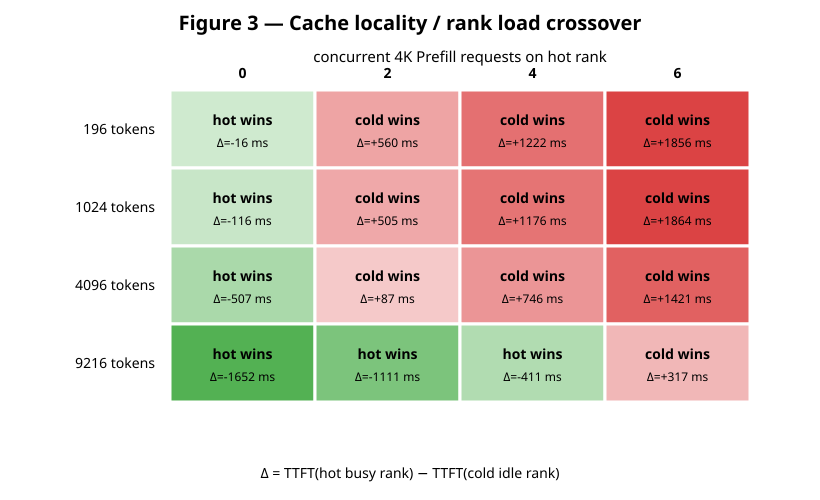

# Multimodal Agent Data-Parallel Scheduling: Experimental Setup and Results

## Executive Summary

This preliminary study evaluates three scheduling questions for multimodal agent workloads on data-parallel vLLM replicas:

1. Does vision encoding interfere with text prefill on the same GPU replica?
2. Is recomputing a vision embedding on another replica substantially more expensive than transferring the existing embedding?
3. Does a real crossover exist between cache locality and load balancing?

All three effects were observed with Qwen3.5-9B on a four-GPU RTX 5090 server:

- Same-replica victim TTFT slowdown increased from **1.13x** at 196 vision tokens to **6.49x** at 9,216 vision tokens. The different-replica control remained approximately 1.0x.
- Vision recomputation was **131x to 668x** more expensive than copying the corresponding BF16 embedding tensor between GPU 0 and GPU 1.
- The best replica changed as rank load increased. Small images lost their locality advantage at low load, while a 9,216-token image remained preferable on the busy hot replica through four concurrent 4K prefills and crossed over only at six.

These results support a prefix-aware DP policy that jointly models reusable multimodal computation and current replica load. They do not require changes to KV-cache memory management at this stage.

## 1. System Configuration

### 1.1 Software

| Component | Configuration |
|---|---|
| vLLM | 0.25.0 |
| Git commit | `702f4814fe54fabff350d43cb753ae3e47c0c276` |
| Model | Qwen3.5-9B |
| Weight dtype | BF16 |
| Python | 3.12.14 in the existing `uv` environment |
| PyTorch | 2.11.0+cu130 |
| CUDA build toolchain | CUDA 13.0 |
| Attention backend | FlashAttention 2 |
| Execution mode | Eager; Torch compilation and CUDA Graphs disabled |
| vLLM scheduler | V1 engine with asynchronous scheduling |

The CUDA 13 source build was used because the unmodified vLLM 0.25.0 baseline does not compile its cooperative TopK path with the available CUDA 12.8 setup. No ForkAttention or Agentrix source changes were present during these experiments.

The following environment settings were used for serving:

```bash
export VLLM_USE_FLASHINFER_SAMPLER=0
export VLLM_ENABLE_V1_MULTIPROCESSING=0
```

FlashInfer sampling was disabled because FlashInfer 0.6.13 did not correctly recognize SM 12.x with this setup. vLLM's native sampler was used instead; this is unrelated to multimodal encoding or ForkAttention.

### 1.2 Hardware and Replica Layout

The server contains four NVIDIA RTX 5090 GPUs with 32,607 MiB visible memory per GPU. The request-level experiments used two independent single-GPU vLLM servers:

```text
GPU 0                         GPU 1
Replica 0                     Replica 1
127.0.0.1:8000                127.0.0.1:8001
TP=1, DP replica              TP=1, DP replica
```

This arrangement models two independently routable DP replicas without introducing a DP coordinator. GPU 2 was used for isolated offline encoder timing. GPU 2 and GPU 3 were also used for a supplemental copy check.

The relevant `nvidia-smi topo -m` result was:

```text
GPU0 -> GPU1: SYS
GPU2 -> GPU3: NODE
```

There is no NVLink. `torch.cuda.can_device_access_peer(0, 1)` returned `False`.

### 1.3 Serving Arguments

The two servers used the following effective configuration:

```bash
python -c 'from vllm.entrypoints.cli.main import main; main()' \
  serve /root/autodl-tmp/models/Qwen3.5-9B \
  --host 127.0.0.1 \
  --port 8000 \
  --served-model-name qwen35 \
  --dtype bfloat16 \
  --max-model-len 16384 \
  --max-num-seqs 8 \
  --gpu-memory-utilization 0.88 \
  --enforce-eager \
  --no-enable-prefix-caching \
  --allowed-local-media-path /root/autodl-tmp
```

Replica 1 used port 8001. Multimodal processor-cache settings depended on the experiment and are documented below.

All requests used local media files to avoid network download and storage I/O variance. Generation was limited to one output token:

```json
{
  "temperature": 0,
  "max_tokens": 1,
  "stream": true,
  "stream_options": {"include_usage": true}
}
```

TTFT was measured from the client immediately before the HTTP request until the first non-empty generated content or reasoning token in the SSE stream. With one output token, completion latency was close to TTFT, but both values were retained in the raw CSV files.

## 2. Workloads

### 2.1 Image Workloads

Deterministic synthetic RGB images were generated locally. Each variant had different pixel content so a new variant could guarantee a cold encoder-cache lookup.

| Workload | Resolution | Vision tokens | Server prompt tokens | BF16 embedding size |
|---|---:|---:|---:|---:|
| Small | 448 x 448 | 196 | 215 | 1.61 MB |
| Medium | 1,024 x 1,024 | 1,024 | 1,043 | 8.39 MB |
| Large | 2,048 x 2,048 | 4,096 | 4,115 | 33.55 MB |
| XLarge | 3,072 x 3,072 | 9,216 | 9,235 | 75.50 MB |

The server prompt-token count includes 19 text and chat-template tokens. The vision-token count was therefore obtained by subtracting this fixed overhead and matches the expected Qwen vision patching geometry.

### 2.2 Text Prefill Victim

The victim was a deterministic text prompt constructed by tokenizing repeated benchmark text and retaining 4,096 content tokens. The OpenAI chat request contained 4,106 prompt tokens after template overhead. Each request generated one token.

The median unloaded victim TTFT in the final interference run was:

```text
386.75 ms
```

### 2.3 Background Load

Experiment 3 represented rank load as the number of concurrent 4K-prefill, one-output-token text requests sent to replica 0. The sweep used load levels 0, 2, 4, and 6. With `--max-num-seqs 8`, all background requests plus the measured target request remained within the configured sequence limit.

## 3. Experiment 1: Vision Encode to Prefill Interference

### 3.1 Method

Two cases were compared:

```text
Same rank:
  GPU 0: cold multimodal attacker + 4K text victim

Different rank:
  GPU 0: 4K text victim
  GPU 1: cold multimodal attacker
```

Every attacker used a previously unseen image variant. This guaranteed a cold vision-encoder execution even when the processor cache was enabled. Prefix caching remained disabled.

The slowdown metric was:

```text
slowdown = concurrent victim TTFT / unloaded victim TTFT
```

### 3.2 Arrival-Time Calibration

A fixed HTTP launch offset is not sufficient for this experiment. Large images spend considerably longer in CPU preprocessing before they reach the engine. With a uniform 30 ms attacker head start, the 3,072 x 3,072 victim often entered the GPU first and incorrectly appeared to have no interference.

vLLM's built-in multimodal timing instrumentation was used to estimate the CPU preprocessing window. The final run used the following attacker head starts:

| Vision tokens | Attacker head start |
|---:|---:|
| 196 | 10 ms |
| 1,024 | 30 ms |
| 4,096 | 150 ms |
| 9,216 | 400 ms |

These offsets place the victim inside the attacker's GPU encoder window rather than inside its CPU preprocessing window.

### 3.3 Results

| Vision tokens | Same-rank victim TTFT | Same-rank slowdown | Different-rank victim TTFT | Different-rank slowdown |
|---:|---:|---:|---:|---:|
| 196 | 435.3 ms | 1.13x | 382.3 ms | 0.99x |
| 1,024 | 522.5 ms | 1.35x | 384.6 ms | 0.99x |
| 4,096 | 1,198.9 ms | 3.10x | 381.8 ms | 0.99x |
| 9,216 | 2,509.4 ms | 6.49x | 384.5 ms | 0.99x |


Vision work therefore reduces the prefill-serving capacity of its local replica, and the effect grows rapidly with vision-token count. A DP load metric based only on request count or text tokens would substantially underestimate the load produced by a large image.

## 4. Experiment 2: Cross-Replica Vision Recomputation

### 4.1 Cache Semantics and Configuration

The original experiment proposal requested both:

- `--mm-processor-cache-gb 0`, and
- a second identical request that reuses the GPU encoder output.

These conditions are incompatible in vLLM 0.25.0. With the multimodal processor cache disabled, identical media did not receive the stable cross-request identity needed for shared encoder-cache reuse. The nominally hot second request still reported:

```text
num_encoder_calls = 1
```

With the processor cache enabled, a repeated request correctly reported:

```text
num_encoder_calls = 0
```

The locality experiment therefore used a 4 GiB multimodal processor cache. CPU processor hits and GPU encoder hits were treated as separate events.

### 4.2 Direct Encoder Timing

End-to-end cold-minus-hot latency is a noisy estimator because it mixes CPU preprocessing, vision encoding, language-model prefill, and scheduling. Instead, the experiment enabled vLLM 0.25.0's `enable_mm_processor_stats` instrumentation and directly measured the synchronized `model.embed_multimodal` interval.

An offline vLLM engine was loaded on GPU 2 with the same model, dtype, eager execution mode, maximum model length, and cache configuration. Three cold variants were measured per size after warmup. Entries with `num_encoder_calls=0` were excluded from the cold encoder median.

### 4.3 Transfer Timing

The Qwen3.5 vision output was modeled as a contiguous BF16 tensor with shape:

```text
[vision_tokens, 4096]
```

For each size, a source tensor was allocated on GPU 0 and a destination tensor on GPU 1. After five warmup copies, 30 copies were measured with source and destination synchronization. The reported value is the median wall-clock copy time.

This is a tensor data-plane lower bound. It does not include IPC protocol handling, metadata, connector scheduling, serialization, or queueing.

### 4.4 Results

| Vision tokens | Embedding size | Encoder median | GPU0 to GPU1 copy median | Recompute/copy ratio |
|---:|---:|---:|---:|---:|
| 196 | 1.61 MB | 9.03 ms | 0.069 ms | 131x |
| 1,024 | 8.39 MB | 37.34 ms | 0.226 ms | 165x |
| 4,096 | 33.55 MB | 286.41 ms | 0.815 ms | 351x |
| 9,216 | 75.50 MB | 1,201.17 ms | 1.799 ms | 668x |


The compute-to-copy ratio increases with image size. Even if a production cross-process transfer mechanism added an order of magnitude over the raw tensor-copy time, avoiding recomputation would still have substantial value for large images.

## 5. Experiment 3: Cache Locality Versus Rank Load

### 5.1 Method

For every cell in the sweep:

1. A unique image was sent to replica 0, populating its processor and GPU encoder caches.
2. Replica 1 remained cold for that image.
3. Replica 0 received 0, 2, 4, or 6 concurrent 4K text-prefill requests.
4. The same image was sent concurrently to the hot/busy replica 0 and cold/idle replica 1.
5. Target TTFT was recorded for both destinations.

The comparison metric was:

```text
delta = TTFT(hot, busy replica 0) - TTFT(cold, idle replica 1)
```

- Negative delta: the hot replica is better.
- Positive delta: the cold replica is better.

Each cell was measured twice in this preliminary sweep.

### 5.2 Results

| Vision tokens | Load 0 | Load 2 | Load 4 | Load 6 |
|---:|---:|---:|---:|---:|
| 196 | -16 ms | +560 ms | +1,222 ms | +1,856 ms |
| 1,024 | -116 ms | +505 ms | +1,176 ms | +1,864 ms |
| 4,096 | -507 ms | +87 ms | +746 ms | +1,421 ms |
| 9,216 | -1,652 ms | -1,111 ms | -411 ms | +317 ms |



The phase boundary is clear:

- For 196 tokens, locality saves only about 16 ms at zero load and is already dominated by two background prefills.
- For 1,024 tokens, the zero-load locality benefit is about 116 ms, but the cold replica wins at load 2.
- For 4,096 tokens, the hot replica wins by about 507 ms at zero load, with the crossover occurring by load 2.
- For 9,216 tokens, the hot replica still wins by about 411 ms at load 4. At load 6, queueing dominates the saved vision computation and the cold replica wins by about 317 ms.

Neither pure cache affinity nor pure least-load routing is optimal over the full workload space.

## 6. Implications for Agentrix

The measurements motivate a routing cost of the general form:

```text
placement_cost(rank, request)
    = queue_and_execution_cost(rank)
    + missing_reusable_compute_cost(rank, request)
```

The load term should account for active vision encoding and prefill, not only request count. The missing-compute term should depend on the media type, number of vision tokens or video frames, and whether a compatible encoder output already exists on the rank.

This supports the planned implementation sequence:

1. Port and validate the ForkAttention operator.
2. Add clean CUDA Graph integration and re-run the interference experiment.
3. Implement Prefix-aware DP routing as a separate layer.
4. Defer KV-cache memory-management changes until the MoonCake and LMCache design is settled.

The experiment also suggests that a future encoder-output transfer mechanism could be valuable, but the present results do not prescribe its storage or lifecycle implementation.

## 7. Limitations and Required Follow-up

This is a directional characterization rather than a publication-grade evaluation:

- Most points contain only two or three repetitions; confidence intervals were not computed.
- Only deterministic synthetic images were tested. The planned 8-, 32-, and 64-frame video cases remain outstanding.
- Eager execution was intentionally used. CUDA Graph and ForkAttention configurations must be tested separately.
- The interference run used calibrated launch offsets rather than a stochastic arrival process.
- A server-side CUDA Event or NVTX E/P timeline was not collected.
- Independent servers represented independently routable DP replicas; vLLM's integrated DP coordinator was not used.
- The transfer benchmark measured only a local tensor copy, not a production cross-process encoder-cache connector.
- The cache/load phase diagram used discrete bursts of 4K prefill requests, not a sustained arrival-rate sweep.

The next rigorous iteration should add more repetitions, randomized arrivals, video workloads, server-side E/P instrumentation, and both eager and CUDA Graph execution modes.

## 8. Reproducibility Artifacts

Raw data retained in this repository:

- [`mm_dp_interference_calibrated.csv`](experiment_results/mm_dp_interference_calibrated.csv)
- [`mm_dp_encoder_timing_cache_enabled.csv`](experiment_results/mm_dp_encoder_timing_cache_enabled.csv)
- [`mm_dp_p2p_gpu0_gpu1.csv`](experiment_results/mm_dp_p2p_gpu0_gpu1.csv)
- [`mm_dp_cache_load_conflict.csv`](experiment_results/mm_dp_cache_load_conflict.csv)

The reusable experiment scripts are located in `experiments/mm_dp`. No vLLM source file was modified and no experimental commit was created on the `agentrix` branch.
