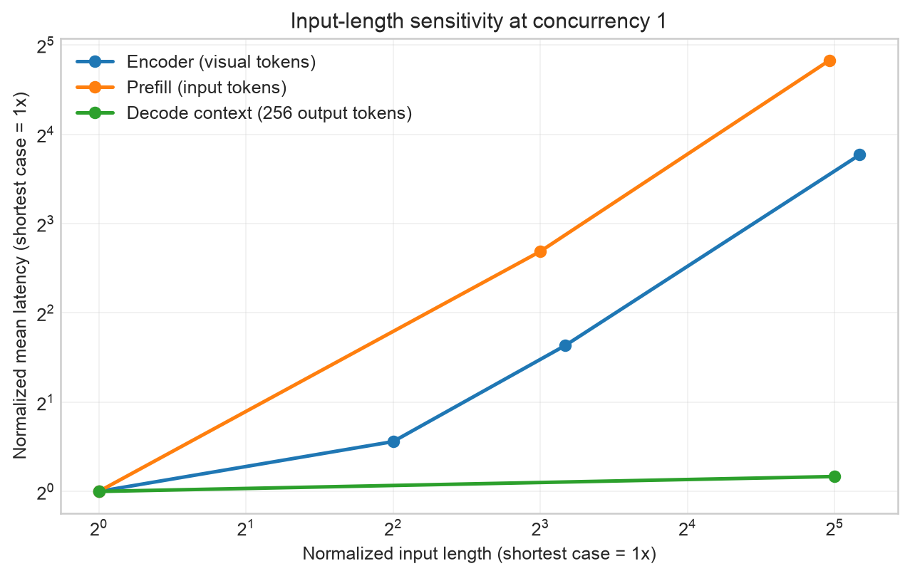
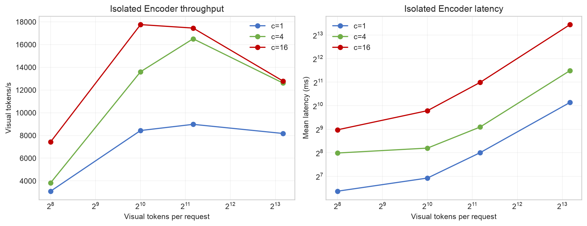
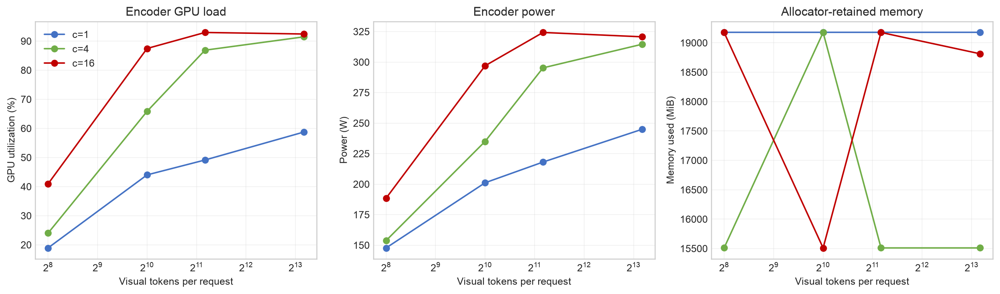
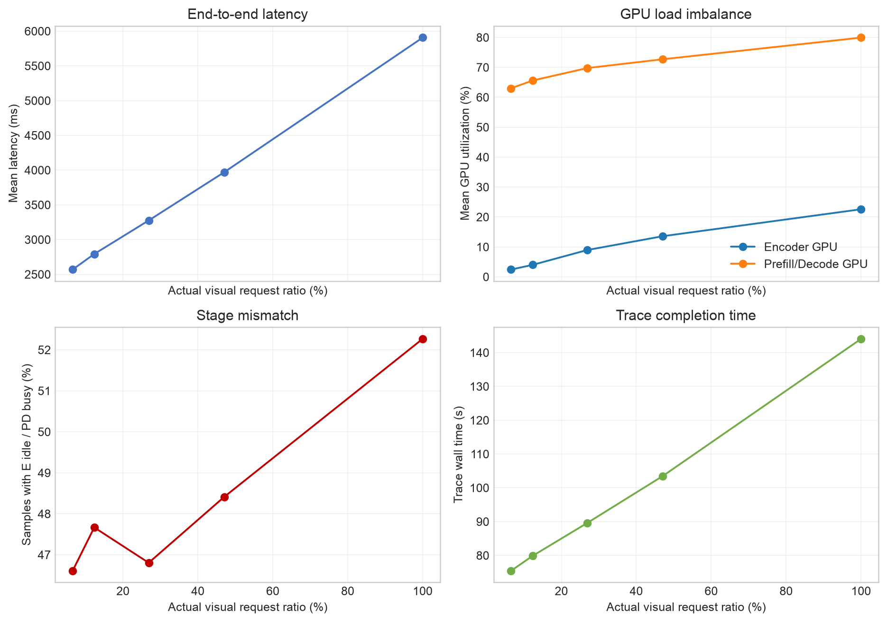

# Qwen2.5-VL-7B EPD Performance on NVIDIA H20

## Overview

This document reports an end-to-end performance study of
Qwen2.5-VL-7B-Instruct on an Encoder-Prefill-Decode (EPD) deployment. The
experiment isolates three questions:

1. How sensitive is the vision Encoder to visual input length?
2. Is Encoder latency more sensitive to input length than text Prefill or
   Decode latency?
3. How do GPU utilization, memory occupancy, power, queue pressure, and stage
   imbalance change with concurrency and the proportion of visual requests?

The main result is that text Prefill is the most input-length-sensitive stage,
the isolated vision Encoder is second, and Decode is only weakly sensitive to
the existing context length. Decode remains approximately linear in the number
of newly generated tokens.

## Experimental Setup

| Component | Configuration |
|---|---|
| Model | Qwen2.5-VL-7B-Instruct |
| Inference framework | vLLM 0.26.0 |
| GPU topology | 1 NVIDIA H20 for Encoder and 1 NVIDIA H20 for Prefill/Decode |
| EPD entry point | OpenAI-compatible proxy on port 10001 |
| Image dataset | COCO 2017 validation images downloaded from ModelScope |
| Encoder matrix repeats | 3 per configuration |
| Text matrix repeats | 3 per configuration |
| Temporal sparse-load repeats | 2 complete repeats per configuration |
| Telemetry interval | 100 ms |
| Experiment date | 2026-08-27 |

The measurements include client latency, proxy stage timestamps, throughput,
GPU compute utilization, memory-controller utilization, `nvidia-smi` memory
occupancy, board power, active and waiting requests, and vLLM KV-cache usage.

The complete request-level JSONL, telemetry streams, and service logs remain
outside the Git repository on the experiment host.

The compact per-repeat and aggregate CSV files are versioned under
[`docs/experiments/qwen2_5_vl_7b_h20_epd/data`](experiments/qwen2_5_vl_7b_h20_epd/data).

## Input-Length Sensitivity

The following figure normalizes both input length and latency to the shortest
case for each stage at concurrency 1.



| Stage | Input change | Mean latency change | Approximate log elasticity |
|---|---:|---:|---:|
| Vision Encoder | 256 to 9,216 visual tokens, 36x | 82.7 to 1,127.3 ms, 13.6x | 0.73 |
| Text Prefill | 512 to 16,000 input tokens, 31.25x | 68.2 to 1,937.4 ms, 28.4x | 0.97 |
| Decode context, 256 output tokens | 128 to 4,096 input tokens, 32x | 3,340.8 to 3,751.3 ms, 1.12x | 0.03 |

Therefore, the answer to the primary research question is:

```text
Input-length sensitivity: Prefill > Encoder >> Decode context
```

This comparison concerns the existing input length. Decode latency is still
strongly sensitive to output length: increasing output from 256 to 1,024
tokens increases latency by approximately four times at concurrency 1.

## Isolated Encoder Results

| Visual tokens | Concurrency | Throughput, visual tokens/s | Mean latency, ms | GPU utilization | Mean memory, MiB | Peak memory, MiB | Mean power, W |
|---:|---:|---:|---:|---:|---:|---:|---:|
| 256 | 1 | 3,095 | 82.7 | 18.9% | 19,176 | 19,176 | 147.7 |
| 256 | 4 | 3,833 | 254.4 | 24.0% | 15,510 | 15,510 | 153.8 |
| 256 | 16 | 7,436 | 503.9 | 40.9% | 19,176 | 19,176 | 188.5 |
| 1,024 | 1 | 8,435 | 121.7 | 44.0% | 19,176 | 19,176 | 201.1 |
| 1,024 | 4 | 13,608 | 293.9 | 65.9% | 19,176 | 19,176 | 235.0 |
| 1,024 | 16 | 17,757 | 884.7 | 87.5% | 15,510 | 15,510 | 297.0 |
| 2,304 | 1 | 8,979 | 256.7 | 49.1% | 19,176 | 19,176 | 218.1 |
| 2,304 | 4 | 16,511 | 546.4 | 86.9% | 15,510 | 15,510 | 295.3 |
| 2,304 | 16 | 17,453 | 2,032.6 | 93.0% | 19,176 | 19,176 | 324.3 |
| 9,216 | 1 | 8,175 | 1,127.3 | 58.8% | 19,176 | 19,176 | 244.9 |
| 9,216 | 4 | 12,613 | 2,877.9 | 91.5% | 15,510 | 15,510 | 314.6 |
| 9,216 | 16 | 12,789 | 11,150.1 | 92.4% | 18,813 | 19,176 | 320.7 |



The 4K-class workload is already saturated near concurrency 4. Raising
concurrency from 4 to 16 improves throughput by only 1.4%, from 12,613 to
12,789 visual tokens/s, while mean latency increases from 2.88 to 11.15
seconds. Concurrency 4 is consequently the practical operating point for this
shape on the tested Encoder GPU.

## GPU Memory Occupancy

GPU memory must be interpreted together with allocator and KV-cache behavior.
`nvidia-smi` reports memory reserved by the process, not only bytes actively
touched by the current request. vLLM also preallocates a large KV-cache pool on
the Prefill/Decode GPU.

| Measurement scope | GPU | Mean occupied memory | Peak occupied memory | Actual KV-cache peak |
|---|---|---:|---:|---:|
| Isolated Encoder matrix | Encoder GPU | 15,510-19,176 MiB | 19,176 MiB | Not applicable |
| Text Prefill matrix | Prefill/Decode GPU | 119,558 MiB | 119,558 MiB | 1.17% |
| Text Decode matrix | Prefill/Decode GPU | 119,558 MiB | 119,558 MiB | 4.41% |
| Temporal mixed workload | Encoder GPU | 19,176 MiB | 19,176 MiB | Not applicable |
| Temporal mixed workload | Prefill/Decode GPU | 119,872-120,004 MiB | 120,004 MiB | 2.78% |

The Encoder process initially occupied approximately 3.2 GiB before the first
vision execution. After warm-up, the CUDA allocator retained a larger pool,
normally about 19.2 GiB. The 15.5 and 19.2 GiB plateaus across repetitions are
allocator states, not a monotonic relationship between visual length and live
activation memory. A higher-resolution memory profiler is required to isolate
transient activation peaks inside one Encoder invocation.

The Prefill/Decode process remained near 119.6-120.0 GiB because its KV pool was
reserved at service initialization. This does not mean every request consumed
120 GiB of KV data. The vLLM KV metric reached only 1.17% in the Prefill matrix,
4.41% in the heaviest Decode configuration, and 2.78% in the mixed temporal
trace. Capacity decisions should therefore use both occupied process memory
and KV-cache usage, rather than process memory alone.



The source values are available in
[`encoder_only_aggregate.csv`](experiments/qwen2_5_vl_7b_h20_epd/data/encoder_only_aggregate.csv),
[`text_aggregate.csv`](experiments/qwen2_5_vl_7b_h20_epd/data/text_aggregate.csv),
and
[`temporal_aggregate.csv`](experiments/qwen2_5_vl_7b_h20_epd/data/temporal_aggregate.csv).

## Prefill Results

| Input tokens | Concurrency | Throughput, tokens/s | Mean latency, ms | PD GPU utilization | KV peak | Waiting requests, peak |
|---:|---:|---:|---:|---:|---:|---:|
| 512 | 1 | 7,512 | 68.2 | N/A | N/A | N/A |
| 4,096 | 1 | 9,324 | 439.3 | 76.3% | 0.00% | 0 |
| 16,000 | 1 | 8,259 | 1,937.4 | 90.5% | 0.86% | 0 |
| 512 | 8 | 9,374 | 355.9 | 58.5% | 0.17% | 0 |
| 4,096 | 8 | 9,631 | 2,101.0 | 95.2% | 0.44% | 4.7 |
| 16,000 | 8 | 8,326 | 8,803.1 | 98.6% | 1.01% | 6.0 |
| 512 | 16 | 9,821 | 766.1 | 77.8% | 0.40% | 0 |
| 4,096 | 16 | 9,679 | 3,791.8 | 97.5% | 0.44% | 13.0 |
| 16,000 | 16 | 8,340 | 16,624.4 | 99.5% | 1.17% | 14.0 |

The shortest concurrency-1 run completed in less than the 100 ms telemetry
interval, so no GPU sample fell entirely inside its measured window. Its GPU,
memory, and queue fields are intentionally reported as unavailable instead of
being replaced with false zeros.

Long Prefill inputs saturate the PD GPU. At 16,000 input tokens and concurrency
16, average utilization reaches 99.5%, while the waiting queue peaks at 14.
This is the clearest system-level explanation for Prefill's nearly linear
input-length sensitivity.

## Decode Results

| Input | Output | Concurrency | Throughput, tokens/s | Mean latency, ms | TPOT, ms | PD utilization | KV peak | Waiting peak |
|---:|---:|---:|---:|---:|---:|---:|---:|---:|
| 128 | 256 | 1 | 76.6 | 3,340.8 | 12.95 | 40.7% | 0.02% | 0 |
| 4,096 | 256 | 1 | 68.2 | 3,751.3 | 12.99 | 48.3% | 0.23% | 0 |
| 128 | 1,024 | 1 | 76.6 | 13,365.5 | 13.03 | 42.3% | 0.06% | 0 |
| 4,096 | 1,024 | 1 | 74.3 | 13,790.2 | 13.05 | 44.6% | 0.28% | 0 |
| 128 | 256 | 8 | 571.7 | 3,577.5 | 13.57 | 44.4% | 0.16% | 0 |
| 4,096 | 256 | 8 | 298.1 | 6,848.5 | 17.65 | 76.5% | 1.88% | 4.3 |
| 128 | 1,024 | 8 | 581.1 | 14,092.3 | 13.65 | 44.4% | 0.50% | 0 |
| 4,096 | 1,024 | 8 | 472.2 | 17,328.1 | 14.64 | 64.6% | 2.21% | 4.7 |
| 128 | 256 | 16 | 1,088.5 | 3,755.4 | 13.78 | 45.7% | 0.33% | 0 |
| 4,096 | 256 | 16 | 397.7 | 10,251.1 | 23.98 | 85.3% | 3.75% | 13 |
| 128 | 1,024 | 16 | 1,128.8 | 14,506.9 | 13.96 | 45.8% | 0.99% | 0 |
| 4,096 | 1,024 | 16 | 778.0 | 21,010.3 | 16.49 | 73.3% | 4.41% | 13 |

At concurrency 1, longer context adds only modest latency because the output
token loop dominates. Under concurrency 8 or 16, the same long contexts cause
queueing and increase TPOT, so context sensitivity becomes a scheduling and
contention effect rather than a purely per-request Decode cost.

## Temporal Sparse-Visual Workload

Each repeat contains 32 sequential sessions with 20 turns per session, for 640
requests. The visual probability controls how frequently a turn passes through
the Encoder before Prefill and Decode.

| Actual visual ratio | Repeats | Errors | Mean latency, ms | P95 latency, ms | Wall time, s | Encoder util. | PD util. | E idle / PD busy | PD KV peak |
|---:|---:|---:|---:|---:|---:|---:|---:|---:|---:|
| 6.56% | 2 | 0 | 2,568.9 | 2,920.9 | 75.4 | 2.4% | 63.0% | 46.6% | 1.35% |
| 12.34% | 2 | 0 | 2,792.8 | 3,192.2 | 79.9 | 4.0% | 65.6% | 47.7% | 1.39% |
| 26.88% | 2 | 0 | 3,275.6 | 3,743.4 | 89.6 | 8.9% | 69.8% | 46.8% | 1.74% |
| 47.03% | 2 | 0 | 3,969.9 | 4,708.2 | 103.5 | 13.6% | 72.7% | 48.4% | 2.22% |
| 100.00% | 2 | 1 | 5,906.5 | 6,884.3 | 144.1 | 22.6% | 79.9% | 52.3% | 2.78% |



The PD GPU remains much busier than the Encoder GPU at every visual ratio. Even
in the all-visual workload, mean Encoder utilization is 22.6% versus 79.9% on
the PD GPU. The fraction of telemetry samples in which the Encoder is below
20% utilization while the PD GPU is above 60% remains around 47-52%. A single
fixed 1E:1PD allocation therefore leaves substantial Encoder capacity idle for
this sequential agent-style trace.

## Conclusions

- Text Prefill is more sensitive to input length than the vision Encoder.
- The vision Encoder is much more input-length-sensitive than Decode when only
  the existing context length changes.
- Decode output length remains an approximately linear latency driver.
- Encoder concurrency should be shape-aware. Concurrency 16 helps smaller
  images but is counterproductive for the 9,216-visual-token workload.
- Process-level memory occupancy is dominated by allocator retention on the
  Encoder GPU and KV-pool preallocation on the PD GPU. KV-cache usage must be
  inspected separately.
- The temporal workload is PD-bound. Static 1E:1PD deployment leaves the
  Encoder underutilized even when every request contains an image.

## Limitations

- The temporal matrix was stopped after two complete repetitions. An incomplete
  third repeat is excluded from every aggregate in this document.
- The included temporal data contain one failed request out of 6,400 requests,
  in the all-visual configuration.
- A 100 ms telemetry interval can miss very short runs and transient memory
  peaks. CUPTI or framework-level allocation tracing is required for exact
  per-kernel activation memory.
- The study covers one model, one vLLM version, one GPU topology, and one image
  preprocessing policy. Its scaling trends should be revalidated before being
  generalized to another deployment.

## Reproduction and Data Files

The plotting script is
[`plot_results.py`](experiments/qwen2_5_vl_7b_h20_epd/plot_results.py). Run it
from the repository root in an environment containing Matplotlib:

```bash
python docs/experiments/qwen2_5_vl_7b_h20_epd/plot_results.py
```

The data directory contains both per-repeat and aggregate results:

- `encoder_only_*.csv`: isolated Encoder matrix;
- `pipeline_encoder_*.csv`: visual matrix through the full E-to-PD path;
- `text_*.csv`: Prefill and Decode length matrix;
- `temporal_*.csv`: sparse-visual multi-session traces.
