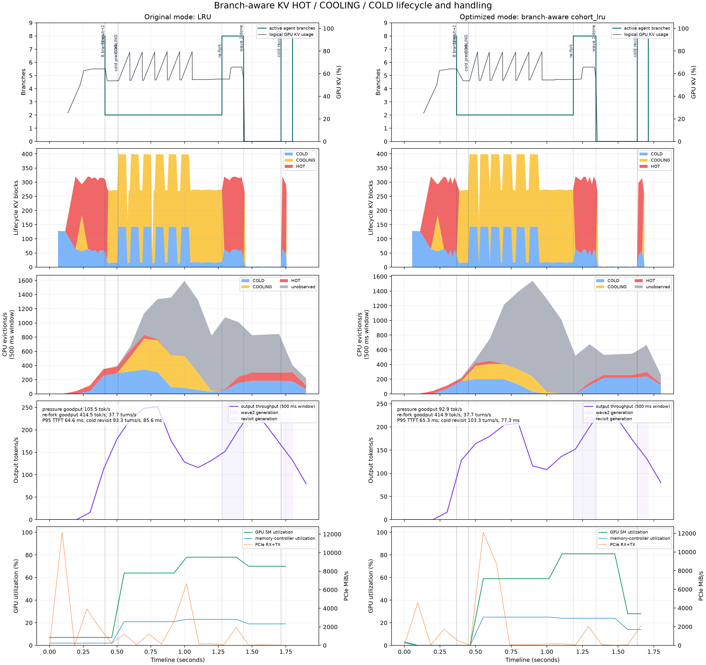
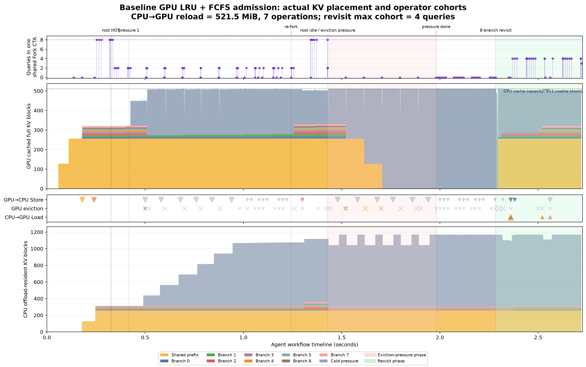
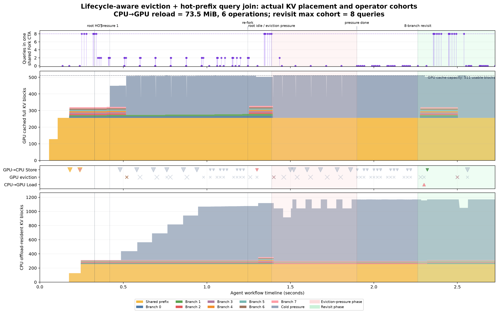

# Tool-call KV Cache Trimmer

## Executive Summary

`ToolKVTrimmer` is an application-owned policy that releases live GPU KV
blocks while a resumable vLLM session is idle waiting for a tool. It addresses
the tool-call KV white-occupancy interval without moving scheduling policy into
vLLM or coupling the application to vLLM's internal Python types.

The policy is disabled by default. When enabled, it:

1. waits for a fixed or learned soft TTL;
2. reads the current total vLLM KV-cache pressure;
3. trims only if pressure is above a configured threshold;
4. leaves request tokens and lifecycle state intact; and
5. lets vLLM use prefix cache or a KV connector on resume, with recomputation
   as the correctness fallback.

On the local Qwen3-0.6B experiment described below, active learned TTL reduced
the total live KV peak from 3.50 GiB to 1.75 GiB, a 50.00% reduction. The
time-integrated live KV occupancy fell by 57.94%. Physical memory reported by
`nvidia-smi` did not fall because vLLM reserves the GPU KV pool at startup; the
optimization returns blocks to that pool rather than returning its CUDA
allocation to the driver.

## Problem

A stateful coding Agent commonly follows this sequence:

```text
prefill and decode
  -> emit tool call
  -> wait for filesystem / search / test / network tool
  -> append tool result
  -> resume decode
```

If the request remains resumable during the tool call, its KV blocks remain
live even though the GPU cannot use them until the tool returns. A cohort of
parallel agents can therefore retain several GiB of KV while producing no
tokens. New requests arriving during that interval see less effective KV
capacity and can be delayed or preempted.

Immediately evicting every session is also undesirable. Short tool calls
benefit from retaining hot KV, while trimming a long session introduces lookup,
reload, or recomputation work when it resumes. The policy must therefore trade
retention against expected tool duration and current global pressure.

## Design Goals and Non-goals

The design goals are:

- keep policy and learning in `application/`;
- keep the vLLM change limited to a narrow validated trim operation;
- protect fast tools with a grace interval;
- make low-pressure behavior a no-op;
- support a fixed TTL, predictor shadow mode, and active predicted TTL;
- preserve correctness if prediction, metrics, HTTP, or cache reuse fails;
- avoid retaining raw commands, paths, queries, or tool arguments;
- expose enough counters to tune the policy from measured workloads.

The module does not:

- shrink vLLM's startup CUDA allocation;
- trim active decode or ordinary non-resumable requests;
- delete request token history;
- guarantee a prefix-cache or CPU-cache hit on resume;
- decide ForkAttention operator routing;
- replace vLLM preemption, APC, or LMCache admission and eviction policy.

## Architecture and Ownership Boundary

```text
Application tool lifecycle
        |
        | tool_started(session_id, request_id, context)
        v
  ToolKVTrimmer -------------------- Tool TTL predictor
        |                             predict / observe
        | sleep soft TTL
        | serialize decisions
        | read KV pressure
        | pressure >= threshold
        v
  VLLMToolKVClient
        | GET /metrics
        | POST /v1/agentrix/tool-kv/trim
        v
  narrow vLLM hook
        | validate resumable + waiting state
        | free live request block references
        | retain token history and resume boundary
        v
  APC / KV connector lookup on resume
        |
        +-> hit: reuse or reload KV
        +-> miss: recompute preserved tokens
```

The application policy depends only on two asynchronous callables:

```python
PressureReader = Callable[[], Awaitable[float]]
TrimRequest = Callable[[str], Awaitable[Mapping[str, Any]]]
```

This makes the decision logic independently testable. The included HTTP
adapter is replaceable; the memory benchmark passes `AsyncLLM.trim_tool_kv`
directly without changing the trimmer.

## Application Implementation

The implementation is split into two files:

| File | Responsibility |
|---|---|
| [`application/src/agentrix_application/tool_kv_trimmer.py`](../application/src/agentrix_application/tool_kv_trimmer.py) | lifecycle, pressure gate, serialization, trim adapter, counters |
| [`application/src/agentrix_application/tool_ttl_predictor.py`](../application/src/agentrix_application/tool_ttl_predictor.py) | bounded features, online horizon model, persistence |

### Fixed-TTL Policy

For each tool lifecycle, `tool_started` creates one pending asynchronous
decision. With a fixed TTL, the decision is:

```text
sleep(grace_ms)
lock the pressure/read/trim transaction
read current kv_cache_usage
if pressure < pressure_threshold:
    keep KV resident
else:
    call trim(request_id)
    record released references and observed usage reduction
    optionally wait for the metric to refresh
unlock
```

If `tool_finished` arrives before the decision enters the trim call, the timer
is cancelled and the hot KV is retained. Once an HTTP trim has started it may
be running in an uncancellable worker thread, so `tool_finished` waits for it
instead of orphaning background work.

### Learned Soft TTL

`OnlineHorizonTTLPredictor` uses six online logistic classifiers to estimate:

```text
P(duration > 100 ms)    P(duration > 250 ms)
P(duration > 500 ms)    P(duration > 1,000 ms)
P(duration > 2,000 ms)  P(duration > 5,000 ms)
```

The bounded context is:

| Feature | Meaning |
|---|---|
| `tool_family` | coarse application-owned tool class |
| `argument_bytes` | encoded argument size, not argument content |
| `kv_tokens` | estimated live tokens for the session |
| `pressure` | total KV usage when the tool starts |
| `active_tool_sessions` | concurrent tool-wait cohort size |
| `shared_prefix_ratio` | optional fraction likely reusable elsewhere |
| `timeout_ms` | configured tool timeout |

Feature hashing bounds state at 128 values per horizon. Raw tool arguments are
never stored. Independently predicted probabilities are projected to a
non-increasing survival curve so that survival at a longer horizon cannot be
higher than survival at a shorter horizon.

The default model requires 50 completed observations. Before that point it
uses the fixed 500 ms fallback. After training, the longest horizon whose
survival probability reaches the confidence threshold controls the TTL:

```text
ttl = clamp(fallback_ttl * min_ttl / longest_confident_horizon,
            min_ttl,
            fallback_ttl)
```

The default bounds are 100-500 ms. Prediction can only shorten the fixed TTL;
it cannot extend retention beyond the fallback. A missing context, cold model,
or prediction exception also returns to the fixed TTL.

Every completed tool call supplies its observed duration to all six horizon
classifiers. The label is recorded whether or not the request was trimmed, so
the learner does not train only on policy-selected samples. State is a
versioned JSON object and can be saved and restored atomically with
`predictor.save(path)` and `OnlineHorizonTTLPredictor.load(path)`.

Predictor accuracy is evaluated separately from the memory experiment. A
controlled dataset contains 2,000 read, search, network, public-test, and build
events; each of five seeds uses a 70/30 held-out split:

| Predictor metric | Five-seed mean | Min-max |
|---|---:|---:|
| Macro six-horizon accuracy | 95.25% | 94.67%-95.78% |
| Macro Brier score, lower is better | 0.0349 | 0.0327-0.0370 |
| Shorten/fallback decision accuracy | 92.73% | 91.50%-93.67% |
| Exact TTL-bucket accuracy | 90.33% | 88.67%-91.83% |
| TTL within one adjacent bucket | 99.90% | 99.67%-100.00% |

The repository's current real trace contains only short `paragraph_search`
events, so its 100% fallback accuracy is not evidence of cross-tool
generalization. Full dataset, per-horizon, calibration, and trace limitations
are documented in [`tool_kv_ttl_predictor.md`](tool_kv_ttl_predictor.md).

### Shadow and Active Modes

There are three operational states:

| State | Trimming | TTL used | Predictor updates |
|---|---|---|---|
| Disabled | No | None | No |
| Fixed TTL / predictor shadow | Yes | `grace_ms` | Yes, if a predictor and context are supplied |
| Active predicted TTL | Yes | predicted, bounded by fixed fallback | Yes |

Shadow mode is important because it records the TTL the model would have used
while the fixed policy remains authoritative. Production activation should be
based on tool-family calibration, live KV savings, and resume cost, not only
classification accuracy.

### Lifecycle and Concurrency Safety

The pending map is keyed by application session ID and also stores the exact
vLLM request ID. This supports the following cases:

- a newer tool lifecycle supersedes an older timer for the same session;
- a late finish for an older request cannot cancel its replacement;
- fast completion cancels a grace or pressure-check phase;
- completion during an in-flight trim waits for a definitive result;
- shutdown cancels timers but drains in-flight trim operations.

Pressure decisions use one `_trim_lock`. This deliberately serializes the
sequence `read pressure -> decide -> trim`. Without it, a 16-request cohort
whose timers expire simultaneously could let every request act on the same
stale high-pressure value. After each trim the next session reads the updated
pressure and may keep its KV if the global threshold has already been met.

The policy rejects non-finite or out-of-range pressure values. Exceptions are
counted and contained in the background decision task rather than failing the
tool itself.

### Observability

`ToolKVTrimmerStats` exposes:

- started lifecycles, trim attempts, successful trims, and rejection reasons;
- pressure skips, grace cancellations, and cancellation before trim;
- finishes that overlap a trim;
- superseded calls and stale finish events;
- prediction, fallback, observation, and prediction-error counts;
- sum of predicted TTL values;
- released block references;
- sum of observed `kv_cache_usage_before - kv_cache_usage_after`;
- latest pressure and internal policy errors.

`released_block_references` must not be interpreted as unique physical blocks
when requests share APC blocks. Releasing one request decrements references;
the before/after total usage delta is authoritative for physical occupancy.

## Minimal vLLM Integration

The policy itself is outside vLLM. The vLLM branch adds only the mechanism
needed to trim a validated resumable request:

1. `POST /v1/agentrix/tool-kv/trim` accepts one `request_id`.
2. The engine resolves an external request ID to its internal request ID.
3. The scheduler accepts only a request that is both resumable and in
   `WAITING_FOR_STREAMING_REQ`.
4. It saves the computed-token boundary, frees the request's live KV block
   references, clears speculative tokens, and resets computed progress.
5. A preemption notification flushes model-runner and connector request state.
6. The next streaming update folds the prior computed output into the prompt,
   then performs normal cache lookup or recomputation.

Active, non-resumable, already-trimmed, missing, and zero-block requests are
rejected without mutation. The response reports:

```json
{
  "request_id": "request-123",
  "trimmed": true,
  "reason": "trimmed",
  "released_block_references": 256,
  "kv_cache_usage_before": 0.238,
  "kv_cache_usage_after": 0.178
}
```

Request token history remains the source of truth. A cache miss can therefore
cost additional compute, but cannot silently omit the pre-tool context.

## Relationship to ForkAttention and KV Offload

The trimmer is compatible with ForkAttention because the two mechanisms act
at different times and optimize different resources:

| Mechanism | State | Optimization |
|---|---|---|
| ForkAttention | sibling queries actively decoding | reuse shared resident KV reads across queries |
| Tool KV trimmer | session idle waiting for external input | release that session's live GPU KV references |

An idle trimmed session is not an active ForkAttention query, so there is no
operator dispatch conflict. When it resumes and rebuilds or reloads its KV, it
can participate in later ForkAttention cohorts normally. Trimming a request
does update prefix residency, so it should not be counted as a resident sibling
until resume completes.

Ordinary connector or fork-aware CPU/disk offload is also complementary. The
trimmer relinquishes the live GPU ownership; it does not delete a connector's
CPU or disk copy. Resume first tries the configured cache/connector path, then
recomputes on a miss. The scheduler sends a preemption-style notification so a
connector can flush stale per-request GPU state.

When several requests reference the same APC block, trimming one request only
removes its reference. The shared physical block stays resident as long as
another request or cache entry owns it. ForkAttention can continue to use that
block for the remaining active siblings; the trimmer neither double-frees it
nor claims memory savings that did not appear in total KV usage.

The trade-off is timing: an overly aggressive TTL can turn a short tool wait
into avoidable reload or recomputation. Pressure gating and shadow deployment
remain necessary even when offload is available.

## Configuration and Integration

The environment switches are:

| Variable | Default | Meaning |
|---|---:|---|
| `AGENTRIX_TOOL_KV_TRIM_ENABLED` | `0` | master switch |
| `AGENTRIX_TOOL_KV_TRIM_GRACE_MS` | `500` | fixed fallback TTL |
| `AGENTRIX_TOOL_KV_TRIM_PRESSURE_THRESHOLD` | `0.70` | minimum total KV usage for trim |
| `AGENTRIX_TOOL_KV_TRIM_POST_TRIM_RECHECK_MS` | `25` | metric refresh delay between serialized trims |
| `AGENTRIX_TOOL_KV_TRIM_USE_PREDICTED_TTL` | `0` | use predicted TTL instead of shadow-only prediction |

Recommended shadow configuration:

```bash
export AGENTRIX_TOOL_KV_TRIM_ENABLED=1
export AGENTRIX_TOOL_KV_TRIM_GRACE_MS=500
export AGENTRIX_TOOL_KV_TRIM_PRESSURE_THRESHOLD=0.70
export AGENTRIX_TOOL_KV_TRIM_POST_TRIM_RECHECK_MS=25
export AGENTRIX_TOOL_KV_TRIM_USE_PREDICTED_TTL=0
```

After validating predictions and resumption cost, activate learned TTL with:

```bash
export AGENTRIX_TOOL_KV_TRIM_USE_PREDICTED_TTL=1
```

Minimal application integration is:

```python
from agentrix_application import (
    OnlineHorizonTTLPredictor,
    ToolKVTrimmer,
    ToolTTLContext,
    VLLMToolKVClient,
)

client = VLLMToolKVClient("http://127.0.0.1:8000")
predictor = OnlineHorizonTTLPredictor(min_training_samples=50)
trimmer = ToolKVTrimmer(
    client.kv_cache_usage,
    client.trim,
    ttl_predictor=predictor,
)

context = ToolTTLContext(
    tool_family="public_test",
    argument_bytes=len(encoded_arguments),
    kv_tokens=session_kv_tokens,
    pressure=last_kv_pressure,
    active_tool_sessions=active_tool_sessions,
    shared_prefix_ratio=shared_prefix_ratio,
    timeout_ms=tool_timeout_ms,
)

trimmer.tool_started(session_id, vllm_request_id, context)
try:
    tool_result = await run_tool()
finally:
    await trimmer.tool_finished(
        session_id,
        vllm_request_id,
        duration_ms=measured_tool_duration_ms,
    )
```

This hook is useful only when the application keeps one vLLM streaming-input
session alive across the tool call. A conventional OpenAI request that ends at
the tool call already releases its request KV and has nothing to trim.

## Qwen3-0.6B Memory Experiment

### Question and Metric

The experiment asks whether active TTL policy reduces the **total live KV Cache
peak**, not whether it changes the CUDA allocation shown by `nvidia-smi`.

The primary metric is vLLM scheduler `kv_cache_usage`, sampled at every
scheduler update. Effective live KV is derived as:

```text
effective KV GiB = kv_cache_usage * inferred KV pool GiB
```

The KV-time area is the trapezoidal integral of live KV GiB across the tool
window. It captures both occupancy size and how long it is retained.

### Hardware and Software

The experiment was run locally on 2026-07-18 with:

| Item | Setting |
|---|---|
| GPU | NVIDIA GeForce RTX 5070, 12,227 MiB |
| Driver | 590.48.01 |
| Model | local Qwen3-0.6B |
| Model dtype | FP16 |
| Attention backend | FlashAttention 2 |
| Execution | eager, chunked prefill enabled |
| `gpu_memory_utilization` | 0.75 |
| Maximum model length | 8,192 tokens |
| KV block size | 16 tokens |
| Startup-reported KV capacity | 68,848 tokens, approximately 7.35 GiB |
| Inferred releasable blocks | 4,302 |
| Bytes per Qwen3 KV block | 1,835,008 bytes, or 1.75 MiB |

FlashAttention was selected to isolate the TTL memory effect from
ForkAttention operator performance. The trimming mechanism is attention
backend independent.

### Workload

Each repeat uses two non-sharing cohorts:

| Parameter | Value |
|---|---:|
| Prompt length per session | 4,096 tokens |
| Primary tool-wait sessions | 4 |
| Secondary tool-wait sessions | 4 |
| Secondary arrival | 300 ms after the primary cohort enters tool wait |
| Tool window | 1,200 ms |
| Fixed TTL | 500 ms |
| Active predicted TTL | 100 ms |
| Pressure threshold | 0.01, deliberately low to exercise active trimming |
| Post-trim recheck delay | 0 ms in the controlled benchmark |
| Physical-memory sampling interval | 50 ms |
| Repetitions | 3 |

Prompts use valid deterministic token IDs but deliberately do not share full
cache blocks. Four primary sessions first prefill and wait. A second four-
session cohort arrives 300 ms later. This creates the relevant peak condition:
if the primary cohort still owns its KV while the secondary cohort prefills,
their live allocations overlap.

All three modes reuse the same loaded model and fixed KV pool. The prefix cache
is reset between runs and each mode uses distinct prompt tokens. The modes are:

- disabled: no trim;
- fixed: active trim after 500 ms;
- predicted: active trim after the learned 100 ms TTL.

Within each repetition the fixed order is disabled, fixed, then predicted. It
was not randomized because the primary question was functional KV peak
reduction, not a small latency comparison. Physical VRAM is sampled at the
whole-device level, so it can include display or other non-vLLM allocations.

For this controlled memory test, the predictor was seeded with 100 long
`memory_benchmark` observations. This tests active prediction, policy timing,
and memory behavior; it is not an additional generalization-accuracy result.

### Results

The following values are the mean of three repetitions:

| Mode | Peak KV usage | Effective KV peak | KV-time area | All-session resume latency | Physical VRAM peak |
|---|---:|---:|---:|---:|---:|
| Disabled | 47.606% | 3.500 GiB | 3.316 GiB·s | 25.59 ms | 10,842 MiB |
| Fixed TTL, 500 ms | 38.680% | 2.844 GiB | 2.384 GiB·s | 26.77 ms | 10,841 MiB |
| Predicted TTL, 100 ms | 23.803% | 1.750 GiB | 1.395 GiB·s | 26.80 ms | 10,842 MiB |

Peak KV was identical across the three repetitions of each mode. KV-time area
and resume latency variation were:

| Mode | KV-time area standard deviation | Resume latency standard deviation |
|---|---:|---:|
| Disabled | 0.0012 GiB·s | 1.28 ms |
| Fixed TTL | 0.0049 GiB·s | 0.27 ms |
| Predicted TTL | 0.0084 GiB·s | 3.02 ms |

Relative to disabled:

| Mode | Peak reduction | KV-time area reduction | Mean resume-latency delta |
|---|---:|---:|---:|
| Fixed TTL | 18.75% | 28.09% | +1.19 ms |
| Predicted TTL | 50.00% | 57.94% | +1.21 ms |

Each 4K session held 256 KV block references. In predicted mode all four
primary sessions were trimmed successfully in every repeat, releasing 1,024
references, equivalent to 1.75 GiB for this non-sharing workload. Across the
three repeats all 12 trim calls succeeded with no pressure skips, rejections,
or policy errors.

Predicted-mode completion times for the four serialized trim calls were
approximately 103.0-105.1 ms after tool wait began. The primary cohort was
therefore fully released before the secondary cohort arrived at 300 ms. The
largest remaining allocation was one 4-session cohort: 1.75 GiB.

Fixed-TTL trims completed approximately 527.2-694.7 ms after tool wait began.
They overlapped the secondary cohort's chunked prefill, so fixed TTL reduced
the peak partially but did not prevent the overlap as early as predicted TTL.

### Interpretation

The 50% predicted-mode peak reduction is the expected controlled result: two
equal 1.75 GiB cohorts overlap when trimming is disabled, while early TTL
removes the first before the second becomes resident. The KV-time result is
larger than the peak reduction because predicted mode also removes the primary
cohort for most of the 1.2-second tool window.

The physical VRAM result is intentionally flat. vLLM allocated the roughly
7.35 GiB KV pool at startup, and `nvidia-smi` observes that CUDA allocation.
Trimming makes blocks available to other requests inside the pool, but does
not destroy and recreate the pool. A claim that this module lowers total live
KV occupancy is supported; a claim that it lowers vLLM's reserved GPU memory
is not.

The measured resume latency is for releasing all eight sessions at once, not a
single-request latency. With only three repeats, the roughly 1.2 ms mean delta
should be treated as a smoke-test estimate rather than a production SLO bound.
Longer contexts, connector misses, and saturated compute can make recomputation
cost much larger.

### Experimental Limitations

- The workload uses 4K prompts and eight sessions on one RTX 5070. It does not
  replace a context-length and concurrency matrix.
- Token IDs are synthetic and deliberately non-sharing. This makes physical KV
  accounting exact but does not model the APC ownership pattern of a real
  forked agent tree.
- The pressure threshold is forced to 0.01 to test active trimming. Production
  should use a capacity-driven threshold such as the conservative 0.70 default.
- The predictor is deliberately pre-seeded with one known long-tool family.
  Generalization evidence comes from the separate accuracy evaluation, not
  this memory run.
- FlashAttention eager mode isolates the memory policy. The current experiment
  does not measure a combined ForkAttention or LMCache resume path.
- Three repetitions are sufficient to show deterministic block accounting but
  insufficient for a precise tail-latency claim.
- `nvidia-smi` measures the reserved whole-device allocation, whereas the
  scheduler metric measures blocks available for admission inside vLLM. These
  two metrics answer different questions and must not be substituted.

## Reproduction

Run the memory experiment with the repository vLLM environment:

```bash
vllm/.venv/bin/python \
  benchmark/scripts/benchmark_tool_kv_ttl_memory.py \
  --model /home/hwx/Documents/models/Qwen3-0.6B \
  --prompt-tokens 4096 \
  --primary 4 \
  --secondary 4 \
  --secondary-arrival-ms 300 \
  --tool-duration-ms 1200 \
  --fixed-ttl-ms 500 \
  --predicted-ttl-ms 100 \
  --repeats 3
```

The raw result, including per-scheduler-update timelines and every trim
response, is written to:

```text
benchmark/results/investigation_20260718/tool_kv_ttl_memory.json
```

Run application unit tests and lint checks with:

```bash
PYTHONPATH=application/src \
  vllm/.venv/bin/python -m pytest application/tests -q

vllm/.venv/bin/python -m ruff check \
  application/src \
  application/tests \
  benchmark/scripts/benchmark_tool_kv_ttl_memory.py
```

The current result is 27 passing application tests and a clean Ruff check.

## Branch-aware HOT/COOLING/COLD Offload Experiment

### Question

This second experiment isolates the fork-aware offload policy. It asks whether
branch fanout can identify high-value shared KV, retain it across a realistic
Agent-scale cooling interval, and turn that retention into faster completion
of later branch turns.

The original and optimized modes have the same model, request order, GPU KV
capacity, CPU cache capacity, and fanout lifecycle metadata:

| Mode | CPU offload eviction policy |
|---|---|
| Original | ordinary `lru` |
| Optimized | branch-aware `cohort_lru` |

Both modes use FlashAttention so the result measures cache lifecycle and
offload handling rather than a ForkAttention kernel-speed difference.

### Agent Timeline and Metrics

Each run uses deterministic valid token IDs and the following workflow:

```text
4K shared root
  -> fork to 8 running branches: root becomes HOT
  -> drop to 2 long-running branches: root becomes COOLING
  -> admit six independent 2K cold requests: CPU/GPU KV pressure
  -> re-fork to 8 branches
  -> finish shared branches and age the root
  -> 8-branch short-turn revisit
```

The controlled token workload is intentional. AppWorld is appropriate for the
separate tool-TTL lifetime experiment, but its heterogeneous prompts would
make it difficult to hold branch fanout, shared-root length, and cold-pressure
volume constant between eviction policies.

The timeline records:

- active Agent branch count and semantic fork/drop/revisit events;
- logical vLLM GPU KV usage;
- lifecycle-classified HOT, COOLING, and COLD blocks;
- CPU eviction occurrences by lifecycle in a 500 ms window;
- useful output throughput from token emission timestamps;
- completed branch turns per second and P50/P95 TTFT;
- NVML GPU SM utilization, memory-controller utilization, physical memory,
  power, and PCIe RX/TX.

`nvidia-smi` memory is not used as the logical KV metric because vLLM
preallocates its KV pool. GPU utilization is supporting evidence only:
recomputation can keep SM utilization high without producing useful output.

### Configuration

The reported run was executed locally on 2026-07-29:

| Item | Value |
|---|---:|
| GPU | NVIDIA GeForce RTX 5070, 12,227 MiB |
| Driver | 590.48.01 |
| Model | Qwen3-0.6B, FP16 |
| Shared root | 4,096 tokens, 256 KV blocks |
| Branch suffix | 128 tokens |
| Maximum fanout / survivors | 8 / 2 |
| Cold pressure | 6 requests × 2,048 tokens |
| GPU KV capacity | 512 blocks |
| CPU cache | 0.5 GiB |
| HOT minimum fanout | 4 |
| HOT minimum reuse | 128 blocks |
| HOT minimum residency | 4 scheduler steps |
| Cooling interval | 1,024 scheduler steps |
| Re-fork continuation | 8 tokens per new branch |
| Cold-revisit continuation | 1 token per branch |
| Repetitions | 3 per policy |

The 1,024-step cooling interval is a deliberate Agent-scale TTL setting, not
the repository default of 16 scheduler steps. Preliminary runs found that 16
steps expired during cold-request prefill, before the later branch reuse.
Likewise, a 0.25 GiB CPU cache forced both policies to evict the shared root
before cold alternatives were available. Those configurations test overload,
but cannot test whether the policy chooses COLD over HOT/COOLING when it has a
choice.

### Results

The following values are mean ± sample standard deviation over three runs:

| Metric | Original LRU | Branch-aware `cohort_lru` | Change |
|---|---:|---:|---:|
| Peak logical GPU KV usage | 79.45% ± 0.00% | 79.45% ± 0.00% | 0.00% |
| HOT eviction occurrences | 107.7 ± 6.5 | 40.0 ± 0.0 | -62.85% |
| COOLING eviction occurrences | 256.0 ± 0.0 | 104.0 ± 0.0 | -59.38% |
| Unique HOT blocks evicted | 76.7 ± 4.2 | 40.0 ± 0.0 | -47.83% |
| Cold-revisit branch throughput | 101.6 ± 2.7 turns/s | 119.9 ± 7.8 turns/s | **+18.00%** |
| Cold-revisit P95 TTFT | 78.6 ± 2.1 ms | 66.8 ± 4.2 ms | **-15.09%** |
| Immediate re-fork throughput | 38.66 ± 0.11 turns/s | 37.39 ± 0.45 turns/s | -3.30% |
| Immediate re-fork P95 TTFT | 64.6 ± 1.0 ms | 64.6 ± 1.1 ms | -0.10% |

The full summary table is
[`experiment_results/fanout_lifecycle_short_turn.csv`](experiment_results/fanout_lifecycle_short_turn.csv).
The representative paired timeline is shown below.



### Interpretation and Limits

The equal peak shows that this is not a lower-capacity experiment. Under the
same 512-block GPU budget, `cohort_lru` changes *which* CPU-backed KV survives:
it substantially reduces HOT/COOLING eviction and makes the later short
8-branch turn complete 18% more turns per second.

The immediate re-fork result is intentionally reported even though it is
neutral to slightly negative. HOT KV retention does not improve the model's
steady decode kernel. The measured benefit appears when branch work is
prefix-recovery dominated, which is common for short Agent planning/tool
turns. Long continuations amortize TTFT and should not be claimed as an 18%
token-throughput gain.

The run uses one small model, one branch topology, deterministic synthetic
tokens, and three repetitions. The result supports the lifecycle mechanism and
its TTL requirement; it is not yet an AppWorld-wide performance result.
A follow-up matrix should vary shared-root length, fanout, CPU/GPU cache ratio,
cooldown steps, and short-turn length, then replay the selected settings on
AppWorld trajectories.

### Reproduction

Run each policy with the same arguments:

```bash
PYTHONPATH="$PWD/vllm" vllm/.venv/bin/python \
  benchmark/scripts/benchmark_fanout_lifecycle_timeline.py \
  --policy lru \
  --num-gpu-blocks 512 \
  --cpu-cache-gib 0.5 \
  --hot-prefix-cooldown-steps 1024 \
  --wave-output-tokens 8 \
  --revisit-output-tokens 1 \
  --gpu-sample-ms 50 \
  --output benchmark/results/fanout_lifecycle/lru.json

PYTHONPATH="$PWD/vllm" vllm/.venv/bin/python \
  benchmark/scripts/benchmark_fanout_lifecycle_timeline.py \
  --policy cohort_lru \
  --num-gpu-blocks 512 \
  --cpu-cache-gib 0.5 \
  --hot-prefix-cooldown-steps 1024 \
  --wave-output-tokens 8 \
  --revisit-output-tokens 1 \
  --gpu-sample-ms 50 \
  --output benchmark/results/fanout_lifecycle/cohort_lru.json

benchmark/.venv/bin/python \
  benchmark/scripts/plot_fanout_lifecycle_timeline.py \
  --baseline benchmark/results/fanout_lifecycle/lru.json \
  --optimized benchmark/results/fanout_lifecycle/cohort_lru.json \
  --output benchmark/results/fanout_lifecycle/timeline.png
```

## GPU Lifecycle-Aware Eviction and Reload Optimization

### Optimization Target

This experiment targets the specific path discussed above:
**CPU/offload medium → GPU KV reload**. It does not change CPU eviction policy
or the attention kernel. Both modes use `cohort_lru` for the CPU cache; the
only A/B variable is GPU prefix-cache eviction:

| Mode | GPU idle-prefix eviction |
|---|---|
| Original | ordinary block-level LRU |
| Optimized | lifecycle, reuse, fanout, prefix position, and post-load residency |

The optimized ranking evicts unclassified/COLD blocks first, then COOLING
blocks, and HOT blocks last. Within a lifecycle tier it prefers low-reuse,
low-fanout suffix blocks. A completed CPU→GPU load receives a short soft
residency window so it is not immediately evicted by the next allocation.
The protection is soft: allocation can still reclaim these blocks if no
lower-value candidate exists.

Lifecycle metadata remains attached to an idle cached prefix after the last
request releases it. Each physical-block mapping is validated against the
expected block hash so a recycled GPU block cannot inherit stale HOT state.
Concurrent requests for the same missing prefix continue to share the
connector's in-flight load instead of issuing duplicate transfers.

### Reload-Producing Agent Timeline

The earlier lifecycle run did not directly measure reload because the shared
root remained in GPU cache. The revised timeline adds a second pressure phase
after all shared branches finish:

```text
4K root -> 8 branches -> 2 survivors -> cold pressure -> re-fork
        -> all shared branches finish
        -> six new independent 2K prompts force idle GPU-prefix eviction
        -> eight branches revisit the original root
```

The CPU cache is increased from 0.5 GiB to 2.0 GiB for this isolation test.
At 0.5 GiB, the pressure phase can evict both the GPU copy and its CPU backup,
turning the revisit into recomputation. At 2.0 GiB the CPU copy remains
available, so the experiment measures the intended GPU eviction and reload
path. GPU capacity remains fixed at 512 blocks in both modes.

The new direct metrics are:

- physical offload load operations and bytes;
- reloaded KV blocks labeled HOT, COOLING, or COLD;
- GPU prefix evictions labeled by lifecycle;
- GPU-resident blocks by lifecycle;
- blocks granted post-load residency and requests coalesced behind an
  in-flight load.

### Results

The following values are mean ± sample standard deviation over three runs on
the same RTX 5070 and Qwen3-0.6B FP16 configuration:

| Metric | Original GPU LRU | Lifecycle GPU eviction | Change |
|---|---:|---:|---:|
| CPU→GPU load operations | 7.0 ± 0.0 | 6.0 ± 0.0 | -14.29% |
| CPU→GPU load volume | 521.5 ± 0.0 MiB | 73.5 ± 0.0 MiB | **-85.91%** |
| CPU→GPU transfer time | 13.79 ± 0.25 ms | 2.13 ± 0.01 ms | **-84.54%** |
| Reloaded KV blocks | 298.0 ± 0.0 | 42.0 ± 0.0 | **-85.91%** |
| Reloaded COOLING blocks | 256.0 ± 0.0 | 0.0 ± 0.0 | **-100.00%** |
| Reloaded COLD blocks | 42.0 ± 0.0 | 42.0 ± 0.0 | 0.00% |
| Revisit P95 TTFT | 81.3 ± 6.2 ms | 54.2 ± 0.8 ms | **-33.28%** |
| Revisit branch throughput | 98.6 ± 7.9 turns/s | 146.5 ± 1.9 turns/s | **+48.52%** |

The optimized runs recorded 1,507 COLD GPU-eviction occurrences and zero
HOT/COOLING GPU-eviction occurrences. These are eviction occurrences rather
than unique keys: pressure blocks can cycle through the fixed GPU pool.

The operation-count reduction is smaller than the block/byte reduction because
the connector already coalesces the 256-block shared root into one large
physical load. Retaining that root therefore removes one load operation but
removes 256 block transfers. The remaining six operations and 42 blocks are
the branch-specific COLD suffixes. Thus the direct evidence for reduced KV
loading is both one fewer transfer launch and 85.91% fewer blocks/bytes moved.

The raw three-run table is
[`experiment_results/gpu_lifecycle_reload.csv`](experiment_results/gpu_lifecycle_reload.csv).
The two figures below use actual cache- and operator-path events. The first
lane is the number of queries in one physical shared ForkAttention CTA. The
remaining lanes show GPU KV residency, store/evict/load events, and CPU KV
residency. Gold is the shared prefix, branch colors are suffix KV, and gray is
cold pressure traffic.



Under original GPU LRU, pressure removes the 256-block shared prefix from GPU,
so revisit reloads 256 prefix blocks and 42 branch blocks. With eight shared
branches interleaved among eight private requests, FCFS forms at most a
four-query cohort.



With lifecycle-aware eviction, the shared prefix remains on GPU and only the
42 branch blocks reload. Its retained HOT/COOLING fanout hint also enables a
bounded query-join window, producing an eight-query cohort in all three
repeats. A GPU-to-CPU store creates a CPU copy rather than immediately
removing the GPU copy, so simultaneous residency in both lanes is expected.
Full experiment details and the 12-run ablation are in
[`kv_lifecycle_reload_experiment.md`](kv_lifecycle_reload_experiment.md).

### Interpretation and Limits

This result supports the fork-version offload mechanism at the GPU residency
boundary: branch-derived HOT/COOLING value is preserved when the prefix
becomes idle, cold pressure absorbs eviction, and the next multi-branch turn
avoids rereading the shared root. The benefit appears as lower reload traffic,
lower revisit TTFT, and higher short-turn branch throughput rather than lower
preallocated `nvidia-smi` memory.

This is still a controlled mechanism experiment, not an AppWorld end-to-end
result. The deterministic topology is useful here because it keeps shared-root
length, branch fanout, GPU pressure, and CPU availability identical across
modes. AppWorld should be used next to measure the distribution of retained
HOT lifetime and reload savings across real Agent trajectories.

### Reproduction

Run both modes with identical workload arguments and toggle lifecycle eviction
and query join together:

```bash
export PYTHONPATH="$PWD/vllm:$PWD/vllm/.venv.broken-root-20260715/lib/python3.12/site-packages"

CUDA_VISIBLE_DEVICES=0 vllm/.venv/bin/python \
  benchmark/scripts/benchmark_fanout_lifecycle_timeline.py \
  --policy cohort_lru \
  --no-gpu-lifecycle-eviction \
  --attention-backend FORK_ATTN \
  --no-fork-query-join \
  --num-gpu-blocks 512 \
  --max-num-seqs 8 \
  --cpu-cache-gib 2.0 \
  --hot-prefix-cooldown-steps 1024 \
  --pressure-sessions 6 \
  --post-finish-pressure-sessions 6 \
  --wave-output-tokens 8 \
  --revisit-output-tokens 16 \
  --revisit-distractors 8 \
  --gpu-sample-ms 50 \
  --output benchmark/results/gpu_lifecycle_reload/baseline.json

CUDA_VISIBLE_DEVICES=0 vllm/.venv/bin/python \
  benchmark/scripts/benchmark_fanout_lifecycle_timeline.py \
  --policy cohort_lru \
  --gpu-lifecycle-eviction \
  --attention-backend FORK_ATTN \
  --fork-query-join \
  --num-gpu-blocks 512 \
  --max-num-seqs 8 \
  --cpu-cache-gib 2.0 \
  --hot-prefix-cooldown-steps 1024 \
  --pressure-sessions 6 \
  --post-finish-pressure-sessions 6 \
  --wave-output-tokens 8 \
  --revisit-output-tokens 16 \
  --revisit-distractors 8 \
  --gpu-sample-ms 50 \
  --output benchmark/results/gpu_lifecycle_reload/optimized.json

benchmark/.venv/bin/python \
  benchmark/scripts/plot_kv_memory_event_timeline.py \
  --baseline benchmark/results/gpu_lifecycle_reload/baseline.json \
  --optimized benchmark/results/gpu_lifecycle_reload/optimized.json \
  --baseline-output docs/assets/kv_memory_timeline_baseline.png \
  --optimized-output docs/assets/kv_memory_timeline_optimized.png
```

## Deployment Guidance

Use the following sequence for a real workload:

1. deploy fixed TTL with a conservative pressure threshold;
2. attach a predictor but keep predicted TTL in shadow mode;
3. stratify prediction error, live KV savings, and resume cost by tool family,
   KV length, cache hit source, and concurrency;
4. activate predicted TTL only for calibrated long-tool families;
5. retain the fixed TTL and recomputation path as fallbacks;
6. alert on rejection reasons, policy errors, recompute latency, and any drop
   in cache/connector hit rate.

The pressure threshold should reflect capacity risk. A low threshold maximizes
released KV but can add unnecessary resume work; a high threshold preserves
hot sessions until capacity is actually scarce. The preferred setting is the
one that improves admission and tail latency under the target agent workload,
not simply the setting with the lowest standalone KV curve.
