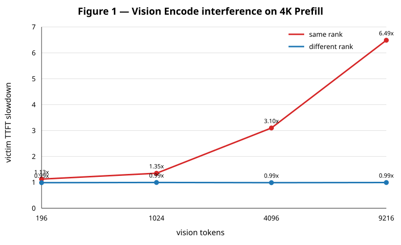
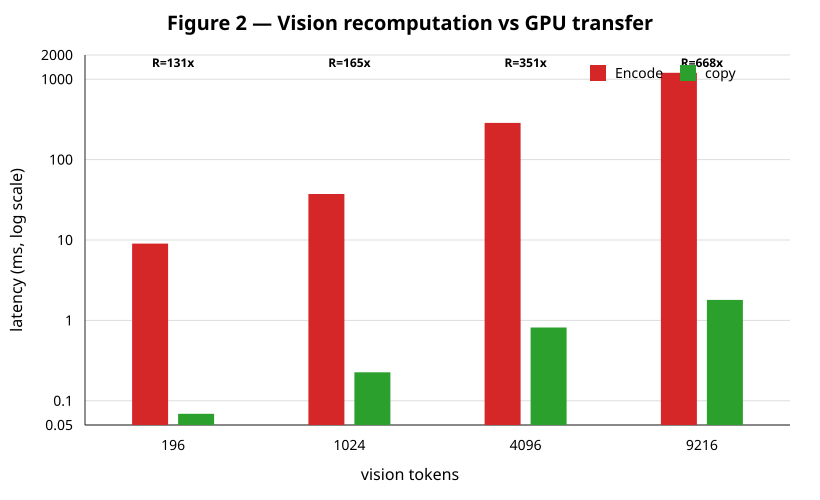

# 多模态 Agent + DP 调度预实验报告

日期：2026-09-02  
基线：vLLM 0.25.0 (`702f4814fe54fabff350d43cb753ae3e47c0c276`)  
模型：Qwen3.5-9B，BF16，单卡单实例，4× RTX 5090 机器  

## 结论

三个待验证问题在本轮图片预实验中均得到正向证据：

1. Vision Encode 会显著干扰同 rank 的 4K-token Prefill；视觉输入从 196 增长到 9216 tokens 时，victim TTFT slowdown 从 1.13× 增长到 6.49×，异 rank 对照始终约为 1.0×。
2. Vision Encode 重算远贵于同机 GPU 间传输。四档输入的 Encode/Transfer 比约为 131×、165×、351×、668×。
3. Cache locality 与 rank load 之间存在清晰 crossover。图片越大，hot rank 能承受的背景 Prefill 负载越高；但负载继续上升后，cold idle rank 仍会胜出。

这些结果支持后续 Prefix-aware DP 路由同时建模“可复用视觉计算价值”和“rank 当前负载”，而不是只看 request 数、文本 tokens 或单独看 cache hit。它们不要求现在修改 KV Cache 内存管理。

## 实验 1：Vision Encode 对 Prefill 的干扰

Victim 为约 4K tokens 的纯文本 Prefill，`max_tokens=1`，baseline TTFT 中位数为 386.75 ms。Attacker 使用每次不同的图片，确保 GPU encoder cold；根据单独测得的 CPU 预处理时间，将 attacker 分别提前 10/30/150/400 ms 发出，使 victim 确实落入 Encode 窗口。

| Vision tokens | Same-rank slowdown | Different-rank slowdown |
|---:|---:|---:|
| 196 | 1.13× | 0.99× |
| 1,024 | 1.35× | 0.99× |
| 4,096 | 3.10× | 0.99× |
| 9,216 | 6.49× | 0.99× |

一个重要的实验校准是：如果所有尺寸统一只提前 30 ms，3072×3072 图片仍处于 CPU 预处理阶段，victim 会先进入 GPU，从而错误地得到约 1.0× slowdown。校准到达时序后，该档 slowdown 变为 6.49×。

## 实验 2：跨 rank 重算与传输

vLLM 0.25.0 已有 `enable_mm_processor_stats` instrumentation。本轮直接记录 `model.embed_multimodal` 前后的同步 wall time，以避免用端到端 cold-hot 差值估计时被 Prefill 和 CPU 预处理噪声掩盖。

传输对象按 Qwen3.5 vision output 的 `[vision_tokens, 4096]`、BF16 计算。GPU0→GPU1 拓扑为 `SYS`、无 NVLink，`torch.cuda.can_device_access_peer` 为 false；复制计时包含目标设备同步。

| Vision tokens | Embedding bytes | Encode median | GPU0→1 copy median | Encode / copy |
|---:|---:|---:|---:|---:|
| 196 | 1.61 MB | 9.03 ms | 0.069 ms | 131× |
| 1,024 | 8.39 MB | 37.34 ms | 0.226 ms | 165× |
| 4,096 | 33.55 MB | 286.41 ms | 0.815 ms | 351× |
| 9,216 | 75.50 MB | 1,201.17 ms | 1.799 ms | 668× |

注意：copy 数字只是 tensor 数据面的下界，不包含跨进程协议、元数据、同步和排队。即使实际机制引入一个数量级的额外成本，大图的重算/传输差距仍然很大。

### vLLM 0.25.0 的缓存语义陷阱

原方案同时要求“关闭 multimodal processor cache”和“第二次相同对象命中 encoder cache”，这在当前版本中不成立。`--mm-processor-cache-gb 0` 会使相同媒体无法形成用于跨请求共享的稳定 cache identity；实测第二次请求仍有 `num_encoder_calls=1`。开启 processor cache 后，第二次请求才变为 `num_encoder_calls=0`。

因此正式协议应拆成两种配置：

- E/P 干扰：允许 processor cache 关闭，但每个 attacker 必须是全新对象，并校准 engine arrival。
- Encoder locality：processor cache 必须开启；同时单独报告 CPU processor hit 和 GPU encoder hit，不能混成一个 “MM cache hit”。

## 实验 3：Cache locality / rank load 冲突

Rank 0 预先缓存图片 encoder output；Rank 1 保持 cold。Rank 0 同时注入 0/2/4/6 个 4K Prefill 请求。表内数值为：

`TTFT(hot busy rank 0) - TTFT(cold idle rank 1)`

负数表示 hot rank 更优，正数表示 cold rank 更优。

| Vision tokens | Load 0 | Load 2 | Load 4 | Load 6 |
|---:|---:|---:|---:|---:|
| 196 | -16 ms | +560 ms | +1,222 ms | +1,856 ms |
| 1,024 | -116 ms | +505 ms | +1,176 ms | +1,864 ms |
| 4,096 | -507 ms | +87 ms | +746 ms | +1,421 ms |
| 9,216 | -1,652 ms | -1,111 ms | -411 ms | +317 ms |

这形成了清晰的 phase boundary：小图在很低负载下就应放弃 locality；9216-token 大图直到约 4 个并发 4K Prefill 时仍适合去 hot rank，到 6 个时才转向 cold rank。

## 范围与局限

- 当前是方向性预实验：每点 2–3 次，不是论文级统计。
- 使用 eager 模式以排除 CUDA Graph；移植 ForkAttention + CUDA Graph 后应复测。
- 当前只测合成图片，尚未覆盖 8/32/64-frame 视频。
- 干扰实验使用校准后的到达间隔；正式测试应增加随机 arrival sweep 和服务端 E/P CUDA Event 或 NVTX timeline。
- 当前是两个独立 vLLM server，等价于两个 DP replica 的 placement 实验，但还不是 vLLM 内建 DP coordinator。
- 传输测试只测 embedding tensor copy，没有实现真正的跨进程 encoder-cache connector。

## 原始数据

- [`interference_calibrated.csv`](interference_calibrated.csv)
- [`encoder_timing_cache_enabled.csv`](encoder_timing_cache_enabled.csv)
- [`p2p_gpu0_gpu1.csv`](p2p_gpu0_gpu1.csv)
- [`cache_load_conflict.csv`](cache_load_conflict.csv)
- [`summary.json`](summary.json)

实验脚本均位于本目录；vLLM `agentrix` 分支没有源码修改或新 commit。
